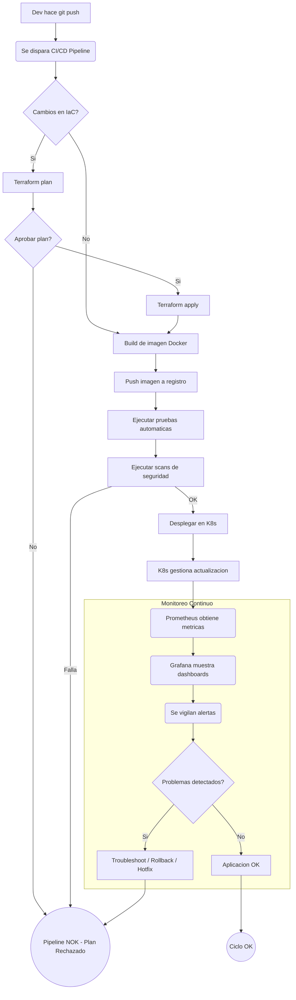

### **Actividad: Del código a la producción: Infraestructura, contenedores, despliegue y observabilidad**

#### 2. Descripción de la actividad

##### A. Infraestructura como Código

> **Tarea teórica:**  
> - Investigar una herramienta de IaC (p. ej. Terraform) y describir cómo organiza sus módulos.  


[Terraform](https://developer.hashicorp.com/terraform/docs) utiliza `modulos` para empaquetar codigo. Cada modulo es una coleccion de archivos `.tf` dentro de un directorio. Cada modulo define un conjunto de recursos que trabajan (como una red o database).

Asimismo cada modulo puede tener `variables.tf` que se usan como input y `outputs.tf` para exponer informacion a otros modulos.


> - Proponer la estructura de archivos y directorios para un proyecto hipotético que incluya tres módulos: `network`, `database` y `application`. Justificar la jerarquía elegida.

Para el proyecto hipotetico, se tiene la estructura mostrada en `tf/projects` donde cada modulo tiene una responsabilidad (network, db, app). En este caso el proyecto muestra informacion basica de cada modulo, se puede agregar variables y outputs para variables.

##### B. Contenerización y despliegue de aplicaciones modernas

> **Tarea teórica:**  
> - Describir un flujo simple de despliegue donde un desarrollador hace un cambio en el código, se construye una nueva imagen Docker y se actualiza un Deployment de Kubernetes.

Un flujo simple de despliegue seria: Codigo -> Docker -> K8s:

- El desarrollador escribe codigo nuevo, lo prueba localmente. Hace git commit y git push.

- CI/CD: El push dispara el pipeline automatico.

- Build: El pipeline clona el codigo y usa el Dockerfile del proyecto para construir una nueva imagen.

- Deploy con K8s: El pipeline le dice a Kubernetes que use esta nueva imagen.

- Kubernetes recibe la orden y empieza a crea pods nuevos con la imagen actualizada y va eliminando los pods viejos gradualmente, asegurando que la app siga disponible durante la actualizacion.


> - Explicar las ventajas de usar Kubernetes para escalar una aplicación en un evento de alto tráfico.

Las ventajas que tiene K8s son:

- Se puede escalar (horizontalmente) de manera facil cambiando manualmente el numero de pods
- Tambien puedes configurar para un auto-escalado basados en metricas
- Repartir trafico o carga entre pods
- K8s puede crear una replica cuando se tiene un trafico alto de red en una app

##### C. Observabilidad y Troubleshooting

> **Tarea teórica:**  
> - Investigar y describir cómo Prometheus y Grafana se integran con Kubernetes para monitorear los contenedores y el cluster.  

Prometheus es una herramienta usada para monitorear eventos alertas y Grafana es una aplicacion web usada para visualizar e interactuar

Para monitorear K8s. Se instala Prometheus y Grafana en el cluster. Prometheus obtiene las metricas de contenedores que las exponene a un endpoint `/metrics`, tambien se puede obtener metricas de cluster usando componentes como `kube-state-metrics` y `cAdvisor`. Cada ciertos segundos, Prometheus guarda los valores que obtiene como series de tiempo. Grafana se configura para que se comunique con la direccion de Prometheus dentro del cluster, luego las metricas obtenidas se visualizan con las consultas que realiza Grafana a Prometheus.


> - Proponer un set de métricas y alertas mínimas para una aplicación web (por ejemplo, latencia de peticiones, uso de CPU/memoria, tasa de errores).

Metricas clave a recolectar (Rate, Errors, Duration  y Use para recursos):

Las consultas fueron sacadas de https://prometheus.io/docs/prometheus/latest/querying/examples/

Rate: `http_requests_total` (contador de peticiones HTTP, con etiquetas para metodo, ruta, codigo de estado).

Errors: Derivado del anterior, filtrando por codigos 4xx y 5xx. Ejemplo: `http_requests_total{status=~"5.."}`

Duration: `http_request_duration_seconds`

Resource Utilization:

`container_cpu_usage_seconds_total` (Uso de CPU del contenedor).

`container_memory_working_set_bytes` (Uso de memoria del contenedor).

Alertas Minimas (usando https://prometheus.io/docs/prometheus/latest/configuration/alerting_rules/):

```yml
groups:
- name: app01Alerts
  rules:

  - alert: High5xxErrorRate
    expr: sum(rate(http_requests_total{status=~"5.."}[5m])) / sum(rate(http_requests_total[5m])) > 0.05
    for: 2m
    labels:
      severity: critical
    annotations:
      summary: "Alta tasa de errores 5xx ({{ $labels.job | default 'aplicacion web' }})" 

  - alert: HighMemoryUsage
    expr: avg_over_time(container_memory_working_set_bytes{container="app01-container"}[10m]) / avg_over_time(kube_pod_container_resource_limits_memory_bytes{container="app01-container"}[10m]) * 100 > 90
    for: 10m
    labels:
      severity: critical
    annotations:
      summary: "Alto uso de memoria en {{ $labels.pod }} ({{ $labels.container }})"

```

##### D. CI/CD (Integración continua / Despliegue continuo)

> **Tarea teórica:**  
> - Explicar la diferencia entre entrega continua (continuous delivery) y despliegue continuo (continuous deployment).

Entrega Continua (CD - Delivery): Aca el codigo pasa por todo el pipeline automatico. Si todo esta bien, se genera un artefacto listo para desplegar. Pero el despliegue final a produccion necesita un aprobacion manual.

Despliegue Continuo (CD - Deployment): Aca si el codigo pasa todas las etapas automaticas del pipeline, se despliega automaticamente en produccion sin que nadie tenga que intervenir.


> - Describir la relevancia de implementar pruebas automáticas (unitarias, de integración, de seguridad) dentro del pipeline.

Son criticas ya que sin pruebas automaticas podrian desplegarse errores a produccion. con las pruebas se logra la deteccion temprana de bugs o problemas en las seguridad (para DevSecOps).

4. Evaluación y discusión final

> - 4.1 Cada estudiante deberá redactar un informe sobre la importancia de IaC, contenedores, Kubernetes, observabilidad y CI/CD para la entrega ágil y confiable de software.
Identificar riesgos y desafíos (p.e. sobrecarga cognitiva, necesidad de capacitación, configuración de seguridad).
Discusión en grupo

El informe se encuentra en el directorio `informe`.


> - 4.2 Debatir cómo la adopción de estas prácticas puede acelerar el “time to market” de un producto.
Comentar ejemplos reales de cómo las grandes empresas usan estas herramientas para manejar volúmenes altos de tráfico y cambios frecuentes en sus aplicaciones.
Trabajo colaborativo

La adopcion de IaC, contenedores, K8s, observabilidad y CI/CD acelera el tiempo que tarda una idea de negocio en llegar a los usuarios (time to market). La automatizacion (CI/CD, IaC) elimina cuellos de botella manuales en pruebas y despliegues. Los contenedores y K8s facilitan despliegues consistentes y rapidos, permitiendo actualizaciones frecuentes y pequeñas (con menos riesgo). La observabilidad permite detectar y corregir problemas mucho mas rapido, minimizando el impacto de los errores.

Ejemplos de grandes empresas:

- https://netflixtechblog.medium.com/tips-for-high-availability-be0472f2599c

Aca Netflix para obtener una confiabilidad alta usa [Spinnaker](https://spinnaker.io/), una herramienta de CI/CD, junto a una series de buenas practicas discutidas en el articulo como tests y `canary analisis`. 

- https://engineering.atspotify.com/2020/08/how-we-improved-developer-productivity-for-our-devops-teams/

Spotify, a través de su equipo de la Plataforma Developer Experience (PDX), se enfoca en agilizar los procesos de desarrollo y despliegue para fomentar la creatividad de sus ingenieros. Utilizan diversas herramientas y beunas practicascon el objetivo de reducir la fragmentacion y mejorar la productividad. Estas herramientas automatizan tareas repetitivas, permitiendo a los ingenieros configurar y desplegar proyectos en tiempos reducidos, pasando de 14 días a menos de 5 minutos en algunos casos.


> - 4.3 En grupos, diseñar un flujo teórico que combine IaC (para crear recursos en la nube), despliegue de contenedores en Kubernetes y monitoreo con Prometheus/Grafana.
Presentar el flujo en un diagrama que incluya cada paso desde el commit hasta la visualización de métricas en tiempo real.

