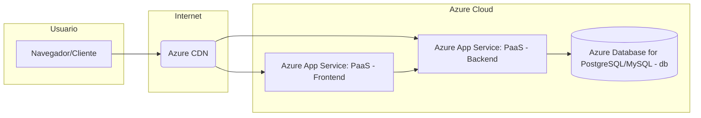

## A. Cuestionario
### Motivaciones para la nube

> (a) ¿Qué problemas o limitaciones existían antes del surgimiento de la computación en la nube y cómo los solucionó la centralización de servidores en data centers?

Antes de la nube, para la infraestructura de un proyecto se necesitaba comprar servidores, esperar semanas para tenerlos listos, calcular cuanta capacidad necesitabas, y  gestionar lo demas (energia, espacio, personal). La centralizacion en grandes datacenters (como Google o Amazon) soluciono parte de esto al optimizar costos operativos y gestion a gran escala.

> (b) ¿Por qué se habla de “The Power Wall” y cómo influyó la aparición de procesadores multi-core en la evolución hacia la nube?

"The Power Wall" fue el limite fisico que se encontro al intentar hacer los procesadores (CPU) mas y mas rapidos (mas GHz): consumian demasiada energia y generaban demasiado calor. La solucion fue poner varios nucleos (multi-core) en un mismo chip, aumentando la capacidad de proceso sin subir tanto la velocidad. Esto fue clave para la nube porque hizo la virtualizacion mucho mas eficiente con un servidor fisico multi-core podia correr muchas maquinas virtuales o contenedores a la vez, permitiendo a los proveedores de nube dividirse y alquilar esa capacidad de forma rentable.

### Clusters y load balancing

> (a) Explica cómo la necesidad de atender grandes volúmenes de tráfico en sitios web condujo a la adopción de clústeres y balanceadores de carga.

Cuando paginas web grandes y con mucho trafico empezaron a tener millones de visitas, un solo servidor no era suficiente. La solucion fue agrupar varios servidores identicos (clusters) que hacian lo mismo. Para repartir el trafico entre ellos y que ninguno se sature, se usaron los balanceadores de carga (load balancers), que manejan el trafico dependiendo de la cantidad de este.

> (b) Describe un ejemplo práctico de cómo un desarrollador de software puede beneficiarse del uso de load balancers para una aplicación web.

Si una de tus APIs tiene mucho trafico, despliegas varias instancias de tu API en diferentes servidores/contenedores. Pones un load balancer delante. Ventajas: si una instancia falla, el trafico va a las otras (alta disponibilidad); puedes añadir mas instancias si hay mas trafico (escalabilidad) sin cambiar nada para el usuario; puedes actualizar las instancias una por una sin cortar el servicio.

### Elastic computing

> (a) Define con tus propias palabras el concepto de Elastic Computing.

Es la capacidad de ajustar los recursos de computacion (como maquinas virtuales o contenedores) de forma automatica y rapida, para arriba o para abajo, segun la demanda real que tengas en cada momento.

> (b) ¿Por qué la virtualización es una pieza clave para la elasticidad en la nube?

La virtualizacion (con maquinas virtuales o contenedores) es fundamental porque convierte el hardware fisico en recursos que puedes crear, eliminar y gestionar por APIs.

> (c) Menciona un escenario donde, desde la perspectiva de desarrollo, sería muy difícil escalar la infraestructura sin un entorno elástico.

Un escenario de venta masiva online con ofertas como en Black Friday para un e-commerce. Sin elasticidad, si compras hardware para ese pico de trafico la web podria caerse por una mal calculo. La nube elastica te permite crecer solo durante el pico y luego volver a la normalidad, pero pagando por ese uso extra.

### Modelos de servicio (IaaS, PaaS, SaaS, DaaS)

> (a) Diferencia cada uno de estos modelos. ¿En qué casos un desarrollador optaría por PaaS en lugar de IaaS?

- IaaS (Infraestructura): Te dan los bloques como VMs, red o almacenamiento, pero gestionas SO, runtime, app. Tienes un control maximo.

- PaaS (Plataforma): Te dan la plataforma lista (SO, runtime, BD gestionada). Solo pones el codigo de la app. Menos control, mas productividad para el desarrollador.

- SaaS (Software): Te dan la aplicacion final lista para usar por internet. Sin responsabilidad sobre la infra/plataforma.

- DaaS (Desktop): Escritorios virtuales desde la nube.

> (b) Enumera tres ejemplos concretos de proveedores o herramientas que correspondan a cada tipo de servicio.

IaaS: AWS EC2, Google Compute Engine, Azure Virtual Machines.

PaaS: Render, Netlify y Vercel.

SaaS: Salesforce, Microsoft 365 y Slack.

DaaS: Amazon WorkSpaces, VMware Horizon Cloud y Microsoft Windows Virtual Desktop.

### Tipos de nubes (Pública, Privada, Híbrida, Multi-Cloud)

> (a) ¿Cuáles son las ventajas de implementar una nube privada para una organización grande?

Mayor control sobre seguridad y datos (que serian privados porque podria ser datos personales), rendimiento mas predecible, personalizacion de la infraestructura.

> (b) ¿Por qué una empresa podría verse afectada por el “provider lock-in”?

"Provider lock-in" se refiere a quedarse atrapado porque cambiar tus servicios a otro proveedor es muy caro y/o complejo. La empresa podria verse afectada porque pierdes poder para negociar precios y no podrias usar lo mejor de cada nube sino que estarias atascado con un proveedor.

> (c) ¿Qué rol juegan los “hyperscalers” en el ecosistema de la nube?

Los "hyperscalers" (AWS, Azure, GCP) son los proveedores de nube publica a gran escala. Su rol es proporcionar la infraestructura global, ofrecer un amplio catalogo de servicios cloud, impulsar la innovacion tecnologica y definir estandares y tendencias en la computacion en la nube.

## B. Actividades de investigación y aplicación
Estudio de casos

> Busca dos o tres casos de empresas (startups o grandes organizaciones) que hayan migrado parte de su infraestructura a la nube. Describe:

Los dos casos son de [Rappi](https://cloud.google.com/customers/rappi?hl=es-419) y [PedidosYa](https://cloud.google.com/customers/pedidosya?hl=es-419), ambos utilizan GCP.

#### Rappi

> Sus motivaciones para la migración.

Ingresar a servicios financieros (tarjeta de credito) para poblacion no bancarizada/infrabancarizada en LATAM, superar tecnologias bancarias antiguas, mejorar la transparencia en transacciones, facilitar y acelerar solicitudes de tarjeta de credito, necesidad de una infraestructura escalable para millones de usuarios y expansion a nuevos paises.

>Los beneficios obtenidos (por ejemplo, reducción de costos, escalabilidad, flexibilidad).

Reduccion del 30% en cargos no reconocidos usando geolocalizacion de transacciones, mejora rentabilidad vs bancos tradicionales, despliegue rapido de servicios financieros, aumento confianza de usuarios (mapa de transaccion es su funcion favorita), reduccion tiempo/recursos DevOps, aceleracion aprobacion de tarjetas (1 millon solicitudes, 300_000 aprobadas en 4 meses en Mexico).

> Los desafíos o dificultades enfrentadas (ej. seguridad, cumplimiento normativo).

Equilibrar experiencia de usuario fluida con seguridad en transacciones financieras complejas, baja tasa de aprobacion historica de tarjetas en LATAM, necesidad de procesar y presentar datos de geolocalizacion de forma legible, manejar demanda masiva de manera rapida.

#### PedidosYa

> Sus motivaciones para la migración.

Necesidad de escalar el negocio para atender mas mercados y usuarios, mejorar la disponibilidad, dar respuesta rapdia a analistas, reducir costos operativos y mantenimiento de infraestructura.

>Los beneficios obtenidos (por ejemplo, reducción de costos, escalabilidad, flexibilidad).

Disponibilidad del casi 100% de la plataforma, reduccion del trabajo operativo, mejora en experiencia de usuarios, reduccion de 5 veces el costo por consulta (usando BigQuery), democratizacion de datos con gestion de metadatos (Data Catalog) y acceso controlado (IAM), reduccion tiempo de implementacion de plataforma de 16 a 4 horas.

> Los desafíos o dificultades enfrentadas (ej. seguridad, cumplimiento normativo).

Gestionar la creciente demanda de analisis, comprender errores de consulta, asegurar que cambios de backend no afecten capas superiores, adaptarse rapidamente al trabajo 100% remoto durante la pandemia.

### Comparativa de modelos de servicio

> Realiza un cuadro comparativo en el que muestres las responsabilidades del desarrollador, del proveedor y del equipo de operaciones en los distintos modelos (IaaS, PaaS, SaaS).
Incluye aspectos como: instalación de S.O., despliegue de aplicaciones, escalado automático, parches de seguridad, etc.

| Responsabilidad del Aspecto | IaaS | PaaS | SaaS |
| :-- | :-- | :-- | :-- |
| **Runtime (Entorno Ejec.)** | Equipo de Operaciones | Proveedor                 | Proveedor               |
| **Sistema Operativo (SO)**  | Equipo de Operaciones | Proveedor                 | Proveedor               |
| **Hardware**    | Proveedor                 | Proveedor                 | Proveedor               |
| **Escalado**   | Equipo de Operaciones | Desarrollador | Proveedor  |
| **Parches de seguridad**  | Equipo de Operaciones | Proveedor                 | Proveedor               |
| **Despliegue de aplicacion**   | Equipo de Operaciones     | Desarrollador         | N/A                     |

### Armar una estrategia multi-cloud o híbrida

> Imagina que trabajas en una empresa mediana que tiene una parte de su infraestructura en un data center propio y otra parte en un proveedor de nube pública.

> Diseña una estrategia (de forma teórica) para migrar el 50% de tus cargas de trabajo a un segundo proveedor de nube, con el fin de no depender exclusivamente de uno.

Se identificarian aquellas aplicaciones o servicios mas adecuados para la migracion a la nube publica (PB). Los criterios de seleccion podiran ser la independencia de la aplicacion con el datacenter (DC) o proveedor A (PA) y si podria beneficiarse economicamente con la nube publica (PB). Las cargas con requisitos muy estrictos de seguridad podrian permanecer temporalmente en datacenter.

Despuesta se usaria IaC, definiendo los recursos de manera que puedan ser desplegados con minimos cambios tanto en PA como en PB. Seria importante la contenerizacion de aplicaciones con Docker y su orquestacion con Kubernetes. Los pipelines de CI/CD se adaptarian para permitir despliegues que podrian ser en PA o PB.

>Explica dónde iría la base de datos, cómo manejarías la configuración de red y cuál sería el plan de contingencia si un proveedor falla.

Se pondria centralizar la base de datos siguiendo conceptos de seguridad o latencia. Asi, las aplicaciones migradas PB accederian a esta db a traves de conexiones de red seguras o privadas. 

Para la configuracion de red, se estableceria conectividad segura entre DC, PA y PB (se podrian usar VPNs).

El plan de contingencia usaria IaC para una recreacion rapida de infraestructura en un proveedor alternativo. Se harian backups de datos fuera de PA.

### Debate sobre costos

> Prepara un breve análisis de los pros y contras de cada tipo de nube (pública, privada, híbrida, multi-cloud) considerando:
> Costos iniciales (CAPEX vs. OPEX).
> Flexibilidad y escalabilidad a mediano y largo plazo.
> Cumplimiento con normativas (p.ej. GDPR, HIPAA).
> Barreras o complejidades al cambiar de proveedor.

| Tipo          | Pros                                          | Contras                                         | Costos (Modelo) | Flexibilidad/Escala | Cumplimiento      | Cambio Proveedor |
| :- | :- | :- | :- | :- | :- | :- |
| **Publica**   | Bajo CAPEX, pago x uso, elastica | Menor control, riesgo lock-in | OPEX            | Muy Alta            | certificaciones   | Moderado  |
| **Privada**   | Maximo control, seguridad directa | Alto CAPEX, menos elastica    | CAPEX + OPEX    | Baja                | Control directo   | Bajo    |
| **Hibrida**   | Flexibilidad, optimiza costos/seguridad     | Complejidad, conectividad   | Mixto           | Moderada     | Mixto             | Moderado         |
| **Multi-Cloud**| Evita lock-in, usa mejor servicio, resiliencia | Maxima complejidad, posible latencia entre nubes | OPEX  | Alta                | Configuracion     | Bajo             |

### C. Ejercicio de presentación de "mini-proyecto"
Como parte del aprendizaje práctico, forma equipos y presenten un "Mini-proyecto de arquitectura en la nube":

> Objetivo del sistema: Cada equipo define brevemente la aplicación o servicio (por ejemplo, un e-commerce, un sistema de reservas, una plataforma de contenido).

La aplicaion sera un servicio de acortador de URLs. Permitira a los usuarios pegar una URL larga y obtener una version corta que redirige a la original. Podria incluir estadisticas basicas de clicks.

> Selección de modelo de servicio: Explica si se utilizará IaaS, PaaS o SaaS, y justifica por qué.

Se usara PaaS para la API (backend) que maneja las redirecciones y la creacion de URLs cortas. Se complementara con una base de datos en la nube para almacenar el mapeo entre URLs cortas y largas. Se usara esto ya que se enfocara en la logica del acortador y no en la gestion de servidores o sistemas operativos.

> Tipo de nube: Decide si vas a desplegar la aplicación en una nube pública, privada, híbrida o multi-cloud. Argumenta con un análisis de ventajas y desventajas.

Se desplegara en una nube publica, como Azure, GCP o AWS ya que se tendra acceso inmediato a servicios PaaS y base de datos en la nube. Ademas de la escalabilidad automatica (dependiendo de la tier del servicio). Una desventaja podria ser que como se tiene la app y su db en un proovedor tendriamos dependencia y un posible `provider lock-in`

> Esquema de escalabilidad: Describe cómo la aplicación escalaría en caso de aumento de demanda.

La aplicacion web/API en PaaS escalara horizontalmente (mas instancias) automaticamente basado en metricas como CPU o numero de peticiones, segun configuracion o tier. La base de datos escalara verticalmente (mas potencia) si es necesario. Se podria una CDN para cachear redirecciones populares y reducir carga.

> Costos y riesgos: Menciona los principales costos (directos o indirectos) y los riesgos asociados a tu elección (p.ej., dependencia del proveedor, requerimientos de seguridad).

Principales costos seran por uso del PaaS (instancias/CPU), db (tamaño/IO), almacenamiento y transferencia de datos/CDN. Los riesgos principales son el provider lock-in por los servicios PaaS/db elegidos, la correcta configuracion de seguridad en la nube y la gestion de costos para evitar gastos inesperados si el trafico escala mucho.

> Presentación final: Prepara un diagrama de alto nivel (físico o lógico) donde se visualice la infraestructura básica y los componentes en la nube.

