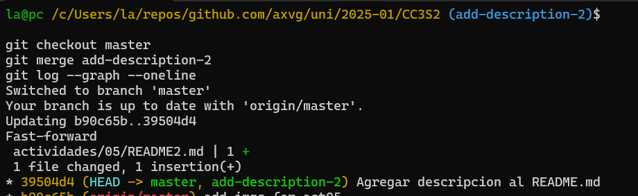
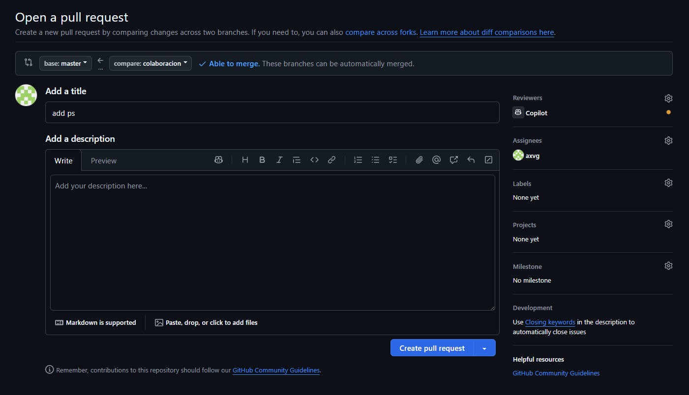

### Ejemplos

#### 1. Fusión Fast-forward (git merge --ff)

La fusión fast-forward es la forma más simple de combinar ramas en Git. Solo es posible cuando la rama base no ha recibido nuevos commits desde que se creó la rama feature.

##### Pasos prácticos:

```bash
# Crear un nuevo repositorio
mkdir prueba-fast-forward-merge
cd prueba-fast-forward-merge
git init

# Agregar un archivo inicial en la rama principal (main)
echo "# Mi Proyecto" > README.md
git add README.md
git commit -m "Commit inicial en main"

# Crear y cambiar a una nueva rama 'add-description'
git checkout -b add-description

# Hacer cambios en la nueva rama y comitearlos
echo "Este proyecto es un ejemplo de cómo usar Git." >> README.md
git add README.md
git commit -m "Agregar descripción al README.md"
```

**Pregunta:** Muestra la estructura de commits resultante.

```bash
# Cambiar de vuelta a la rama 'main' y realizar la fusión fast-forward
git checkout master
git merge add-description

# Ver el historial lineal
git log --graph --oneline
```

> **Resultado:** El historial de tu repositorio.



Despues de esto cambios, se muestra una historia lineal de commits debido  al tipo de merge que se uso (--ff por defecto)

#### 2. Fusión No-fast-forward (git merge --no-ff)

La fusión no-fast-forward crea un nuevo commit de fusión. Es útil para preservar el contexto de la fusión, especialmente en equipos donde se requiere más claridad en el historial de cambios.

##### Pasos prácticos:

```bash
# Crear un nuevo repositorio
mkdir prueba-no-fast-forward-merge
cd prueba-no-fast-forward-merge
git init

# Agregar un archivo inicial en la rama principal (main)
echo "# Mi Proyecto" > README.md
git add README.md
git commit -m "Commit inicial en main"

# Crear y cambiar a una nueva rama 'add-feature'
git checkout -b add-feature

# Hacer cambios en la nueva rama y comitearlos
echo "Implementando una nueva característica..." >> README.md
git add README.md
git commit -m "Implementar nueva característica"
```

**Pregunta:** Muestra el log de commits resultante.


Se muestran dos commits en linea recta, esto debido a que aun no hay un merge y solo commits en la rama master.

```bash
# Cambiar de vuelta a la rama 'main' y realizar una fusión no-fast-forward
git checkout master
git merge --no-ff add-feature
```

Después de la edición, veamos el log ahora:

```bash
# Ver el historial
git log --graph --oneline
```

> El historial de tu repositorio mostrará un commit de fusión.


Este commit mostrado es debido al tipo de merge que usamos (--no-ff), donde se agrego un commit de fusion con un mensaje por defecto

##### 3. Fusión squash (git merge --squash)

La fusión squash combina todos los cambios de una rama en un solo commit en la rama principal. Este método es útil cuando se quiere mantener un historial de commits limpio.

##### Pasos prácticos:

```bash
# Crear un nuevo repositorio
$ mkdir prueba-squash-merge
$ cd prueba-squash-merge
$ git init

# Agregar un archivo inicial en la rama principal (main)
$ echo "# Mi Proyecto" > README.md
$ git add README.md
$ git commit -m "Commit inicial en main"

# Crear y cambiar a una nueva rama 'add-basic-files'
$ git checkout -b add-basic-files

# Hacer algunos cambios y comitearlos
$ echo "# CÓMO CONTRIBUIR" >> CONTRIBUTING.md
$ git add CONTRIBUTING.md
$ git commit -m "Agregar CONTRIBUTING.md"

$ echo "# LICENCIA" >> LICENSE.txt
$ git add LICENSE.txt
$ git commit -m "Agregar LICENSE.txt"
```


> **Pregunta:** ¿Cuál es tu estructura de commits?

Se tiene 2 commits distintos en la rama `add-basic-files`, esto debido a los commits a los archivos md y txt


```bash
# Cambiar de vuelta a la rama 'main' y realizar la fusión squash
$ git checkout master
$ git merge --squash add-basic-files
```

Los commits luego se aplastan y se convierten en un solo commit:

Para completar la fusión squash, realiza un commit:

```bash
$ git add .
$ git commit -m "Agregar documentación estándar del repositorio"
$ git log --graph --oneline
```

Esto combinará todos los cambios de la rama add-multiple-features en un solo nuevo commit en la rama main.


Antes del merge se tenian dos commits individuales en la rama de feature. Luego de aplicar squash, ambos se combinan en un solo commit que aparece al final de la rama principal.

---


#### Ejercicios

1. **Clona un repositorio Git con múltiples ramas.**  
   Identifica dos ramas que puedas fusionar utilizando `git merge --ff`.  
   Haz el proceso de fusión utilizando `git merge --ff`.  
   Verifica el historial con `git log --graph --oneline`.  

> **Pregunta:** ¿En qué situaciones recomendarías evitar el uso de `git merge --ff`? Reflexiona sobre las desventajas de este método.

   No se recomienda usar `git merge --ff` en proyectos medianos o grandes porque no se guarda el contexto de la rama usada para merge.

2. **Simula un flujo de trabajo de equipo.**  
   Trabaja en dos ramas independientes, creando diferentes cambios en cada una.  
   Fusiona ambas ramas con `git merge --no-ff` para ver cómo se crean los commits de fusión.  
   Observa el historial utilizando `git log --graph --oneline`.  

>  **Pregunta:** ¿Cuáles son las principales ventajas de utilizar `git merge --no-ff` en un proyecto en equipo? ¿Qué problemas podrían surgir al depender excesivamente de commits de fusión?

Se mantiene un registro de las ramas y el momento cuando se realizo el merge. Ademas se puede revertir guiandose por el commit de merge.


3. **Crea múltiples commits en una rama.**  
   Haz varios cambios y commits en una rama feature.  
   Fusiona la rama con `git merge --squash` para aplanar todos los commits en uno solo.  
   Verifica el historial de commits antes y después de la fusión para ver la diferencia.  

>  **Pregunta:** ¿Cuándo es recomendable utilizar una fusión squash? ¿Qué ventajas ofrece para proyectos grandes en comparación con fusiones estándar?

Como `squash` combina los commits en uno solo, se recomienda usar cuando se tienen commits de trabajos en progreso, typos para tener un commit con mayor significado. Esto hace que el historial de la rama main este mas limpio.


#### Resolver conflictos en una fusión non-fast-forward

En algunos casos, las fusiones no son tan sencillas y pueden surgir conflictos que necesitas resolver manualmente. Este ejercicio te guiará a través del proceso de manejo de conflictos.

1. Inicializa un nuevo repositorio:
   ```bash
   mkdir prueba-merge-conflict
   cd prueba-merge-conflict
   git init
   ```
2. Crea un archivo index.html y realiza un commit en la rama main:
   ```bash
   echo "<html><body><h1>Proyecto inicial CC3S2</h1></body></html>" > index.html
   git add index.html
   git commit -m "commit inicial del  index.html en main"
   ```

3. Crea y cambia a una nueva rama feature-update:
   ```bash
   git checkout -b feature-update
   ```

4. Edita el archivo y realiza un commit en la rama feature-update:
   ```bash
   echo "<p>.....</p>" >> index.html
   git add index.html
   git commit -m "Actualiza ..."
   ```

5. Regresa a la rama main y realiza una edición en el mismo archivo:
   ```bash
   git checkout main
   echo "<footer>Contacta aquí example@example.com</footer>" >> index.html
   git add index.html
   git commit -m "....index.html"
   ```

6. Fusiona la rama feature-update con --no-ff y observa el conflicto:
   ```bash
   git merge --no-ff feature-update
   ```

7. Git detectará un conflicto en index.html. Abre el archivo y resuelve el conflicto. Elimina las líneas de conflicto generadas por Git (`<<<<<<<`, `=======`, `>>>>>>>`) y crea la versión final del archivo con ambos cambios:

   ```html
   <html>
     <body>
       <h1>....</h1>
       <p>....</p>
       <footer>...example@example.com</footer>
     </body>
   </html>
   ```


Estos son los cambios que se muestran al revisar el merge conflict, los dos marcadores <<< y >>> muestran los cambios y lineas que generan este conflicto, para solucionarlo se edita el archivo con ambos cambios.


8. Agrega el archivo corregido y completa la fusión:
   ```bash
   git add index.html
   git commit
   ```

9. Verifica el historial para confirmar la fusión y el commit de resolución de conflicto:
   ```bash
   git log --graph --oneline
   ```

**Preguntas:**
> - ¿Qué pasos adicionales tuviste que tomar para resolver el conflicto?

Identificar el archivo en conflicto, localizar los marcadores `HEAD`, `>>>` ,`<<<` y editar con los cambios que resolveran el conflicto para finalmente realizar el commit.

> - ¿Qué estrategias podrías emplear para evitar conflictos en futuros desarrollos colaborativos?

Comunicacion constante para saber que partes del codigo se esta trabajando entre los integrantes de un equipo.

Ramas de corta duracion y actualizar frecuentemente con el repositorio en remoto.

#### Ejercicio: Comparar los historiales con git log después de diferentes fusiones

Este ejercicio te permitirá observar las diferencias en el historial generado por fusiones fast-forward, non-fast-forward y squash.

##### Pasos

1. Crea un nuevo repositorio y realiza varios commits en dos ramas:
   ```bash
   mkdir prueba-compare-merge
   cd prueba-compare-merge
   git init
   echo "Version 1.0" > version.txt
   git add version.txt
   git commit -m "...."
   git checkout -b feature-1
   echo "Caracteristica 1 agregada" >> version.txt
   git add version.txt
   git commit -m "Agregar caracteristica 1"
   git checkout main
   git checkout -b feature-2
   echo "Caracteristica 2 agregada" >> version.txt
   git add version.txt
   git commit -m "Se agrega caracteristica 2"
   ```

2. Fusiona feature-1 usando fast-forward:
   ```bash
   git checkout main
   git merge feature-1 --ff
   ```

3. Fusiona feature-2 usando non-fast-forward:
   ```bash
   git merge feature-2 --no-ff
   ```

4. Realiza una nueva rama feature-3 con múltiples commits y fusiónala con squash:
   ```bash
   git checkout -b feature-3
   echo "Caracteristica 3 paso 1" >> version.txt
   git add version.txt
   git commit -m "Caracteristica 3 paso 1"
   echo "Caracteristica 3 paso 2" >> version.txt
   git add version.txt
   git commit -m "Caracteristica 3 paso 2"
   git checkout main
   git merge --squash feature-3
   git commit -m "Agregar caracteristica 3 en un commit"
   ```

5. Compara el historial de Git:
   - Historial Fast-forward:
     ```bash
     git log --graph --oneline --merges --first-parent –branches
     ```
   


E muestra el unico commit de la rama 

   - Historial Non-fast-forward:
     ```bash
     git log --graph --oneline –merges
     ```


   - Historial con Squash:
     ```bash
     git log --graph --oneline --merges --decorate --all
     ```


Este es el log para ver todos los commits de todas las ramas, se puede ver ambos commits de la rama `feature-3` y que en su merge sera solo uno.


Se observa los cambios entre los commits realizados para los 3 tipos de merges visto en este ejercicios, mientras que `--no-ff` tiene un commit adicional de fusion, `--ff` tiene un commit lineal, asimismo para el merge `squash` se puede ver el unico commit que combino a sus dos commits.

**Preguntas:**
> - ¿Cómo se ve el historial en cada tipo de fusión?

Fast-forward (feature-1): El commit "Agregar caracteristica 1" aparece en la linea de master después del "...".El historial parece lineal.

Non-fast-forward (feature-2): Se ve claramente una rama que diverge (feature-2) y luego se vuelve a unir a main mediante un commit de fusion. Se muestra un grafo.

Squash (feature-3): Aparece un unico commit nuevo en master, pero no hay una linea de  que conecte feature-3 con el commit en master. El historial de master se mantiene lineal en este punto.

> - ¿Qué método prefieres en diferentes escenarios y por qué?

- `--ff`: Aceptable cuando es un proyecto personal porque no hay historial de ramas (no hay trabajo en colaboracion).

- `-no-ff`: Para trabajo en equipo porque preserva historial de ramas y agrega un commit de merge

- `--squash`: Cuando se hara merge a un rama que tiene varios commits como typos o en progreso para mantener el historial limpio.

#### Ejercicio: Usando fusiones automáticas y revertir fusiones

En este ejercicio, aprenderás cómo Git puede fusionar automáticamente cambios cuando no hay conflictos y cómo revertir una fusión si cometes un error.

##### Pasos

1. Inicializa un nuevo repositorio y realiza dos commits en main:
   ```bash
   mkdir prueba-auto-merge
   cd prueba-auto-merge
   git init
   echo "Linea 1" > file.txt
   git add file.txt
   git commit -m "Agrega linea 1"
   echo "Linea 2" >> file.txt
   git add file.txt
   git commit -m "...linea 2"
   ```

2. Crea una nueva rama auto-merge y realiza otro commit en file.txt:
   ```bash
   git checkout -b auto-merge
   echo "Linea 3" >> file.txt
   git add file.txt
   git commit -m "... linea 3"
   ```

3. Vuelve a main y realiza cambios no conflictivos en otra parte del archivo:
   ```bash
   git checkout main
   echo "Footer: Fin del archivo" >> file.txt
   git add file.txt
   git commit -m "Add footer al archivo file.txt"
   ```

4. Fusiona la rama auto-merge con main:
   ```bash
   git merge auto-merge
   ```

5. Git debería fusionar los cambios automáticamente sin conflictos.


6. Revertir la fusión: Si decides que la fusión fue un error, puedes revertirla:
   ```bash
   git revert -m 1 HEAD
   ```

7. Verifica el historial:
   ```bash
   git log --graph --oneline
   ```


En la figura se puede ver el merge automatico de la rama `auto-merge`, en el paso 6 se uso `revert` creando quitando los cambios de este merge y el historial de commits siga intacto ya que `revert` crea un nuevo commits sin alterar la historia pasada.

**Preguntas:**
> - ¿Cuándo usarías un comando como git revert para deshacer una fusión?

Se puede usar cuando el merge ha sido pusheado ya que `revert` crea un nuevo commit en lugar de re-escribir la historia.

> - ¿Qué tan útil es la función de fusión automática en Git?

Esta fusion ahorra tiempo cuando no hay conflictos.

#### Ejercicio: Fusión remota en un repositorio colaborativo

Este ejercicio te permitirá practicar la fusión de ramas en un entorno remoto colaborativo, simulando un flujo de trabajo de equipo.

##### Pasos:

1. Clona un repositorio remoto desde GitHub o crea uno nuevo:
   ```bash
   git clone https://github.com/axvg/new-project-test-01.git
   cd new-project-test-01
   ```

2. Crea una nueva rama colaboracion y haz algunos cambios:
   ```bash
   git checkout -b colaboracion
   echo "Colaboración remota" > colaboracion.txt
   git add colaboracion.txt
   git commit -m "...."
   ```

3. Empuja los cambios a la rama remota:
   ```bash
   git push origin colaboracion
   ```

   

Se puede ver el repositorio de github seteado y la rama que se esta subiendo `colaboracion` para realizar el pull request y merge en la pagina de github.

4. Simula una fusión desde la rama colaboracion en la rama main de otro colaborador. (Puedes usar la interfaz de GitHub para crear un Pull Request y realizar la fusión).

El proceso de creacion de una PR hasta realizar la fusion es el siguiente:


Al subir una rama al repositorio se obtiene un popup amarillo que nos indica que podemos realizar un PR



Al presionar este boton podemos crear un PR, con el titulo de este y comentarios (podria ir un comentario como CHANGELOG).


Cuando se crea el PR, se espera la aprobacion para que este pase a la rama principal (en este caso master). Se nota el label `Open`. En este caso se agrego assignees para revisar este PR y hacer una revision de codigo.


Finalmnente se aprueba este PR y los cambios pasan a la rama master.

**Preguntas:**
> - ¿Cómo cambia la estrategia de fusión cuando colaboras con otras personas en un repositorio remoto?

La estrategia es el uso de Pull Requests (PRs) para revision y fusiones controladas a traves de la GitHub o GitLab, se puede usar politicas de fusion  para asegurar la calidad y la claridad del historial compartido.

> - ¿Qué problemas comunes pueden surgir al integrar ramas remotas?

Podria ocurrir conflictos de fusion debido a modificaciones concurrentes en las mismas partes de codigo, ramas desactualizadas, dependencias entre PRs y comunicacion deficiente en el equipo.

#### Ejercicio final: flujo de trabajo completo

Configura un proyecto simulado:

Este proyecto esta el repositorio https://github.com/axvg/new-project-test-01 , tiene la siguiente estructura:


- Crea un proyecto con tres ramas: main, feature1, y feature2.

Las 3 ramas tienen distintos archivos de lenguajes de programacion para mostrar la diferencia

- Realiza varios cambios en feature1 y feature2 y simula colaboraciones paralelas.


- Realiza fusiones utilizando diferentes métodos:
  - Fusiona feature1 con main utilizando `git merge --ff`.

  
  - Fusiona feature2 con main utilizando `git merge --no-ff`.


  - Haz una rama adicional llamada feature3 y aplasta sus commits utilizando `git merge --squash`.


Se observan los dos commits de los dos tipos de merge utilizados y el commit de fusion del merge `--no-ff`.

Analiza el historial de commits:

> - Revisa el historial para entender cómo los diferentes métodos de fusión afectan el árbol de commits.

- Se puede ver que `--ff` no conserva la historia de la rama usada en el merge. `--no-ff` si conserva la historia y agrega un commit de fusion y `--squash` combina los commits de la rama feature3 en uno solo. Con `--no-ff` se puede observar la bifurcacion de las ramas.


> - Compara los resultados y discute con tus compañeros de equipo cuál sería la mejor estrategia de fusión para proyectos más grandes.

- Para proyectos grandes podria usarse `--no-ff` debido a que se tiene un historia de las ramas `feature` que puede trabajar cada integrante, tambien podria usarse `--squash` cuando la rama es de corta duracion y se tiene muchos commits como `typo` o `WIP`.