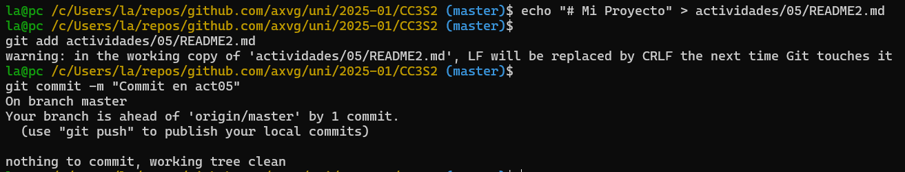
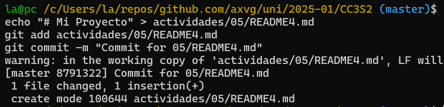
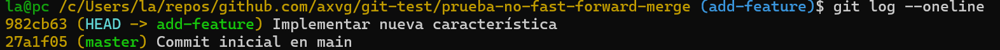

### Ejemplos

#### 1. Fusión Fast-forward (git merge --ff)

La fusión fast-forward es la forma más simple de combinar ramas en Git. Solo es posible cuando la rama base no ha recibido nuevos commits desde que se creó la rama feature.

##### Pasos prácticos:

```bash
# Crear un nuevo repositorio
mkdir prueba-fast-forward-merge
cd prueba-fast-forward-merge
git init

# Agregar un archivo inicial en la rama principal (main)
echo "# Mi Proyecto" > README.md
git add README.md
git commit -m "Commit inicial en main"

# Crear y cambiar a una nueva rama 'add-description'
git checkout -b add-description

# Hacer cambios en la nueva rama y comitearlos
echo "Este proyecto es un ejemplo de cómo usar Git." >> README.md
git add README.md
git commit -m "Agregar descripción al README.md"
```




**Pregunta:** Muestra la estructura de commits resultante.

```bash
# Cambiar de vuelta a la rama 'main' y realizar la fusión fast-forward
git checkout master
git merge add-description

# Ver el historial lineal
git log --graph --oneline
```

**Resultado:** El historial de tu repositorio.


#### 2. Fusión No-fast-forward (git merge --no-ff)

La fusión no-fast-forward crea un nuevo commit de fusión. Es útil para preservar el contexto de la fusión, especialmente en equipos donde se requiere más claridad en el historial de cambios.

##### Pasos prácticos:

```bash
# Crear un nuevo repositorio
mkdir prueba-no-fast-forward-merge
cd prueba-no-fast-forward-merge
git init

# Agregar un archivo inicial en la rama principal (main)
echo "# Mi Proyecto" > README.md
git add README.md
git commit -m "Commit inicial en main"

# Crear y cambiar a una nueva rama 'add-feature'
git checkout -b add-feature

# Hacer cambios en la nueva rama y comitearlos
echo "Implementando una nueva característica..." >> README.md
git add README.md
git commit -m "Implementar nueva característica"
```



**Pregunta:** Muestra el log de commits resultante.

```bash
# Cambiar de vuelta a la rama 'main' y realizar una fusión no-fast-forward
git checkout master
git merge --no-ff add-feature
```

Después de la edición, veamos el log ahora:

```bash
# Ver el historial
git log --graph --oneline
```

El historial de tu repositorio mostrará un commit de fusión.




##### 3. Fusión squash (git merge --squash)

La fusión squash combina todos los cambios de una rama en un solo commit en la rama principal. Este método es útil cuando se quiere mantener un historial de commits limpio.

##### Pasos prácticos:

```bash
# Crear un nuevo repositorio
$ mkdir prueba-squash-merge
$ cd prueba-squash-merge
$ git init

# Agregar un archivo inicial en la rama principal (main)
$ echo "# Mi Proyecto" > README.md
$ git add README.md
$ git commit -m "Commit inicial en main"

# Crear y cambiar a una nueva rama 'add-basic-files'
$ git checkout -b add-basic-files

# Hacer algunos cambios y comitearlos
$ echo "# CÓMO CONTRIBUIR" >> CONTRIBUTING.md
$ git add CONTRIBUTING.md
$ git commit -m "Agregar CONTRIBUTING.md"

$ echo "# LICENCIA" >> LICENSE.txt
$ git add LICENSE.txt
$ git commit -m "Agregar LICENSE.txt"
```


**Pregunta:** ¿Cuál es tu estructura de commits?


Se tiene 2 commits distintos en la rama `add-basic-files`


```bash
# Cambiar de vuelta a la rama 'main' y realizar la fusión squash
$ git checkout master
$ git merge --squash add-basic-files
```


Los commits luego se aplastan y se convierten en un solo commit:

Para completar la fusión squash, realiza un commit:

```bash
$ git add .
$ git commit -m "Agregar documentación estándar del repositorio"
$ git log --graph --oneline
```

Esto combinará todos los cambios de la rama add-multiple-features en un solo nuevo commit en la rama main.


---