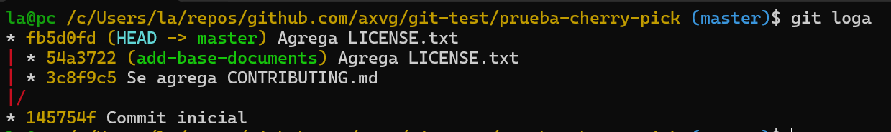

#### **Parte 1: git rebase para mantener un historial lineal**

1. **Introducción a Rebase:**

   El rebase mueve tus commits a una nueva base, dándote un historial lineal y limpio. En lugar de fusionar ramas y mostrar un "commit de merge", el rebase integra los cambios aplicándolos en la parte superior de otra rama.

   - **Caso de uso**: Simplifica la depuración y facilita la comprensión del historial de commits.

2. **Escenario de ejemplo:**

   - Crea un nuevo repositorio Git y dos ramas, main y new-feature:
     ```bash
     mkdir prueba-git-rebase
     cd prueba-git-rebase
     git init
     echo "# Mi Proyecto de Rebase" > README.md
     git add README.md
     git commit -m "Commit inicial en main"
     ```


   - Crea y cambia a la rama new-feature:
     ```bash
     $ git checkout -b new-feature
     $ echo "Esta es una nueva característica." > NewFeature.md
     $ git add NewFeature.md
     $ git commit -m "Agregar nueva característica"
     ```

    **Pregunta:** Presenta el historial de ramas obtenida hasta el momento.


   Ahora, digamos que se han agregado nuevos commits a main mientras trabajabas en new-feature:

   ```bash
   # Cambiar de nuevo a 'main' y agregar nuevos commits
   git checkout main
   echo "Updates to the project." >> Updates.md
   git add Updates.md
   git commit -m "Update main"
   ```


   Tu gráfico de commits ahora diverge (comprueba esto)

   > **Tarea**: Realiza el rebase de `new-feature` sobre `main` con los siguientes comandos:
   ```bash
   git checkout new-feature
   git rebase main
   ```

3. **Revisión:**

   Después de realizar el rebase, visualiza el historial de commits con:
   ```bash
   git log --graph –oneline
   ```


4. **Momento de fusionar y completar el proceso de git rebase:**
   ```bash
   # Cambiar a 'main' y realizar una fusión fast-forward
   git checkout main
   git merge new-feature
   ```
>   Cuando se realiza una fusión *fast-forward*, las HEADs de las ramas main y new-feature serán los commits correspondientes.

Se observa que el grafo es una linea recta, sin divergencia. Pareciendo que el trabajo se realizo de manera secuencial.
El commit de `new-feature` esta arriba del ultimo commit de `master` a pesar de que el primero fue realizado antes. Las dos ramas y `HEAD` apuntan al mismo commit.

Algo importante aqui es que el hash del ultimo commit de `new-feature` (como se ve en las figuras) cambio, esto debido a que este commit tiene un padre diferente (el nodo cambio de arista en la DAG)


#### Parte 2: **git cherry-pick para la integración selectiva de commit**

. **Escenario de ejemplo:**

   ```bash
   # Inicializar un nuevo repositorio
   $ mkdir prueba-cherry-pick
   $ cd prueba-cherry-pick
   $ git init

   # Agregar y commitear README.md inicial a main
   $ echo "# Mi Projecto" > README.md
   $ git add README.md
   $ git commit -m "Commit inicial"

   # Crear y cambiar a una nueva rama 'add-base-documents'
   $ git checkout -b add-base-documents

   # Hacer cambios y commitearlos
   # Agregar CONTRIBUTING.md
   $ echo "# CONTRIBUTING" >> CONTRIBUTING.md
   $ git add CONTRIBUTING.md
   $ git commit -m "Se agrega CONTRIBUTING.md"

   # Agregar LICENSE.txt
   $ echo "LICENSE" >> LICENSE.txt
   $ git add LICENSE.txt
   $ git commit -m "Agrega LICENSE.txt"

   # Echa un vistazo al log de la rama 'add-base-documents'
   $ git log add-base-documents --graph --oneline
   ```

    **Pregunta:** Muestra un diagrama de como se ven las ramas en este paso.


4. **Tarea: Haz cherry-pick de un commit de add-base-documents a main:**
   ```bash
   $ git checkout main
   $ git cherry-pick a80e8ad  # Reemplaza con el hash real del commit de tu log
   ```


5. **Revisión:**  
   Revisa el historial nuevamente:
   ```bash
   $ git log --graph --oneline
   ```
   Después de que hayas realizado con éxito el cherry-pick del commit, se agregará un nuevo commit a tu rama actual (main en este ejemplo) y contendrá los cambios del commit cherry-picked.  

   Ten en cuenta que el nuevo commit tiene los mismos cambios pero un valor de hash de commit diferente. !Comprueba esto!.



Nota: Se seteo un alias para `git log --oneline --graph --all` como `loga`

El contenido del commit usado para `cherry-pick` y su mensaje son iguales, sin embargo su hash es distinto. La rama que cambia es la rama `master` donde se realizo `cherry-pick` la rama de donde se saco el hash quedo intacta1


##### **Preguntas de discusión:**

> 1. ¿Por qué se considera que rebase es más útil para mantener un historial de proyecto lineal en comparación con merge? 

En general, `rebase` comparado a los tipos de `merge` no puede crear un commit de fusion (`no-ff`) o confusion entre commits (`ff`) u omision de commits por error (`squash`) ya que el padre del ultimo commit cambia a uno de la rama objetivo del `rebase`. Esto ayuda a que el historial del proyecto sea mas limpio.


> 2. ¿Qué problemas potenciales podrían surgir si haces rebase en una rama compartida con otros miembros del equipo?  

Como `rebase` re-escribe la historia y con esto cambia hashes, los otros miembros tendran hashes distintos en su local y al querer hacer un `pull` o `push` habra que resolver las diferencias y puede crear un historial mas confuso. Esto podria crear`git merge spaghetti` como se ve en https://stackoverflow.com/questions/4252110/git-merge-spaghetti-how-to-fix-it


> 3. ¿En qué se diferencia cherry-pick de merge, y en qué situaciones preferirías uno sobre el otro?  

`merge` integra la historia de commits de una rama en otra y `cherry-pick` toma los cambios de un commit especifico y lo integra a otra rama con un nuevo commit.

Se prefiere `merge` cuando se esta trabajando en una rama `feature` y se realizaron un cambio tipo `hotfix` a un archivo. Si se requiere este cambio en `master` se puede realizar un `cherry-pick` en lugar de realizar un `merge` completo de toda la rama, se prefiere `merge` si se requiere pasar estos cambios probados y completos

> 4. ¿Por qué es importante evitar hacer rebase en ramas públicas?

Porque las ramas publicas tienen varios miembros que tienen clones del repositorio en su local y con hashes distintos a los hashes que cambiaran cuando suceda el `rebase`. Esto podria solucionarse con `push -f` pero sobre-escribiendo la historia en remoto.

#### **Ejercicios teóricos**

> 1. **Diferencias entre git merge y git rebase**  
   **Pregunta**: Explica la diferencia entre git merge y git rebase y describe en qué escenarios sería más adecuado utilizar cada uno en un equipo de desarrollo ágil que sigue las prácticas de Scrum.

`merge` combina ramas y sus historiales de commits, preserva estos y su historial sin modificacion.

`rebase` re-escribe la historia, cambiando hashes de commits, crea nuevos commits con nuevos hashes pero con los cambios de esos commits. Con esto se parece a un trabajo secuencial de commits.

En un equipo Scrum, usarias rebase principalmente de forma local. Un desarrollador trabajando en rama `feature` deberia hacer `rebase` sobre `develop` o `master` frecuentemente antes de compartir su codigo. Asi integra los ultimos cambios de la rama principal en su trabajo, resuelve conflictos pronto y mantiene su historial local limpio y lineal. Usarias `merge` para integrar una feature branch ya terminada y probada en `develop` o `master`. Aca se usaria `--no-ff` porque crea un commit de fusion que documenta claramente la integracion de esa funcionalidad completa, manteniendo visible que grupo de commits pertenecian a esa tarea especifica del sprint.


> 2. **Relación entre git rebase y DevOps**  
   **Pregunta**: ¿Cómo crees que el uso de git rebase ayuda a mejorar las prácticas de DevOps, especialmente en la implementación continua (CI/CD)? Discute los beneficios de mantener un historial lineal en el contexto de una entrega continua de código y la automatización de pipelines.


`rebase` ayuda a DevOps porque produce un historial lineal en las ramas principales, cuando se usa correctamente para preparar las ramas de caracteristica antes de fusionarlas. Este historial lineal es mas facil de leer y seguir para todos en el equipo y esto es importante porque los cambios pueden (o deben) ser frecuentes. Si ocurre un problema en produccion, un historial lineal hace mas rapido encontrar el commit culpable usando herramientas como `bisect`. Tambien si los desarrolladores hacen rebase local a menudo, estan forzados a integrar continuamente los cambios de los demas, lo que reduce los conflictos grandes al final. El historia lineal ayuda a la trazabilidad.

> 3. **Impacto del git cherry-pick en un equipo Scrum**  
   **Pregunta**: Un equipo Scrum ha finalizado un sprint, pero durante la integración final a la rama principal (main) descubren que solo algunos commits específicos de la rama de una funcionalidad deben aplicarse a producción. ¿Cómo podría ayudar git cherry-pick en este caso? Explica los beneficios y posibles complicaciones.

El equipo identificaria los hashes  de esos commits especificos y desde la rama `main` los aplica usando `cherry-pick`. Git toma el cambio de cada commit original y crea un commit nuevo en main con ese cambio, el mismo mensaje pero un hash nuevo. Esto permite desplegar cammbios importantes a produccion de forma selectiva sin esperar a que toda la feature branch este terminada. Sin embargo pude que el commit seleccionado podria depender de cambios en otros commits no seleccionados y esto podria generar conflictos. Podria haber conflictos al aplicarlo en main.


#### **Ejercicios prácticos**

1. **Simulación de un flujo de trabajo Scrum con git rebase y git merge**

   **Contexto:**  
   Tienes una rama `main` y una rama `feature` en la que trabajas. Durante el desarrollo del sprint, se han realizado commits tanto en `main` como en `feature`.  

   Tu objetivo es integrar los cambios de la rama `feature` en `main` manteniendo un historial limpio.

   **Instrucciones:**

   - Crea un repositorio y haz algunos commits en la rama main.
   - Crea una rama feature, agrega nuevos commits, y luego realiza algunos commits adicionales en main.
   - Realiza un rebase de feature sobre main.
   - Finalmente, realiza una fusión fast-forward de feature con main.

   **Comandos:**
   ```bash
   $ mkdir scrum-workflow
   $ cd scrum-workflow
   $ git init
   $ echo "Commit inicial en main" > mainfile.md
   $ git add mainfile.md
   $ git commit -m "Commit inicial en main"

   $ git checkout -b feature
   $ echo "Nueva característica en feature" > featurefile.md
   $ git add featurefile.md
   $ git commit -m "Commit en feature"

   $ git checkout main
   $ echo "Actualización en main" >> mainfile.md
   $ git add mainfile.md
   $ git commit -m "Actualización en main"

   $ git checkout feature
   $ git rebase main

   $ git checkout main
   $ git merge feature --ff-only
   ```


   **Preguntas:**

   > - ¿Qué sucede con el historial de commits después del rebase?

Despues del rebase el historial de la rama `feature` se reescribe. Los commits originales de `feature` son reemplazados por commits nuevos. Estos nuevos commits tienen los mismos cambios y mensajes que los originales pero tienen hashes diferentes porque su commit padre ahora es el ultimo commit de la rama master sobre la cual se hizo el rebase. El resultado es que el historial se vuelve lineal como si el trabajo de feature se hubiera hecho despues del trabajo de master.


   > - ¿En qué situación aplicarías una fusión fast-forward en un proyecto ágil?

Una fusion fast forward (`ff`) se aplicaria en un proyecto agil cuando se quiere integrar los cambios de una rama en otra y la rama destino es un ancestro directo de la rama origen. Esto sucederia despues de haber hecho un rebase de tu rama `feature` sobre `master`. Al hacer `merge -ff` solo se mueve el puntero de la rama master hacia adelante para que apunte al ultimo commit de la feature branch. No se crea un commit de fusion. Entonces esto ayuda a mantener el historial de la rama principal lo mas lineal y limpio posible. Se podria usar para ramas tipo `hotfix`.


2. **Cherry-pick para integración selectiva en un pipeline CI/CD**

   **Contexto:**  
   Durante el desarrollo de una funcionalidad, te das cuenta de que solo ciertos cambios deben ser integrados en la rama de producción, ya que el resto aún está en desarrollo. Para evitar fusionar toda la rama, decides hacer cherry-pick de los commits que ya están listos para producción.

   **Instrucciones:**

   - Crea un repositorio con una rama main y una rama feature.
   - Haz varios commits en la rama feature, pero solo selecciona uno o dos commits específicos que consideres listos para producción.
   - Realiza un cherry-pick de esos commits desde feature a main.
   - Verifica que los commits cherry-picked aparezcan en main.

   **Comandos:**
   ```bash
   $ mkdir ci-cd-workflow
   $ cd ci-cd-workflow
   $ git init
   $ echo "Commit inicial en main" > main.md
   $ git add main.md
   $ git commit -m "Commit inicial en main"

   $ git checkout -b feature
   $ echo "Primera característica" > feature1.md
   $ git add feature1.md
   $ git commit -m "Agregar primera característica"

   $ echo "Segunda característica" > feature2.md
   $ git add feature2.md
   $ git commit -m "Agregar segunda característica"

   $ git checkout main
   $ git cherry-pick <hash_del_commit1>
   $ git cherry-pick <hash_del_commit2>
   ```

   **Preguntas:**

>   - ¿Cómo utilizarías cherry-pick en un pipeline de CI/CD para mover solo ciertos cambios listos a producción?  

En un pipeline de CI/CD se usaria cherry-pick  en un paso que requiere aprobacion manual o se activa bajo condiciones especificas. Primero identificarias los hashes de los commits en la rama `feature` que contienen los cambios listos y aprobados para produccion. El paso del pipeline haria checkout de la rama `master`. Luego ejecutaria `cherry-pick` con los hashes seleccionados. Esto aplicaria esos cambios especificos creando nuevos commits en la rama de produccion. Despues de eso el pipeline continuaria con sus pasos normales de pruebas y despliegue de esa rama actualizada.

>   - ¿Qué ventajas ofrece cherry-pick en un flujo de trabajo de DevOps?

Ofrece un control granular permite seleccionar y desplegar commits especificos como correcciones urgentes o simples mejoras sin necesidad de fusionar ramas enteras que podrian contener trabajo inestable. Esto acelera la entrega de valor o la solucion de problemas criticos reduciendo el tiempo de reparacion. Tambien da flexibilidad para separar el ciclo de desarrollo del ciclo de despliegue permitiendo lanzar partes de una funcionalidad antes de que este completamente terminada. Ademas facilita el "movimiento" de commits entre ramas, es decir llevar un fix de una rama mas nueva como master a una rama mas antigua.


#### **Git, Scrum y Sprints**

#### **Fase 1: Planificación del sprint (sprint planning)**

**Ejercicio 1: Crear ramas de funcionalidades (feature branches)**

En esta fase del sprint, los equipos Scrum deciden qué historias de usuario van a trabajar. Cada historia de usuario puede representarse como una rama de funcionalidad.

**Objetivo:** Crear ramas para cada historia de usuario y asegurar que el trabajo se mantenga aislado.

**Instrucciones:**

1. Crea un repositorio en Git.
2. Crea una rama `main` donde estará el código base.
3. Crea una rama por cada historia de usuario asignada al sprint, partiendo de la rama `main`.

**Comandos:**
```bash
$ mkdir scrum-project
$ cd scrum-project
$ git init
$ echo "# Proyecto Scrum" > README.md
$ git add README.md
$ git commit -m "Commit inicial en main"

# Crear ramas de historias de usuario
$ git checkout -b feature-user-story-1
$ git checkout -b feature-user-story-2
```

> **Pregunta:** ¿Por qué es importante trabajar en ramas de funcionalidades separadas durante un sprint?

Porque permite trabajar en una funcionalidad o historia de usuario por cada rama aislando los cambios. Cada desarrollador puede trabajar en su tarea sin afectar directamente el trabajo de los demas. Si algo sale mal en una rama no bloquea al resto del equipo. Tambien facilita la revision de codigo especifica para esa funcionalidad. Permite integrar caracteristicas completas de forma controlada al final del sprint o cuando esten listas en lugar de tener cambios mezclados constantemente en la rama master. Ayuda a mantener la rama master mas estable.


#### **Fase 2: Desarrollo del sprint (sprint execution)**

**Ejercicio 2: Integración continua con git rebase**

A medida que los desarrolladores trabajan en sus respectivas historias de usuario, pueden ocurrir cambios en main. Para mantener un historial lineal y evitar conflictos más adelante, se usa `git rebase` para integrar los últimos cambios de main en las ramas de funcionalidad antes de finalizar el sprint.

**Objetivo:** Mantener el código de la rama de funcionalidad actualizado con los últimos cambios de main durante el sprint.

**Instrucciones:**

1. Haz algunos commits en main.
2. Realiza un rebase de la rama `feature-user-story-1` para actualizar su base con los últimos cambios de main.

**Comandos:**
```bash
# Simula cambios en la rama main
$ git checkout main
$ echo "Actualización en main" > updates.md
$ git add updates.md
$ git commit -m "Actualizar main con nuevas funcionalidades"

# Rebase de la rama feature-user-story-1 sobre main
$ git checkout feature-user-story-1
$ git rebase main
```

> **Pregunta:** ¿Qué ventajas proporciona el rebase durante el desarrollo de un sprint en términos de integración continua?

Usar `rebase` en tu `feature` branch sobre master permite integrar los ultimos cambios de la rama principal en tu trabajo de forma frecuente y de forma rapida. Esto ayuda a detectar y resolver conflictos a medida que surgen en lugar de enfrentarte a un gran conflicto al final del sprint cuando intentes fusionar. Mantiene tu rama de trabajo actualizada con los cambios mas reciente del proyecto. Ademas al mantener tu historial local lineal y basado en la punta de `master` facilita la futura fusion final que a menudo puede ser un simple `fast forward` resultando en un historial principal mas limpio y facil de seguir.


#### **Fase 3: Revisión del sprint (sprint review)**

**Ejercicio 3: Integración selectiva con git cherry-pick**

En esta fase, es posible que algunas funcionalidades estén listas para ser mostradas a los stakeholders, pero otras aún no están completamente implementadas. Usar `git cherry-pick` puede permitirte seleccionar commits específicos para mostrar las funcionalidades listas, sin hacer merge de ramas incompletas.

**Objetivo:** Mover commits seleccionados de una rama de funcionalidad (`feature-user-story-2`) a `main` sin integrar todos los cambios.

**Instrucciones:**

1. Realiza algunos commits en `feature-user-story-2`.
2. Haz cherry-pick de los commits que estén listos para mostrarse a los stakeholders durante la revisión del sprint.

**Comandos:**
```bash
$ git checkout feature-user-story-2
$ echo "Funcionalidad lista" > feature2.md
$ git add feature2.md
$ git commit -m "Funcionalidad lista para revisión"

$ echo "Funcionalidad en progreso" > progress.md
$ git add progress.md
$ git commit -m "Funcionalidad aún en progreso"

# Ahora selecciona solo el commit que esté listo
$ git checkout main
$ git cherry-pick <hash_del_commit_de_feature-lista>
```

> **Pregunta:** ¿Cómo ayuda `git cherry-pick` a mostrar avances de forma selectiva en un sprint review?

`cherry-pick` ayuda en un sprint review porque permite tomar solo los commits especificos de una feature branch que representan funcionalidades terminadas y listas para mostrar. Se puede aplicar estos commits seleccionados a la rama `master` o a una rama temporal de demostracion sin necesidad de fusionar toda la `feature` branch que podria contener trabajo incompleto o inestable. Con esto nos aseguramos que lo que se muestra a los stakeholders durante la revision del sprint sea funcional y represente incremento de valor completado sin exponer codigo incompleto y con errores. Esto nos da flexibilidad para presentar avances concretos aunque la historia de usuario completa no este cerrada.


#### **Fase 4: Retrospectiva del sprint (sprint retrospective)**

**Ejercicio 4: Revisión de conflictos y resolución**

Durante un sprint, pueden surgir conflictos al intentar integrar diferentes ramas de funcionalidades. Es importante aprender cómo resolver estos conflictos y discutirlos en la retrospectiva.

**Objetivo:** Identificar y resolver conflictos de fusión con `git merge` al intentar integrar varias ramas de funcionalidades al final del sprint.

**Instrucciones:**

1. Realiza cambios en `feature-user-story-1` y `feature-user-story-2` que resulten en conflictos.
2. Intenta hacer merge de ambas ramas con main y resuelve los conflictos.

**Comandos:**
```bash
$ git checkout feature-user-story-1
$ echo "Cambio en la misma línea" > conflicted-file.md
$ git add conflicted-file.md
$ git commit -m "Cambio en feature 1"

$ git checkout feature-user-story-2
$ echo "Cambio diferente en la misma línea" > conflicted-file.md
$ git add conflicted-file.md
$ git commit -m "Cambio en feature 2"

# Intentar hacer merge en main
$ git checkout main
$ git merge feature-user-story-1
$ git merge feature-user-story-2
```


> **Pregunta**: ¿Cómo manejas los conflictos de fusión al final de un sprint? ¿Cómo puede el equipo mejorar la comunicación para evitar conflictos grandes?

Cuando `merge` falla por un conflicto, git te lo indica y marca los archivos y lineas en conflicto. Abres esos archivos y buscas los marcadores <<<<<<< ======= >>>>>>>. Se tienen que editar manualmente el archivo para decidir que lineas y version del codigo conservar o como combinar ambas partes eliminando los marcadores. Despues de guardar los cambios haces `add` con el archivo resuelto para marcarlo como solucionado. Finalmente haces `commit` para completar la fusion creando el `merge` commit.

Para evitar conflictos grandes el equipo puede mejorar la comunicacion. Hacer integraciones mas frecuentes usando `rebase` local sobre master antes de hacer push ayuda a detectar conflictos antes. Comunicar en las reuniones diarias de  scrum en que partes se esta trabajando y asi evitar solapamientos. Dividir las historias de usuario en tareas definidas y enfocadas para reducir la probabilidad de que dos personas modifiquen lo mismo al mismo tiempo. Usar `feature` flags puede permitir integrar codigo incompleto a `master` sin activarlo evitando ramas de larga duracion que divergen mucho.

#### **Fase 5: Fase de desarrollo, automatización de integración continua (CI) con git rebase**

**Ejercicio 5: Automatización de rebase con hooks de Git**

En un entorno CI, es común automatizar ciertas operaciones de Git para asegurar que el código se mantenga limpio antes de que pase a la siguiente fase del pipeline. Usa los hooks de Git para automatizar el rebase cada vez que se haga un push a una rama de funcionalidad.

**Objetivo:** Implementar un hook que haga automáticamente un rebase de `main` antes de hacer push en una rama de funcionalidad, asegurando que el historial se mantenga limpio.

**Instrucciones:**

1. Configura un hook `pre-push` que haga un rebase automático de la rama `main` sobre la rama de funcionalidad antes de que el push sea exitoso.
2. Prueba el hook haciendo push de algunos cambios en la rama `feature-user-story-1`.

**Comandos:**
```bash
# Dentro de tu proyecto, crea un hook pre-push
$ nano .git/hooks/pre-push

# Agrega el siguiente script para automatizar el rebase
#!/bin/bash
git fetch origin main
git rebase origin/main

# Haz el archivo ejecutable
$ chmod +x .git/hooks/pre-push

# Simula cambios y haz push
$ git checkout feature-user-story-1
$ echo "Cambios importantes" > feature1.md
$ git add feature1.md
$ git commit -m "Cambios importantes en feature 1"
$ git push origin feature-user-story-1
```


> **Pregunta**: ¿Qué ventajas y desventajas observas al automatizar el rebase en un entorno de CI/CD?

La ventaja de automatizar el `rebase` con un hook pre-push es:
-  fuerza a que el codigo enviado al remoto este siempre basado en la ultima version de la rama principal. Esto podria reducir la probabilidad de que el codigo falle en el pipeline de CI debido a cambios recientes en la base y asegura que el historial que llega al remoto sea lineal para esa rama.

Las desventajas son: 
- Si el rebase automatico falla debido a conflictos el push se bloquea y requiere intervencion manual del desarrollador lo cual puede ser frustrante e interrumpir el flujo. Reescribir la historia justo antes del push podria confundir a otros si la rama ya estaba compartida aunque sea brevemente.

---


### **Navegando conflictos y versionado en un entorno devOps**

**Objetivo:**  
Gestionar conflictos en Git, realizar fusiones complejas, utilizar herramientas para comparar y resolver conflictos, aplicar buenas prácticas en el manejo del historial de versiones  y usar el versionado semántico en un entorno de integración continua (CI).

**Herramientas:**

- Git  
- Un entorno de desarrollo (Visual Studio Code, terminal, etc.)  
- Un repositorio en GitHub o GitLab (opcional, puede ser local)

**Contexto:**  
En un entorno de desarrollo colaborativo, los conflictos son inevitables cuando varios desarrolladores trabajan en la misma base de código. Resolver estos conflictos es crucial para mantener un flujo de trabajo eficiente en DevOps.

Los conflictos ocurren cuando dos ramas modifican la misma línea de un archivo y luego se intenta fusionarlas. Git no puede decidir qué cambio priorizar, por lo que la resolución manual es necesaria.


#### **Cómo fusionar conflictos en Git:**

1. **Identificar conflictos**: Usa `git status` para ver los archivos en conflicto.
2. **Examinar los archivos**: Busca los marcadores de conflicto (`<<<<<<<`, `=======`, `>>>>>>`) en los archivos.
3. **Resolver los conflictos**: Elige qué cambios conservar (rama actual o fusionada) o mezcla ambos.
4. **Commit de los archivos resueltos**: Después de resolver, añade los archivos al staging y realiza el commit.

#### **Comandos para resolver conflictos**

- `git checkout --ours <file-path>`: Conserva los cambios de tu rama.  
- `git checkout --theirs <file-path>`: Conserva los cambios de la rama fusionada.


#### **Herramientas para gestionar fusiones**

- `git diff`: Compara las diferencias entre dos ramas o commits, ayudando a identificar conflictos:
  ```bash
  $ git diff feature-branch..main
  ```

- `git merge --no-commit --no-ff`: Simula una fusión sin realizar el commit para ver los cambios:
  ```bash
  $ git merge --no-commit --no-ff feature-branch
  $ git diff --cached
  ```
  Si no es lo que esperas, puedes abortar la fusión:
  ```bash
  $ git merge --abort
  ```

- `git mergetool`: Usa herramientas gráficas para resolver conflictos de manera visual. Configura tu herramienta preferida:
  ```bash
  $ git config --global merge.tool vimdiff
  $ git mergetool
  ```

##### **Comandos para organizar tu entorno de trabajo**

- **git reset**: Este comando permite retroceder en el historial de commits. Existen tres tipos:

  1. **Soft Reset**: Mueve el HEAD sin cambiar los archivos:
     ```bash
     $ git reset --soft <commit>
     ```
  2. **Mixed Reset**: Mueve el HEAD y quita archivos del staging, pero mantiene los cambios:
     ```bash
     $ git reset --mixed <commit>
     ```
  3. **Hard Reset**: Elimina todos los cambios no guardados y resetea el directorio de trabajo:
     ```bash
     $ git reset --hard <commit>
     ```

- **git revert**: Deshace cambios sin modificar el historial de commits, creando un nuevo commit:
  ```bash
  $ git revert <commit_hash>
  ```

- **git checkout**: Además de cambiar de ramas, este comando te permite restaurar archivos específicos:
  ```bash
  $ git checkout -- <file_name>
  ```

##### **Herramientas para depurar**

- **git blame**: Muestra qué usuario hizo cambios en una línea específica de un archivo:
  ```bash
  $ git blame file.txt
  ```

- **git bisect**: Realiza una búsqueda binaria para encontrar el commit que introdujo un error:
  ```bash
  $ git bisect start
  $ git bisect bad
  $ git bisect good <commit>
  $ git bisect reset
  ```


##### **git clean y stash**

1. `git clean`: Elimina archivos y directorios no rastreados.
   ```bash
   $ git clean -fd
   ```

2. `git stash`: Guarda cambios sin hacer commit, útil para multitasking.
   ```bash
   $ git stash
   $ git stash apply stash@{0}
   ```

##### **.gitignore**

El archivo `.gitignore` te permite especificar qué archivos y carpetas deben ignorarse durante un `git add`, asegurando que permanezcan exclusivos de tu entorno local.

```bash
# Ignorar todos los archivos de log
.log

# Ignorar archivos de configuración personal
config/personal/
```

##### **Versioning en Git**

Usa versioning semántico para gestionar versiones del software de manera clara:
```bash
$ git tag -a v1.0 -m "Initial stable release"
$ git tag v2.4.4 <commit>
```

---

#### **Ejemplo:**

1. **Inicialización del proyecto y creación de ramas**

   - **Paso 1**: Crea un nuevo proyecto en tu máquina local.
     ```bash
     $ mkdir proyecto-colaborativo
     $ cd proyecto-colaborativo
     ```
   - **Paso 2**: Inicializa Git en tu proyecto.
     ```bash
     $ git init
     ```
   - **Paso 3**: Crea un archivo de texto llamado `archivo_colaborativo.txt` y agrega algún contenido inicial.
     ```bash
     $ echo "Este es el contenido inicial del proyecto" > archivo_colaborativo.txt
     ```
   - **Paso 4**: Agrega el archivo al área de staging y haz el primer commit.
     ```bash
     $ git add .
     $ git commit -m "Commit inicial con contenido base"
     ```
   - **Paso 5**: Crea dos ramas activas: main y feature-branch.
     ```bash
     $ git branch feature-branch  # Crear una nueva rama
     ```
   - **Paso 6**: Haz checkout a la rama feature-branch y realiza un cambio en el archivo `archivo_colaborativo.txt`.
     ```bash
     $ git checkout feature-branch
     $ echo "Este es un cambio en la feature-branch" >> archivo_colaborativo.txt
     $ git add .
     $ git commit -m "Cambios en feature-branch"
     ```
   - **Paso 7**: Regresa a la rama main y realiza otro cambio en la misma línea del archivo `archivo_colaborativo.txt`.
     ```bash
     $ git checkout main
     $ echo "Este es un cambio en la rama main" >> archivo_colaborativo.txt
     $ git add .
     $ git commit -m "Cambios en main"
     ```


En este repositorio se prepara un conflicto de fusion. Esta situacion es comun en desarrollo paralelo (entre miembros del eqipo que realizan cambios en los mismos archivos) y aislar trabajo en ramas es bueno pero la integracion requiere resolver estas divergencias.

2. **Fusión y resolución de conflictos**

   - **Paso 1**: Intenta fusionar feature-branch en main. Se espera que surjan conflictos de fusión.
     ```bash
     $ git merge feature-branch
     ```
   - **Paso 2**: Usa `git status` para identificar los archivos en conflicto. Examina los archivos afectados y resuelve manualmente los conflictos, conservando las líneas de código más relevantes para el proyecto.
     ```bash
     $ git status
     $ git checkout --theirs <archivo>  # Si decides aceptar los cambios de feature-branch
     $ git checkout --ours <archivo>    # Si decides aceptar los cambios de main
     ```


   - **Paso 3**: Una vez resueltos los conflictos, commitea los archivos y termina la fusión
     ```bash
     $ git add .
     $ git commiSe intento fusionar feature-branch en master con git merge feature-branch. Git detecto el conflicto en archivo_colaborativo.txt y detuvo la fusion. Se uso git status para confirmar el conflicto. Se edito manualmente el archivo eliminando los marcadores de conflicto y eligiendo el contenido final deseado. Se guardo el archivo. Se uso git add archivo_colaborativo.txt para marcar el conflicto como resuelto. Finalmente se ejecuto git commit para crear el merge commit y completar la fusion. La reflexion es que la resolucion manual es el metodo base funciona pero puede ser propenso a errores en conflictos grandes. La comunicacion en el equipo sobre quien trabaja en que ayuda a minimizar estos casos.t -m "Conflictos resueltos"
     ```


Se intento fusionar `feature` en `master` con `merge feature`. Git detecto el conflicto en archivo_colaborativo.txt y detuvo la fusion. Se uso git status para confirmar el conflicto. Se edito manualmente el archivo eliminando los marcadores de conflicto y eligiendo las lineas de ambos commits. Finalmente se ejecuto git commit para crear el merge commit y completar la fusion.

Esta resolucion manual es el metodo base h funciona pero puede ser propenso a errores en conflictos grandes. Se puede evitar esto con la comunicacion en el equipo sobre que archivos o features estan trabajando.

3. **Simulación de fusiones y uso de git diff**

   Para los siguientes pasos, se hara un reset del merge que se realizo:

   ```sh
   git reset --hard HEAD~1
   git loga -n 3
   git status
   ```

   - **Paso 1**: Simula una fusión usando `git merge --no-commit --no-ff` para ver cómo se comportarían los cambios antes de realizar el commit.
     ```bash
     $ git merge --no-commit --no-ff feature-branch
     $ git diff --cached  # Ver los cambios en el área de staging
     $ git merge --abort  # Abortar la fusión si no es lo que se esperaba
     ```


Primero se deshizo el merge commit anterior usando `reset --hard HEAD~1` para volver al estado antes del merge . Luego se uso `diff master..feature-branch` para ver las diferencias antes de fusionar anticipando el conflicto. Despues se ejecuto `merge --no-commit --no-ff feature-branch`. Este comando tipo dry-run muestra el fallo por conflicto pero no crea e commit. 

El directorio quedo en estado conflictivo permitiendo inspeccionar el resultado. Luego con el uso de `merge --abort` se cancela la fusion y se vuelve al estado limpio anterior.

`--no-commit` da una opcion que nos ayuda a ver el conflicto antes de finalizar una fusion compleja permite revisar o abortar sin ensuciar el historial. `diff` ayuda a prepararse.

4. **Uso de git mergetool**

   - **Paso 1**: Configura git mergetool con una herramienta de fusión visual (puedes usar meld, vimdiff, o Visual Studio Code).
     ```bash
     $ git config --global merge.tool <nombre-herramienta>
     $ git mergetool
     ```
   - **Paso 2**: Usa la herramienta gráfica para resolver un conflicto de fusión.

   En el archivo de .gitconfig realizo estos cambios:

   ```sh
   [merge]
      tool = emacsediff

   [diff]
      tool = emacsdiff
   ```


Resolviendo el conflicto


Este es el uso de `mergetool`. Se lanza una herramienta visual configurada mostrando las versiones LOCAL REMOTE BASE y MERGED. Esto ayuda a resolver el conflicto usando la interfaz grafica y guardando el resultado. Esta herramienta es superior a la edicion manual (usado en un paso anterior) para conflictos complejos la vista en paralelo facilita entender y resolver los cambios.

5. **Uso de git revert y git reset**

   - **Paso 1**: Simula la necesidad de revertir un commit en main debido a un error. Usa `git revert` para crear un commit que deshaga los cambios.
     ```bash
     $ git revert <commit_hash>
     ```
   - **Paso 2**: Realiza una prueba con `git reset --mixed` para entender cómo reestructurar el historial de commits sin perder los cambios no commiteados.
     ```bash
     $ git reset --mixed <commit_hash>
     ```
Despues de realizar reset del commit de merge anterior


`revert` es la forma segura de deshacer cambios que estan en github (remoto) creando un commit nuevo. `reset` es para limpieza local antes de compartir modifica la historia y `--mixed` es util para rehacer commits manteniendo el codigo.

6. **Versionado semántico y etiquetado**

   - **Paso 1**: Aplica versionado semántico al proyecto utilizando tags para marcar versiones importantes.
     ```bash
     $ git tag -a v1.0.0 -m "Primera versión estable"
     $ git push origin v1.0.0
     ```

El tag es importante en DevOps para marcar releases (github usa el mismo nombre) y puntos estables en el codigo. El versionado semantico (v1.0.0) comunica el tipo de cambios y la compatibilidad esto es crucial para la gestion de librerias y despliegues a produccion.

7. **Aplicación de git bisect para depuración**

   - **Paso 1**: Usa `git bisect` para identificar el commit que introdujo un error en el código.
     ```bash
     $ git bisect start
     $ git bisect bad   # Indica que la versión actual tiene un error
     $ git bisect good <último_commit_bueno>
     # Continúa marcando como "good" o "bad" hasta encontrar el commit que introdujo el error
     $ git bisect reset  # Salir del modo bisect
     ```


Este es el flujo de `bisect` start bad good para encontrar un commit que introdujo un bug. Se marca un commit malo actual y uno bueno anterior (como el tag v1.0.0). Aqui se usa una busqueda binaria probando commits intermedios y preguntando si son buenos o malos hasta aislar el commit culpable. Se finaliza con `bisect reset`. Esta es una herramienta de depuracion en DevOps ahorra tiempo para obtener regresiones rapidamente sobre todo si el historial es limpio y lineal.

8. **Documentación y reflexión**

   - **Paso 1**: Documenta todos los comandos usados y los resultados obtenidos en cada paso.
   - **Paso 2**: Reflexiona sobre la utilidad de cada comando en un flujo de trabajo de DevOps.

Realizados en cada paso anterior

#### **Preguntas**

1. **Ejercicio para git checkout --ours y git checkout --theirs**

   **Contexto**: En un sprint ágil, dos equipos están trabajando en diferentes ramas. Se produce un conflicto de fusión en un archivo de configuración crucial. El equipo A quiere mantener sus cambios mientras el equipo B solo quiere conservar los suyos. El proceso de entrega continua está detenido debido a este conflicto.

>   **Pregunta**:  
   ¿Cómo utilizarías los comandos `git checkout --ours` y `git checkout --theirs` para resolver este conflicto de manera rápida y eficiente? Explica cuándo preferirías usar cada uno de estos comandos y cómo impacta en la pipeline de CI/CD. ¿Cómo te asegurarías de que la resolución elegida no comprometa la calidad del código?


Si necesitas resolver un conflicto aceptando completamente una de las versiones usas estos comandos desde la rama donde haces el merge. Para mantener los cambios de tu rama actual (la que recibe la fusion) y descartar los de la rama que fusionas ejecutas `git checkout --ours archivo_conflictivo.txt`. Para hacer lo contrario descartar tus cambios y aceptar los de la rama que traes ejecutas `git checkout --theirs archivo_conflictivo.txt`. Despues de usar uno de estos comandos haces git add archivo_conflictivo.txt y git commit para finalizar la fusion.

Se prefiere --ours si los cambios de tu rama actual son los correctos. Preferirias --theirs si la version que viene de la otra rama es la quse se usara en produccion. Son utiles para resolver rapido cuando sabes que una de las versiones es completamente erronea. En CI/CD esto desbloquea el pipeline rapidamente. Sin embargo la rapidez puede comprometer la calidad si no estas seguro de cual version es la correcta o si se necesitaba una mezcla. Para asegurar calidad se debe entender por que ocurrio el conflicto y cual es la logica correcta antes de elegir --ours o --theirs. Para esto deberia haber una revision de codigo o un testeo.

2. **Ejercicio para git diff**

   **Contexto**: Durante una revisión de código en un entorno ágil, se observa que un pull request tiene una gran cantidad de cambios, muchos de los cuales no están relacionados con la funcionalidad principal. Estos cambios podrían generar conflictos con otras ramas en la pipeline de CI/CD.

>   **Pregunta**:  
   Utilizando el comando `git diff`, ¿cómo compararías los cambios entre ramas para identificar diferencias específicas en archivos críticos? Explica cómo podrías utilizar `git diff feature-branch..main` para detectar posibles conflictos antes de realizar una fusión y cómo esto contribuye a mantener la estabilidad en un entorno ágil con CI/CD.

Antes de fusionar un pull request se usa `git diff` para ver los cambios exactos. Con `git diff rama_principal..rama_feature` comparas las puntas de ambas ramas. Si quieres revisar solo un archivo usas `git diff rama_principal..rama_feature -- archivo_critico.txt`. Esto te permite ver si hay lineas que sabes que otros tocaron recientemente anticipando conflictos. Detectar esto antes de la fusion permite corregirlo en la rama feature. Asi evitas meter codigo problematico a la rama principal que podria romper el build del pipeline de CI/CD Con esto se mantiene la estabilidad de la rama principal y del proceso de CI/CD.


3. **Ejercicio para git merge --no-commit --no-ff**

   **Contexto**: En un proyecto ágil con CI/CD, tu equipo quiere simular una fusión entre una rama de desarrollo y la rama principal para ver cómo se comporta el código sin comprometerlo inmediatamente en el repositorio. Esto es útil para identificar posibles problemas antes de completar la fusión.

>   **Pregunta**:  
   Describe cómo usarías el comando `git merge --no-commit --no-ff` para simular una fusión en tu rama local. ¿Qué ventajas tiene esta práctica en un flujo de trabajo ágil con CI/CD, y cómo ayuda a minimizar errores antes de hacer commits definitivos? ¿Cómo automatizarías este paso dentro de una pipeline CI/CD?

Para simular la fusion se ejecuta `git merge --no-commit --no-ff nombre_rama_a_fusionar`. Git aplica los cambios a tu directorio de trabajo como si fuera a fusionar pero no crea el commit automaticamente. Esto te deja revisar el resultado final. Puedes ver si hay conflictos o ejecutar pruebas sobre el codigo pre-fusionado. Si todo esta bien haces `git commit`. Si quieres resetear el merge se hace `git merge --abort` y vuelves atras sin afectar el historial. La ventaja en CI/CD es que puedes tener un paso que haga esta simulacion ejecute pruebas rapidas y solo si pasan continue con el `git commit` real, es una validacion extra que minimiza errores que lleguen al pipeline principal. Se podria automatizar en un script del pipeline que haga el `merge no-commit` las pruebas y luego el commit o el abort segun el resultado.

4. **Ejercicio para git mergetool**

   **Contexto**: Tu equipo de desarrollo utiliza herramientas gráficas para resolver conflictos de manera colaborativa. Algunos desarrolladores prefieren herramientas como vimdiff o Visual Studio Code. En medio de un sprint, varios archivos están en conflicto y los desarrolladores prefieren trabajar en un entorno visual para resolverlos.

>  **Pregunta**:  
   Explica cómo configurarías y utilizarías `git mergetool` en tu equipo para integrar herramientas gráficas que faciliten la resolución de conflictos. ¿Qué impacto tiene el uso de `git mergetool` en un entorno de trabajo ágil con CI/CD, y cómo aseguras que todos los miembros del equipo mantengan consistencia en las resoluciones?

Configuras `git mergetool` con `git config --global merge.tool tu_herramienta` donde tu_herramienta puede ser tu editor.
Tambien se puede configurar usando archivos .gitconfig
Cuando un `git merge` falla por conflicto ejecutas `git mergetool`. Esto abre la herramienta grafica mostrando las versiones LOCAL REMOTE BASE y MERGED. Resuelves el conflicto visualmente guardas y cierras el editor. Git detecta la solucion y puedes hacer `git commit`. Su impacto en CI/CD es indirecto ayuda a los desarrolladores a resolver conflictos mas rapido y con menos errores antes de hacer push lo que mejora el flujo hacia el pipeline.

5. **Ejercicio para git reset**

   **Contexto**: En un proyecto ágil, un desarrollador ha hecho un commit que rompe la pipeline de CI/CD. Se debe revertir el commit, pero se necesita hacerlo de manera que se mantenga el código en el directorio de trabajo sin deshacer los cambios.

>   **Pregunta**:  
   Explica las diferencias entre `git reset --soft`, `git reset --mixed` y `git reset --hard`. ¿En qué escenarios dentro de un flujo de trabajo ágil con CI/CD utilizarías cada uno? Describe un caso en el que usarías `git reset --mixed` para corregir un commit sin perder los cambios no commiteados y cómo afecta esto a la pipeline.

La diferencia esta en que resetean. `ssoft` solo mueve la rama (HEAD) los cambios quedan staged. `mixed` mueve la rama y limpia el stage los cambios quedan unstaged. `hard` mueve la rama limpia el stage y limpia el directorio de trabajo perdiendo cambios. En CI/CD casi nunca reseteas ramas que afectan al pipeline porque reescribes historia publica es para uso local. Usas `--soft` si quieres rehacer los ultimos commits en uno solo por ejemplo. Usas `--mixed` si hiciste un commit mal quieres borrarlo pero quedarte con los cambios para arreglarlos y commitear de nuevo antes de pushear. Por ejemplo haces commit pruebas localmente y falla usas `git reset --mixed HEAD~1` el commit se va tus cambios siguen ahi los arreglas haces `git add .` y `git commit` de nuevo. `--hard` lo usas localmente solo si quieres descartar completamente commits y cambios no guardados.

6. **Ejercicio para git revert**

   **Contexto**: En un entorno de CI/CD, tu equipo ha desplegado una característica a producción, pero se ha detectado un bug crítico. La rama principal debe revertirse para restaurar la estabilidad, pero no puedes modificar el historial de commits debido a las políticas del equipo.

>   **Pregunta**:  
   Explica cómo utilizarías `git revert` para deshacer los cambios sin modificar el historial de commits. ¿Cómo te aseguras de que esta acción no afecte la pipeline de CI/CD y permita una rápida recuperación del sistema? Proporciona un ejemplo detallado de cómo revertirías varios commits consecutivos.

Para deshacer un commit en produccion sin cambiar la historia usas `git revert hash`. Esto crea un commit nuevo que hace lo contrario al commit malo. Este commit de revert entra al pipeline de CI/CD como un cambio normal se prueba y despliega anulando el efecto del commit original. Es seguro porque no reescribe historia no afecta a otros colaboradores. Para revertir varios commits seguidos puedes usar un rango `git revert hash1..hash2` o revertirlos individualmente `git revert hash1` `git revert hash2`. Cada revert crea un commit nuevo y tenemos una recuperacion rapida y documentada en el historial de la rama principal.


7. **Ejercicio para git stash**

   **Contexto**: En un entorno ágil, tu equipo está trabajando en una corrección de errores urgente mientras tienes cambios no guardados en tu directorio de trabajo que aún no están listos para ser committeados. Sin embargo, necesitas cambiar rápidamente a una rama de hotfix para trabajar en la corrección.

>   **Pregunta**:  
   Explica cómo utilizarías `git stash` para guardar temporalmente tus cambios y volver a ellos después de haber terminado el hotfix. ¿Qué impacto tiene el uso de `git stash` en un flujo de trabajo ágil con CI/CD cuando trabajas en múltiples tareas? ¿Cómo podrías automatizar el proceso de *stashing* dentro de una pipeline CI/CD?

Si tienes cambios sin commitear y necesitas cambiar de rama se usa `git stash`. Guarda tus cambios locales (staged y unstaged) aparte y limpia tu directorio, cambias de rama haces el hotfix vuelves a tu rama original y usas `git stash pop` para recuperar tus cambios y seguir trabajando. Stash es local no afecta el historial compartido ni CI/CD hasta que haces commit de los cambios recuperados. Ayuda a manejar interrupciones y hace que el desarrollador cambie de rama rapidamente dejando el trabajo realizado hasta ese momento en un stack que luego puede hacer pop. Automatizar stash en un pipeline de CI/CD no seria recomendable los pipelines trabajan sobre commits fijos no sobre estados de trabajo temporales.

8. **Ejercicio para .gitignore**

   **Contexto**: Tu equipo de desarrollo ágil está trabajando en varios entornos locales con configuraciones diferentes (archivos de logs, configuraciones personales). Estos archivos no deberían ser parte del control de versiones para evitar confusiones en la pipeline de CI/CD.

>   **Pregunta**:  
   Diseña un archivo `.gitignore` que excluya archivos innecesarios en un entorno ágil de desarrollo. Explica por qué es importante mantener este archivo actualizado en un equipo colaborativo que utiliza CI/CD y cómo afecta la calidad y limpieza del código compartido en el repositorio.

Un archivo `.gitignore` define patrones de archivos o carpetas que git debe ignorar y no poner como staged o unstaged. Es importante en un equipo con CI/CD para mantener el repositorio limpio solo con el codigo fuente y configuracion necesaria. Evita subir archivos generados o especificos del entorno local, y evita subir archivos que cada desarrollador puede usar para probar localmente o son sensibles como credenciales. Si estos archivos entran al repo pueden causar problemas en el entorno limpio de CI/CD. Un buen `.gitignore` compartido asegura consistencia y que el pipeline trabaje solo con lo relevante mejorando la calidad y fiabilidad del proceso, existen varios ejemplos para cada lenguaje de programacion y entorno en https://github.com/github/gitignore.

---

#### **Ejercicios adicionales**

##### **Ejercicio 1: Resolución de conflictos en un entorno ágil**

**Contexto:**  
Estás trabajando en un proyecto ágil donde múltiples desarrolladores están enviando cambios a la rama principal cada día. Durante una integración continua, se detectan conflictos de fusión entre las ramas de dos equipos que están trabajando en dos funcionalidades críticas. Ambos equipos han modificado el mismo archivo de configuración del proyecto.

**Pregunta:**  
> - ¿Cómo gestionarías la resolución de este conflicto de manera eficiente utilizando Git y manteniendo la entrega continua sin interrupciones? ¿Qué pasos seguirías para minimizar el impacto en la CI/CD y asegurar que el código final sea estable?

Para gestionar conflictos frecuentes en un entorno agil:
*   Fomentar la comunicacion sobre quien trabaja en archivos y en que ramas.
*   Integrar frecuentemente: desarrolladores deben hacer `pull --rebase` (o merge) de la principal a sus feature branches varias veces al dia para detectar conflictos localmente.
*   Notificar inmediatamente al equipo (usando una alerta automatizada) si un conflicto ocurre en CI/CD.
*   Resolver conflictos en la feature branch: hacer checkout, pull de la principal, resolver localmente, probar bien y pushear la rama corregida para reintentar el pipeline.
*   Asegurar estabilidad: el codigo resuelto necesita pruebas especificas y revision antes de re-integrar.
*   Minimizar duracion de feature branches para reducir conflictos.

##### **Ejercicio 2: Rebase vs. Merge en integraciones ágiles**

**Contexto:**  
En tu equipo de desarrollo ágil, cada sprint incluye la integración de varias ramas de características. Algunos miembros del equipo prefieren realizar merge para mantener el historial completo de commits, mientras que otros prefieren rebase para mantener un historial lineal.

**Pregunta:**  
> - ¿Qué ventajas y desventajas presenta cada enfoque (merge vs. rebase) en el contexto de la metodología ágil? ¿Cómo impacta esto en la revisión de código, CI/CD, y en la identificación rápida de errores?

*   **Rebase (antes de fusionar):**
    *   Ventaja: Historial lineal, facil de leer/seguir, `git bisect` simple, log CI/CD limpio.
    *   Desventaja: Reescribe historia (hashes cambian), peligroso en ramas compartidas, requiere entenderlo bien.
    *   Impacto: Facilita lectura despues de la integracion de cambios y bisect. Revision de codigo sobre commits reescritos.
*   **Merge (especialmente `--no-ff`):**
    *   Ventaja: Preserva historial exacto, merge commit marca integracion, revertir feature completa es claro.
    *   Desventaja: Historial puede volverse complejo ("spaghetti"), `git bisect` seria mas dificil.
    *   Impacto: Facilita ver contexto original de la rama. Revision sobre codigo tal cual se desarrollo.
Para este caso la eleccion dependeria de la preferencia del equipo: claridad lineal (rebase) vs preservacion historica (merge).


##### **Ejercicio 3: Git Hooks en un flujo de trabajo CI/CD ágil**

**Contexto:**  
Tu equipo está utilizando Git y una pipeline de CI/CD que incluye tests unitarios, integración continua y despliegues automatizados. Sin embargo, algunos desarrolladores accidentalmente comiten código que no pasa los tests locales o no sigue las convenciones de estilo definidas por el equipo.

**Pregunta:**  
> - Diseña un conjunto de Git Hooks que ayudaría a mitigar estos problemas, integrando validaciones de estilo y tests automáticos antes de permitir los commits. Explica qué tipo de validaciones implementarías y cómo se relaciona esto con la calidad del código y la entrega continua en un entorno ágil.

Se podrian usar git hooks de tipo `pre-commit`. Este hook se ejecuta antes de crear el commit y podria incluir validaciones como:
*   Ejecutar linters (flake8 eslint) para verificar estilo.
*   Ejecutar tests unitarios.
Si alguna validacion falla el hook aborta el commit. Un script `pre-commit` haria esto:
```sh
#!/bin/bash
echo "Ejecutando validaciones pre-commit..."
echo "Linting..."
flake8 .
if [ $? -ne 0 ]; then echo "Linting fallo!"; exit 1; fi
echo "Running unit tests..."
pytest test/
if [ $? -ne 0 ]; then echo "Unit tests fallaron!"; exit 1; fi
echo "Validaciones OK. Procediendo con commit."
exit 0
```

##### **Ejercicio 4: Estrategias de branching en metodologías ágiles**

**Contexto:**  
Tu equipo de desarrollo sigue una metodología ágil y está utilizando Git Flow para gestionar el ciclo de vida de las ramas. Sin embargo, a medida que el equipo ha crecido, la gestión de las ramas se ha vuelto más compleja, lo que ha provocado retrasos en la integración y conflictos de fusión frecuentes.

**Pregunta:**  
> - Explica cómo adaptarías o modificarías la estrategia de branching para optimizar el flujo de trabajo del equipo en un entorno ágil y con integración continua. Considera cómo podrías integrar feature branches, release branches y hotfix branches de manera que apoyen la entrega continua y minimicen conflictos.

Para optimizar Git Flow en agil y CI/CD se pueden usar **GitHub Flow** o **GitLab Flow**:
*   Caracteristica central: `master` (o `main`) es siempre desplegable.
*   Trabajo en feature branches cortas creadas desde `master`.
*   Integracion frecuente de `master` en la feature branch.
*   Fusion rapida de features completas a `master` (con revision).
*   Despliegue a produccion desde `master` (o tags en `master`).
*   Opcional (GitLab Flow): ramas `release` desde `master` para estabilizacion.
*   Ramas `hotfix` creadas desde `master` y fusionadas de vuelta a `master` (y `release` si aplica).

##### **Ejercicio 5: Automatización de reversiones con git en CI/CD**

**Contexto:**  
Durante una integración continua en tu pipeline de CI/CD, se detecta un bug crítico después de haber fusionado varios commits a la rama principal. El equipo necesita revertir los cambios rápidamente para mantener la estabilidad del sistema.

**Pregunta:**  
> - ¿Cómo diseñarías un proceso automatizado con Git y CI/CD que permita revertir cambios de manera eficiente y segura? Describe cómo podrías integrar comandos como `git revert` o `git reset` en la pipeline y cuáles serían los pasos para garantizar que los bugs se reviertan sin afectar el desarrollo en curso.

Automatizar reversiones en CI/CD se haria con `git revert` (no `reset`). Un proceso podria ser:
*   Si un despliegue falla pruebas criticas o genera alertas se activa un paso de rollback (manual o automatico).
*   Identificar el commit o commits del despliegue fallido (usando tags).
*   Ejecutar `git revert <commit_o_rango>` en la rama principal (`master`).
*   El commit de revert entra al pipeline para desplegar la version revertida.

Tambien se podria usar estrategias Blue/Green o Canary que permiten redirigir trafico a la version estable anterior sin revertir inmediatamente permitiendo investigacion offline.


--- 
**Entrega:**  
- Al finalizar, debes hacer push a su repositorio remoto con los cambios realizados y etiquetar el commit final.

**Evaluación:**  
> - El dominio de los comandos Git será evaluado, junto con la correcta resolución de conflictos, uso de herramientas de fusión, y comprensión de versionado semántico.
