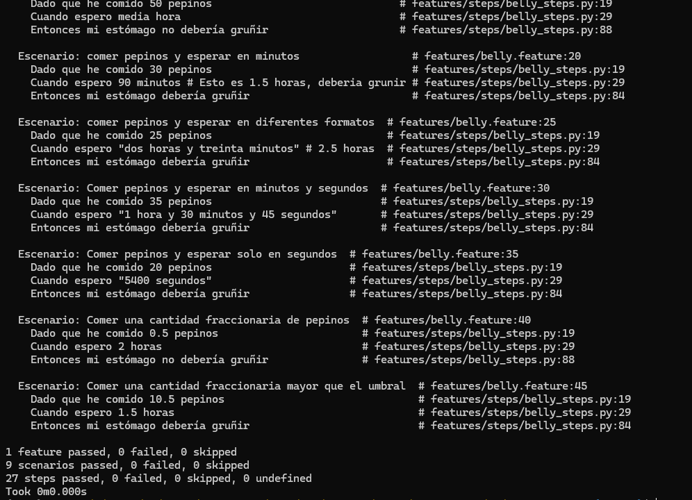
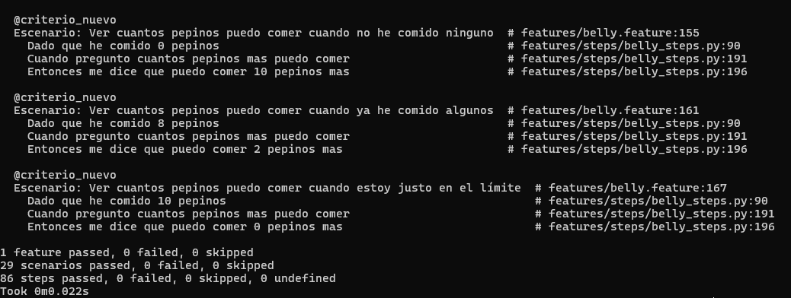

### Actividad: Pruebas BDD con behave en español

#### Ejercicio 1: **Añadir soporte para minutos y segundos en tiempos de espera**

> **Objetivo**  
> - Ampliar la funcionalidad para reconocer tiempos de espera expresados en horas, minutos y segundos.
> 
> **Instrucciones**  
> 1. **Modifica** la función que maneja el tiempo de espera en `steps.py` (o donde parsees el tiempo) para que acepte:
>   - "1 hora y 30 minutos"
>  - "90 minutos"
>   - "3600 segundos"
>   - **Variaciones** que incluyan segundos (por ejemplo, `"1 hora, 30 minutos y 45 segundos"`).
>2. **Implementa** un escenario de prueba en Gherkin (`belly.feature`) que valide que el estómago gruñe o no según estas variaciones de tiempo.
>3. **Considera** también crear pruebas unitarias con Pytest para la lógica de parsing (función que convierte el texto de tiempo en horas decimales).
>4. **En un entorno DevOps**:
>   - Agrega la ejecución de `behave` y `pytest` en tu *pipeline* de CI/CD, de modo que al hacer push de los cambios se ejecuten automáticamente las pruebas.
>
>**Ejemplo Gherkin**:
>```gherkin
>Escenario: Comer pepinos y esperar en minutos y segundos
>  Dado que he comido 35 pepinos
>  Cuando espero "1 hora y 30 minutos y 45 segundos"
>  Entonces mi estómago debería gruñir
>```

### Solucion:

Despues de realizar cambios en `belly_steps.py` 

- Se quitan los espacios con `strip` y se pasa a minusculas para procesar luego con regex:

- Se usa el patron de regex que permite obtener las palabras de union como `y`:

https://github.com/axvg/CC3S2/blob/21226d8175f9ba9ae0922bbca143b224ca089246/actividades/07/belly_project/features/steps/belly_steps.py#L25-L26


- Y los digitos en la medidas de tiempo como `horas` en grupos.

https://github.com/axvg/CC3S2/blob/21226d8175f9ba9ae0922bbca143b224ca089246/actividades/07/belly_project/features/steps/belly_steps.py#L38

- `minutos`

https://github.com/axvg/CC3S2/blob/21226d8175f9ba9ae0922bbca143b224ca089246/actividades/07/belly_project/features/steps/belly_steps.py#L47

- `segundos`

https://github.com/axvg/CC3S2/blob/21226d8175f9ba9ae0922bbca143b224ca089246/actividades/07/belly_project/features/steps/belly_steps.py#L56

y el escenario en `belly.feature`:

https://github.com/axvg/CC3S2/blob/72ab77a1b44caed885284f91e9f4df383cbd68da/actividades/07/belly_project/features/belly.feature#L35-L39


- Finalmente se suma los tiempos obtenidos (esto es importante para el caso de 5400 segundos porque se transforma a horas que es lo que la clase usa como tiempo)

https://github.com/axvg/CC3S2/blob/21226d8175f9ba9ae0922bbca143b224ca089246/actividades/07/belly_project/features/steps/belly_steps.py#L71

Este es el escenario descrito en el ejercicio.

Se obtienen los siguientes tests:


Esto demuestra el correcto uso de patrones de regex para obtener horas, minutos y segundos de manera separada. Al inicio se reemplaza los valores para limpiar inputs.


>#### Ejercicio 2: **Manejo de cantidades fraccionarias de pepinos**
>
>**Objetivo**  
>- Permitir que el sistema acepte cantidades fraccionarias de pepinos (decimales).
>
>**Instrucciones**  
>1. **Modifica** el sistema (la clase `Belly` y los steps en Behave) para que acepte entradas como `"0.5"`, `"2.75"`.
>2. **Implementa** un nuevo escenario en Gherkin donde se ingiera una cantidad fraccionaria y verifica el comportamiento.
>3. **Valida** que el sistema lance una excepción o error si se ingresa una cantidad negativa de pepinos.
>4. **Pruebas unitarias**:  
>   - Cubre el caso de pepinos fraccionarios en `test_belly.py`.
>   - Cubre también el caso de pepinos negativos (se espera un error).
>
>**Ejemplo Gherkin**:
>```gherkin
>Escenario: Comer una cantidad fraccionaria de pepinos
>  Dado que he comido 0.5 pepinos
>  Cuando espero 2 horas
>  Entonces mi estómago no debería gruñir
>```
>**En un entorno DevOps**:
>- Asegúrate de que la falla (excepción por valor negativo) sea reportada como *falla de build* si ocurre.  
>- Configura notificaciones (por correo/Slack/Teams) si alguna de las pruebas falla.
>

### Solucion:

- Se modifico el metodo step_given_eaten_cukes para aceptar valores flotantes:
- Se agrego conversion explicita a float
- Se añadio manejo para entradas que usan coma como separador decimal
- Se implemento manejo de excepciones para convertir correctamente los valores

https://github.com/axvg/CC3S2/blob/b33fc77885261e2d0176c330230df7820a7a8115/actividades/07/belly_project/features/steps/belly_steps.py#L22-L24

Aca se tomaron en cuenta los casos de `1.2` y `1,2` que habrian en los escenarios de belly.feature.

- Se agrego comprobacion de valores negativos en el metodo comer
- La validacion ocurre antes de procesar la cantidad

https://github.com/axvg/CC3S2/blob/b33fc77885261e2d0176c330230df7820a7a8115/actividades/07/belly_project/src/belly.py#L14-L15


- Se agregaron valores en el diccionario de numeros para manejar las pruebas de este ejercicio:

https://github.com/axvg/CC3S2/blob/b33fc77885261e2d0176c330230df7820a7a8115/actividades/07/belly_project/features/steps/belly_steps.py#L15

- Y se agrego este caso especial donde se tiene `media hora` de manera especifica:

https://github.com/axvg/CC3S2/blob/b33fc77885261e2d0176c330230df7820a7a8115/actividades/07/belly_project/features/steps/belly_steps.py#L37-L38

- Se agregaron escenarios para probar cantidades fraccionarias pequeñas (0.5) y otro para probar cantidades fraccionarias cercanas al umbral (10.5) junto con pruebas unitarias




> #### Ejercicio 3: **Soporte para idiomas múltiples (Español e Inglés)**
> 
> **Objetivo**  
> - Aceptar descripciones de tiempo en distintos idiomas (español e inglés).
> 
> **Instrucciones**  
> 1. **Modifica** el parsing de tiempo para que reconozca palabras clave en inglés, además de español (por ejemplo, `"two hours"`, `"thirty minutes"`).
> 2. **Escribe** al menos dos escenarios de prueba en Gherkin que usen tiempos en inglés.
> 3. **Implementa** una función que convierta las palabras en inglés a valores numéricos (similar a la que se usa para el español).
> 4. **En un pipeline DevOps**, podrías:
>    - Dividir los escenarios en distintos *tags* (`@spanish`, `@english`) y ejecutar cada conjunto en etapas diferentes, o en paralelo.
> 
> **Ejemplo Gherkin**:
> ```gherkin
> Escenario: Esperar usando horas en inglés
>   Dado que he comido 20 pepinos
>   Cuando espero "two hours and thirty minutes"
>   Entonces mi estómago debería gruñir
> ```

### Solucion:

Para este ejercicio, he implementado el soporte para interpretar tiempos en idiomas multiples (español e ingles)

- Se agrego un diccionario para palabras numericas en ingles (numeros_en)

https://github.com/axvg/CC3S2/blob/91f05a7e9b7440bcd2a59ae5afb758b7b38ae2ee/actividades/07/belly_project/features/steps/belly_steps.py#L18-L25

- Se modifico la funcion convertir_palabra_a_numero para buscar primero en español y luego en ingles

https://github.com/axvg/CC3S2/blob/91f05a7e9b7440bcd2a59ae5afb758b7b38ae2ee/actividades/07/belly_project/features/steps/belly_steps.py#L28-L31


- Se actualizo la expresion regular para reconocer "hours", "minutes", "seconds" y "and":

https://github.com/axvg/CC3S2/blob/91f05a7e9b7440bcd2a59ae5afb758b7b38ae2ee/actividades/07/belly_project/features/steps/belly_steps.py#L50

https://github.com/axvg/CC3S2/blob/91f05a7e9b7440bcd2a59ae5afb758b7b38ae2ee/actividades/07/belly_project/features/steps/belly_steps.py#L57

https://github.com/axvg/CC3S2/blob/91f05a7e9b7440bcd2a59ae5afb758b7b38ae2ee/actividades/07/belly_project/features/steps/belly_steps.py#L62

https://github.com/axvg/CC3S2/blob/91f05a7e9b7440bcd2a59ae5afb758b7b38ae2ee/actividades/07/belly_project/features/steps/belly_steps.py#L67

- En relacion al ejercio anterior, se añadio soporte para casos especiales como "half an hour":

https://github.com/axvg/CC3S2/blob/91f05a7e9b7440bcd2a59ae5afb758b7b38ae2ee/actividades/07/belly_project/features/steps/belly_steps.py#L47-L48

- Se crearon escenarios de prueba etiquetados con @english para validar la funcion

https://github.com/axvg/CC3S2/blob/91f05a7e9b7440bcd2a59ae5afb758b7b38ae2ee/actividades/07/belly_project/features/belly.feature#L50-L60


Estos escenarias quedan correctos con los nuevos cambios de regex y metodo en belly_steps.py.


> #### Ejercicio 4: **Manejo de tiempos aleatorios**
> 
> **Objetivo**  
> - Permitir ingresar rangos de tiempo (por ejemplo, "entre 1 y 3 horas") y escoger un tiempo aleatorio dentro de ese rango.
> 
> **Instrucciones**  
> 1. **Crea** una función que, dada una expresión como "entre 1 y 3 horas", devuelva un valor aleatorio entre 1 y 3 horas.
> 2. **Implementa** un escenario en Gherkin que verifique que, tras comer pepinos y esperar un tiempo aleatorio, el estómago puede gruñir.
> 3. **Imprime** (en consola o logs) el tiempo aleatorio elegido para que el resultado sea rastreable en tu pipeline.
> 4. **En un pipeline DevOps**:  
>    - Considera utilizar un *seed* de aleatoriedad fijo para evitar *flakiness* (tests intermitentes).  
>    - O, si manejas aleatoriedad real, acepta el riesgo de pruebas no deterministas y monitorea cuidadosamente.
> 
> **Ejemplo Gherkin**:
> ```gherkin
> Escenario: Comer pepinos y esperar un tiempo aleatorio
>   Dado que he comido 25 pepinos
>   Cuando espero un tiempo aleatorio entre 1 y 3 horas
>   Entonces mi estómago debería gruñir
> ```

### Solucion

- Se creo una funcion `generar_tiempo_aleatorio` que produce un valor decimal aleatorio entre dos limites, este usa la dependencia `random` (nativa para python).

https://github.com/axvg/CC3S2/blob/ee448f6f1f607409a88a6b30bb86f1d2ea15fdb0/actividades/07/belly_project/features/steps/belly_steps.py#L7-L10

- Se añadio una expresion regular para detectar patrones como "entre X y Y horas" en español e ingles (between).

https://github.com/axvg/CC3S2/blob/ea95ddcc3f0aeec79b9101cc3ce6a7fda2b5c6f5/actividades/07/belly_project/features/steps/belly_steps.py#L111-L114


- Se establecio una semilla fija (random.seed(99)) para garantizar pruebas deterministas.

https://github.com/axvg/CC3S2/blob/ea95ddcc3f0aeec79b9101cc3ce6a7fda2b5c6f5/actividades/07/belly_project/features/steps/belly_steps.py#L109


- Se implemento conversion a horas para los diferentes tipos de unidades (horas, minutos, segundos)

https://github.com/axvg/CC3S2/blob/ea95ddcc3f0aeec79b9101cc3ce6a7fda2b5c6f5/actividades/07/belly_project/features/steps/belly_steps.py#L137-L154

- Cada patron toma los numeros (digital y palabras) de las unidades de tiempo hora, minuto y segudno. Por ejemplo para hora toma los digitos o palabra despues de una cantidad de espacios hasta encontrar `hours`, `horas`, o `h` (en caso de horas) y para los minutos y segundos igual usando sus terminos en ingles, español e iniciales.

- Se agregaron los escenarios para probar estos cambios:

https://github.com/axvg/CC3S2/blob/ea95ddcc3f0aeec79b9101cc3ce6a7fda2b5c6f5/actividades/07/belly_project/features/belly.feature#L77-L87


- Las pruebas verifican el correcto uso de estos casos.

> #### Ejercicio 5: **Validación de cantidades no válidas**
> 
> **Objetivo**  
> - Manejar y reportar adecuadamente errores al ingresar cantidades no válidas.
> 
> **Instrucciones**  
> 1. **Añade** validaciones para evitar que el usuario ingrese < 0 pepinos o > 100 pepinos.
> 2. **Modifica** la lógica para arrojar un error (excepción) si la cantidad no es válida.
> 3. **Implementa** un escenario de prueba que verifique el comportamiento de error.
> 4. **En tu pipeline**, verifica que la excepción se maneje y el test falle de manera controlada si el sistema no lanza la excepción esperada.
> 
> **Ejemplo Gherkin**:
> ```gherkin
> Escenario: Manejar una cantidad no válida de pepinos
>   Dado que he comido -5 pepinos
>   Entonces debería ocurrir un error de cantidad negativa.
> ```

### Solucion

Para esto igual al ejercicio anterior se cambio agrego un tag para behave y se modifico el metod comer:

- Se modifico el metodo belly.py en Belly para validar el rango de pepinos <0, 100>.

https://github.com/axvg/CC3S2/blob/ea95ddcc3f0aeec79b9101cc3ce6a7fda2b5c6f5/actividades/07/belly_project/src/belly.py#L15-L18

- Se actualizo el metodo `step_given_eaten_cukes` en belly_steps.py para manejar errores usando `try` y `except`.

https://github.com/axvg/CC3S2/blob/ea95ddcc3f0aeec79b9101cc3ce6a7fda2b5c6f5/actividades/07/belly_project/features/steps/belly_steps.py#L101-L102


- Se crearon escenarios de prueba en Gherkin con etiqueta @validacion

https://github.com/axvg/CC3S2/blob/ea95ddcc3f0aeec79b9101cc3ce6a7fda2b5c6f5/actividades/07/belly_project/features/belly.feature#L89-L97


- Para estos dos nuevos escenarios, la ejecucion esta correcta cumpliendo con los requerimientos.

#### Ejercicio 6: **Escalabilidad con grandes cantidades de pepinos**

**Objetivo**  
- Asegurar que el sistema no falle ni se ponga lento con cantidades y tiempos muy grandes.

**Instrucciones**  
1. **Añade** soporte para manejar cantidades de pepinos como 1000 (más allá del límite de validación anterior, o ajusta ese límite para pruebas internas).
2. **Implementa** un escenario en Gherkin para comer 1000 pepinos y esperar 10 horas.
3. **Verifica** que el sistema sigue comportándose correctamente (sin timeouts ni errores de rendimiento).
4. **En un pipeline DevOps**:
   - Ejecuta pruebas de estrés o de larga duración (puedes simular) para garantizar la robustez.
   - Mide el tiempo de ejecución para asegurarte de que no aumente drásticamente.

**Ejemplo Gherkin**:
```gherkin
Escenario: Comer 1000 pepinos y esperar 10 horas
  Dado que he comido 1000 pepinos
  Cuando espero 10 horas
  Entonces mi estómago debería gruñir
```

Para esto se realizaron los siguientes:
- Se modifico el metodo step_given_eaten_cukes en belly_steps para agregar "estres" en tags

https://github.com/axvg/CC3S2/blob/ee448f6f1f607409a88a6b30bb86f1d2ea15fdb0/actividades/07/belly_project/features/steps/belly_steps.py#L91

https://github.com/axvg/CC3S2/blob/ee448f6f1f607409a88a6b30bb86f1d2ea15fdb0/actividades/07/belly_project/features/steps/belly_steps.py#L97-L99

- Este paso toma como input si se tiene el tag @estres para usarlo en el metodo `comer` cambiado:

https://github.com/axvg/CC3S2/blob/ee448f6f1f607409a88a6b30bb86f1d2ea15fdb0/actividades/07/belly_project/src/belly.py#L17-L21

- Se creo el escenario de prueba en Gherkin con etiqueta @estres

https://github.com/axvg/CC3S2/blob/ee448f6f1f607409a88a6b30bb86f1d2ea15fdb0/actividades/07/belly_project/features/belly.feature#L99-L103


- El nuevo escenario se ejecuta de manera correcta.

> #### Ejercicio 7: **Descripciones de tiempo complejas**
> 
> **Objetivo**  
> - Ampliar la lógica para manejar descripciones avanzadas tipo `"1 hora, 30 minutos y 45 segundos"`.
> 
> **Instrucciones**  
> 1. **Refuerza** la expresión regular y parsing para que soporte múltiples separadores (comas, "y", espacios, etc.).
> 2. **Implementa** escenarios que cubran al menos 2-3 variaciones complejas en Gherkin.
> 3. **Valida** que el total en horas sea exacto (suma de horas, minutos, segundos).
> 4. **En un pipeline**:  
>    - Puedes analizar la cobertura de pruebas (coverage) para asegurarte de que la nueva lógica de parsing está completamente testeada.
> 
> **Ejemplo Gherkin**:
> ```gherkin
> Escenario: Manejar tiempos complejos
>   Dado que he comido 50 pepinos
>   Cuando espero "1 hora, 30 minutos y 45 segundos"
>   Entonces mi estómago debería gruñir
> ```

### Solucion 

- Se actualizo el pattern para obtener horas, minutos y segundos en ambos idiomas (usando "y" o "and" por ejemplo)

https://github.com/axvg/CC3S2/blob/ee448f6f1f607409a88a6b30bb86f1d2ea15fdb0/actividades/07/belly_project/features/steps/belly_steps.py#L111-L114

- Se agregaron 2 escenarios en belly.feature, estos tienen tiempos complejos como el descrito en el ejercicio en ambos escenarios.

https://github.com/axvg/CC3S2/blob/ee448f6f1f607409a88a6b30bb86f1d2ea15fdb0/actividades/07/belly_project/features/belly.feature#L105-L113


- Los nuevos escenarios BDD se ejecutan correctamente.

> #### Ejercicio 8: **De TDD a BDD – Convertir requisitos técnicos a pruebas en Gherkin**
> 
> **Objetivo**  
> - Practicar el paso de una prueba unitaria técnica a un escenario BDD comprensible por el negocio.
> 
> **Instrucciones**  
> 1. **Escribe** un test unitario básico con Pytest que valide que si se han comido más de 10 pepinos y se espera 2 horas, el estómago gruñe.
> 2. **Convierte** ese test unitario en un escenario Gherkin, con la misma lógica, pero más orientado al usuario.
> 3. **Implementa** los pasos en Behave (si no existen).
> 4. **En un pipeline DevOps**:
>    - Ejecuta primero los tests unitarios (rápidos) y luego los tests de Behave (que pueden ser más lentos y de nivel de integración).
> 
> **Ejemplo de test unitario** (TDD):
> ```python
> def test_gruñir_si_comido_muchos_pepinos():
>     belly = Belly()
>     belly.comer(15)
>     belly.esperar(2)
>     assert belly.esta_gruñendo() == True
> ```
> 
> **Ejemplo Gherkin** (BDD):
> ```gherkin
> Escenario: Comer muchos pepinos y esperar el tiempo suficiente
>   Dado que he comido 15 pepinos
>   Cuando espero 2 horas
>   Entonces mi estómago debería gruñir
> ```

### Solucion

- Se implemento un test unitario en test_belly.py que valida el comportamiento del estomago con el caso del ejercicio.

https://github.com/axvg/CC3S2/blob/c7da1851a2257f3794666751b8b670f0d965fde7/actividades/07/belly_project/tests/test_belly.py#L107-L111

- Se tradujo este comportamiento a un escenario BDD en belly.feature.

https://github.com/axvg/CC3S2/blob/c7da1851a2257f3794666751b8b670f0d965fde7/actividades/07/belly_project/features/belly.feature#L115-L118

- Aca se prueba el mismo escenario pero usando BDD, se puede ver la misma cantidad de pepinos (15) y la misma cantidad de horas esperado (2).

- Se actualizo el pipeline de CI/CD para ejecutar primero pytest y luego behave.

https://github.com/axvg/CC3S2/blob/c7da1851a2257f3794666751b8b670f0d965fde7/.github/workflows/act07ci.yml#L31-L43


- Las pruebas y escenarios corren correctamente con los nuevos cambios.

> #### Ejercicio 9: **Identificación de criterios de aceptación para historias de usuario**
> 
> **Objetivo**  
> - Traducir una historia de usuario en criterios de aceptación claros y escenarios BDD.
> 
> **Instrucciones**  
> 1. **Toma** la historia de usuario:  
>    > "Como usuario que ha comido pepinos, quiero saber si mi estómago va a gruñir después de esperar un tiempo suficiente, para poder tomar una acción."
> 2. **Identifica** los criterios de aceptación (por ejemplo, cuántos pepinos y cuánto tiempo se debe esperar).
> 3. **Escribe** escenarios Gherkin que reflejen esos criterios.
> 4. **Implementa** los pasos en Behave.
> 5. **En un pipeline**:
>    - Asegúrate de vincular (por ejemplo, en GitLab Issues o GitHub Issues) los escenarios con la historia de usuario para tener *traceability* (rastreabilidad).
> 
> **Ejemplo de escenarios Gherkin**:
> ```gherkin
> Escenario: Comer suficientes pepinos y esperar el tiempo adecuado
>   Dado que he comido 20 pepinos
>   Cuando espero 2 horas
>   Entonces mi estómago debería gruñir
> 
> Escenario: Comer pocos pepinos y no esperar suficiente tiempo
>   Dado que he comido 5 pepinos
>   Cuando espero 1 hora
>   Entonces mi estómago no debería gruñir
> ```

### Solucion

- Se agregaron 3 escenarios en belly.feature que cubren casos distintos: con pocos, suficientes y muchos pepinos y esperando 2 o 1 horas.
- Se vinculo estos escenarios con la historia de usuario usando tags.

https://github.com/axvg/CC3S2/blob/c7da1851a2257f3794666751b8b670f0d965fde7/actividades/07/belly_project/features/belly.feature#L115-L130


> #### Ejercicio 10: **Escribir pruebas unitarias antes de escenarios BDD**
> 
> **Objetivo**  
> - Demostrar la secuencia TDD (tests unitarios) → BDD (escenarios).
> 
> **Instrucciones**  
> 1. **Escribe** un test unitario para una nueva función, por ejemplo, `pepinos_comidos()`, que retorna el total de pepinos ingeridos.
> 2. **Crea** un escenario Gherkin que describe este comportamiento desde el punto de vista del usuario.
> 3. **Implementa** los pasos en Behave y verifica que pase la misma validación.
> 4. **En un pipeline**:  
>    - Ejecución secuencial: 1) Pytest, 2) Behave.  
>    - O en etapas separadas para un mejor feedback.
> 
> **Ejemplo de test unitario**:
> ```python
> def test_pepinos_restantes():
>     belly = Belly()
>     belly.comer(15)
>     assert belly.pepinos_comidos == 15
> ```
> 
> **Ejemplo Gherkin**:
> ```gherkin
> Escenario: Saber cuántos pepinos he comido
>   Dado que he comido 15 pepinos
>   Entonces debería haber comido 15 pepinos
> ```

### Solucion

- Se creo el test unitario en test_belly.py para esta funcion (TDD).

https://github.com/axvg/CC3S2/blob/c7da1851a2257f3794666751b8b670f0d965fde7/actividades/07/belly_project/tests/test_belly.py#L134-L141

- Se implemento la nueva funcion pepinos_comidos(), ademas se cambio al propiedad pepinos_comidos a _pepinos_comidos, (esta funcion seria un getter).

https://github.com/axvg/CC3S2/blob/c7da1851a2257f3794666751b8b670f0d965fde7/actividades/07/belly_project/src/belly.py#L39-L40


- Primero, se escribo la prueba unitaria, luego el requirimiento y finalmente el escenario BDD, con estos cambios las pruebas corren correctamente.

> #### Ejercicio 11: **Refactorización guiada por TDD y BDD**
> 
> **Objetivo**  
> - Refactorizar código existente sin romper funcionalidades, validado por pruebas unitarias y escenarios BDD.
> 
> **Instrucciones**  
> 1. **Elige** una funcionalidad ya existente (por ejemplo, `esta_gruñendo()`).
> 2. **Escribe** (o asegura que existen) pruebas unitarias que cubran los casos clave.  
> 3. **Refactoriza** el código (`Belly` o funciones auxiliares) para mejorar eficiencia, legibilidad o reducir duplicación.
> 4. **Valida** que todas las pruebas unitarias y escenarios BDD siguen pasando sin cambios.
> 5. **En un pipeline**:
>    - Activa la medición de **coverage** para asegurarte de que la refactorización no rompa funcionalidades no cubiertas.
> 
> **Ejemplo de test unitario**:
> ```python
> def test_estomago_gruñendo():
>     belly = Belly()
>     belly.comer(20)
>     belly.esperar(2)
>     assert belly.esta_gruñendo() == True
> ```
> 
> **Ejemplo Gherkin**:
> ```gherkin
> Escenario: Verificar que el estómago gruñe tras comer suficientes pepinos y esperar
>   Dado que he comido 20 pepinos
>   Cuando espero 2 horas
>   Entonces mi estómago debería gruñir
> ```

### Solucion

- Se refactoriza para las mejorar de eficiencia y legibilidad, agregando variables para lo ultimo.

https://github.com/axvg/CC3S2/blob/c7da1851a2257f3794666751b8b670f0d965fde7/actividades/07/belly_project/src/belly.py#L30-L37

- Aca la refactorizacion ayuda a la mejor legibilidad puesto que el valor retornado (booleano) se lee de manera mas facil. Para esto se definidio dos variables en mayusculas (ya que son constantes en el proyecto) y dos variables que chequean la condicion para que el estomago gruña.

- Se agregan 5 casos para test unitarios de este metodo, estos cubren cuando hay o no suficientes pepinos y el tiempo fue suficiente, justo o excesivo.

https://github.com/axvg/CC3S2/blob/c7da1851a2257f3794666751b8b670f0d965fde7/actividades/07/belly_project/tests/test_belly.py#L40-L73


- Con esta refactorizacion, las pruebas corren satisfactoriamente.

> #### Ejercicio 12: **Ciclo completo de TDD a BDD – Añadir nueva funcionalidad**
> 
> **Objetivo**  
> - Desarrollar una nueva funcionalidad *desde cero* con TDD (prueba unitaria) y BDD (escenarios Gherkin).
> 
> **Instrucciones**  
> 1. **Imagina** una nueva funcionalidad, por ejemplo, "Predecir si el estómago gruñirá con una cantidad dada de pepinos y un tiempo de espera".
> 2. **Escribe** primero la prueba unitaria.
> 3. **Conviértelo** en una historia de usuario y escribe el escenario BDD.
> 4. **Implementa** y verifica que tanto la prueba unitaria como el escenario Gherkin pasen.
> 5. **En tu pipeline**, revisa que no haya *regresiones* en otros tests.
> 
> **Ejemplo de test unitario**:
> ```python
> def test_estomago_predecir_gruñido():
>     belly = Belly()
>     belly.comer(12)
>     belly.esperar(1.5)
>     assert belly.esta_gruñendo() == True
> ```
> 
> **Ejemplo Gherkin**:
> ```gherkin
> Escenario: Predecir si mi estómago gruñirá tras comer y esperar
>   Dado que he comido 12 pepinos
>   Cuando espero 1.5 horas
>   Entonces mi estómago debería gruñir
> ```

### Solucion

Para este ejercicio se agregara la funcion predecir_gruñido que tendra como argumento un tiempo adicional

https://github.com/axvg/CC3S2/blob/cdb08abac8614c5684c531de672f778be1306477/actividades/07/belly_project/src/belly.py#L42-L48

- La idea de este metodo es agregar el `tiempo_adicional` al `tiempo_esperado` y ver si para ese tiempo sumado el estomago gruñira

- Se agregaron pasos en belly_steps.py para el nuevo escenario BDD.

https://github.com/axvg/CC3S2/blob/cdb08abac8614c5684c531de672f778be1306477/actividades/07/belly_project/features/steps/belly_steps.py#L210-L224

- Aqui obtenemos el tiempo del archivo `belly.feature` y lo usamos como input para el metodo definido `predecir_gruñido`

https://github.com/axvg/CC3S2/blob/cdb08abac8614c5684c531de672f778be1306477/actividades/07/belly_project/features/belly.feature#L143-L146


- Con estos cambios, los escenarios y pruebas unitarios pasan correctamente.

> #### Ejercicio 13: **Añadir criterios de aceptación claros**
> 
> **Objetivo**  
> - Definir con precisión los criterios de aceptación de una nueva funcionalidad y plasmarlos en Gherkin.
> 
> **Instrucciones**  
> 1. **Define** una nueva historia de usuario (por ejemplo, "Ver cuántos pepinos me faltan para gruñir").
> 2. **Identifica** al menos 2-3 criterios de aceptación.
> 3. **Convierte** esos criterios en escenarios BDD.
> 4. **Implementa** los pasos.  
> 5. **En un pipeline**, agrupa los escenarios bajo un mismo *tag* (`@criterio_nuevo`) para ejecutarlos juntos.
> 
> **Ejemplo**:
> ```gherkin
> Escenario: Ver cuántos pepinos puedo comer antes de que el estómago gruña
>   Dado que he comido 8 pepinos
>   Cuando pregunto cuántos pepinos más puedo comer
>   Entonces debería decirme que puedo comer 2 pepinos más
> ```

### Solucion

La historia de usuario para este ejercicio sera:
"Como usuario que ha comido pepinos, quiero saber cuantos pepinos mas puedo comer antes de que mi estomago gruña."

- Se agrego un test unitario para el nuevo metodo que se creara pepinos_restantes que nos dara el numero de pepinos que pide el usuario.

https://github.com/axvg/CC3S2/blob/cdb08abac8614c5684c531de672f778be1306477/actividades/07/belly_project/tests/test_belly.py#L134-L141

- Aca se comen 10 pepinos pero en partes de tal manera que al final el numero restante debe ser cero.

- Se define este metodo en belly.py.

https://github.com/axvg/CC3S2/blob/cdb08abac8614c5684c531de672f778be1306477/actividades/07/belly_project/src/belly.py#L50-L53

- Aca el orden es importante puesto que primero se escribe el test y luego la funcionalidad (TDD).

- Se definieron 3 escenarios BDD en belly.feature con el tag @criterio_nuevo.

https://github.com/axvg/CC3S2/blob/cdb08abac8614c5684c531de672f778be1306477/actividades/07/belly_project/features/belly.feature#L154-L170

- Estos nuevos escenarios junto con las pruebas unitarias corren correctamente.





> #### Ejercicio 14: **Integración con Mocking, Stubs y Fakes (para DevOps)**
> 
> **Objetivo**  
> - Demostrar cómo inyectar dependencias simuladas en tu clase `Belly` y usarlas en pruebas BDD y TDD.
> 
> **Instrucciones**  
> 1. **Crea** un archivo `clock.py` (por ejemplo) con una función `get_current_time()`.
> 2. **Modifica** `Belly` para aceptar un `clock_service` opcional que se inyecta.
> 3. **Crea** un test unitario con Pytest que use `unittest.mock` para simular el paso del tiempo.
> 4. **En Behave**, usa `environment.py` para inyectar un mock o stub del reloj en el `before_scenario`.
> 5. **En un pipeline DevOps**:
>    - Asegúrate de no depender de la hora real, así evitas inestabilidad en las pruebas.
> 
> **Ejemplo**:
> ```python
> def before_scenario(context, scenario):
>     from unittest.mock import MagicMock
>     from src.belly import Belly
>     
>     fake_clock = MagicMock()
>     fake_clock.return_value = 10000  # tiempo fijo
>     context.belly = Belly(clock_service=fake_clock)
> ```

### Solucion

- Se agrego el metodo get_curren_time de la libreria time para obtener el tiempo actual en segundos

https://github.com/axvg/CC3S2/blob/cdb08abac8614c5684c531de672f778be1306477/actividades/07/belly_project/src/clock.py#L1-L5


- Se agrega como servicio a la clase en belly.py, se importa get_current_time por si no se agrega el servicio como en test unitarios anteriores

https://github.com/axvg/CC3S2/blob/cdb08abac8614c5684c531de672f778be1306477/actividades/07/belly_project/src/belly.py#L9

- Se realizo mocks y un test unitario usando el servicio

https://github.com/axvg/CC3S2/blob/cdb08abac8614c5684c531de672f778be1306477/actividades/07/belly_project/tests/test_belly.py#L144-L148


- Se agrego pasos y modifico environment con el codigo que estaba como ejemplo para el nuevo escenario

https://github.com/axvg/CC3S2/blob/cdb08abac8614c5684c531de672f778be1306477/actividades/07/belly_project/features/environment.py#L6-L28


Con estos cambios los tests unitarios y los escenarios corrieron crrectamente.

> #### Ejercicio 15: **Despliegue y validación continua en un entorno de integración (CI/CD)**
> 
> **Objetivo**  
> - Completar el ciclo DevOps: Cada push al repositorio **desencadena** pruebas automáticas BDD y TDD.
> 
> **Instrucciones**  
> 1. **Configura** un pipeline (por ejemplo, en GitHub Actions o GitLab CI) con estos pasos:
>    - Instalar dependencias (Python, Behave, Pytest).
>    - Ejecutar pruebas unitarias (Pytest).
>    - Ejecutar pruebas de comportamiento (Behave).
>    - Generar reportes (HTML, JUnit) y publicarlos como *artifacts*.
> 2. **Incluye** verificación de calidad de código (por ejemplo, flake8 o black).
> 3. **Al aprobarse** el pipeline, **despliega** (si corresponde) tu aplicación o *script* a un entorno de staging/producción.

### Solucion

- Se creo el archivo .github/workflows/act07ci.yml que corre los tests unitarios y pruebas de comportamiento.

https://github.com/axvg/CC3S2/blob/ee448f6f1f607409a88a6b30bb86f1d2ea15fdb0/.github/workflows/act07ci.yml#L1-L22

- Los jobs definidos en el pipeline se ejecuta en `ubuntu` y cada vez que se realizan push al directorio donde se encuentra esta actividad `actividades/07/*` (esto para evitar dispararlo constantemente), ademas los tests unitarios y escenarios BDD usan como directorio de trabajo la misma ruta (junto con la instalacion de dependencias).

- Los reportes se presentan en artifacts despues de correr cada pipeline, ademas estos pueden mostrar el error que ocurre en los tests ya que se usa `continue-on-error: true`


- Esto debido al siguiente job definido para subir los reportes originados por los jobs de pruebas:

https://github.com/axvg/CC3S2/blob/ee448f6f1f607409a88a6b30bb86f1d2ea15fdb0/.github/workflows/act07ci.yml#L75-L79

---

> #### Referencias
> 
> - [Documentación de Behave](https://behave.readthedocs.io/en/latest/)
> - [Referencia de Gherkin](https://cucumber.io/docs/gherkin/reference/)
> - [Desarrollo Dirigido por Comportamiento (BDD) en Wikipedia](https://es.wikipedia.org/wiki/Desarrollo_guiado_por_pruebas#Desarrollo_guiado_por_el_comportamiento)
> 
> #### Notas adicionales
> 
> - **Idioma**: Asegúrate de que todos los archivos `.feature` comienzan con `# language: es` para indicar que los pasos están en español.
> - **Codificación**: Guarda todos los archivos en formato UTF-8 para evitar problemas con caracteres especiales.
> - **Versión de Behave**: Se recomienda utilizar la última versión de Behave para garantizar el soporte completo del idioma español.