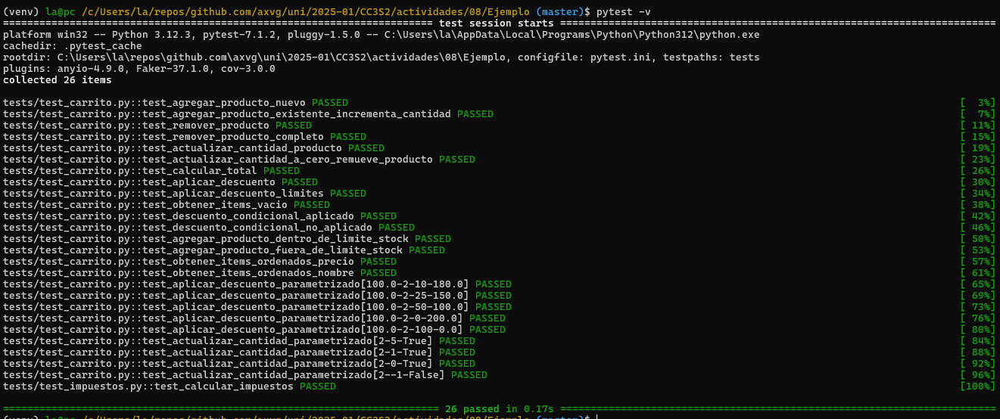

### Actividad: El patrón Arrange-Act-Assert

---
#### Ejercicios

<details>
<summary><h2>Ejercicio 1: Método para vaciar el carrito</h2></summary>
 
 **Objetivo:**  
 Implementa en la clase `Carrito` un método llamado `vaciar()` que elimine todos los items del carrito. Luego, escribe pruebas siguiendo el patrón AAA para verificar que, al vaciar el carrito, la lista de items quede vacía y el total sea 0.
 
 **Pistas:**
 - Agrega el método `vaciar` en `src/carrito.py` que realice `self.items = []`, se vacia la lista.
</details>

### Solucion

- Se agrega el método `vaciar` en la clase Carrito que vacia la lista.

https://github.com/axvg/CC3S2/blob/88b1b61626d0f6e0c1f03c2f58c7b7aef965c609/actividades/08/Ejemplo/src/carrito.py#L103-L107

- Crea pruebas en `tests/test_carrito.py` que agreguen varios productos, invoquen `vaciar()` y verifiquen que `obtener_items()` retorne una lista vacía y `calcular_total()` retorne 0.

https://github.com/axvg/CC3S2/blob/88b1b61626d0f6e0c1f03c2f58c7b7aef965c609/actividades/08/Ejemplo/tests/test_carrito.py#L191-L213


- Con estos cambios las pruebas unitarias corren correctamente.

<details>
<summary> Ejercicio 2: Descuento por compra mínima</summary>

**Objetivo:**  
Amplía la lógica del carrito para aplicar un descuento solo si el total supera un monto determinado. Por ejemplo, si el total es mayor a \$500, se aplica un 15% de descuento.

**Pistas:**
- Agrega un nuevo método, por ejemplo, `aplicar_descuento_condicional(porcentaje, minimo)` en la clase `Carrito` que primero verifique si `calcular_total() >= minimo`.  
- Si se cumple la condición, aplica el descuento; de lo contrario, retorna el total sin descuento.
- Escribe pruebas para ambos escenarios (condición cumplida y no cumplida).
</details>

### Solucion

- Se agrega el metodo para aplicar descuentos, con los valores 15% y \$500 como define el ejercicio si no se cumple este monto no hay descuento:

https://github.com/axvg/CC3S2/blob/78478da27e56a2c69cbb215a6b554d3c56830eed/actividades/08/Ejemplo/src/carrito.py#L99-L106

- Se agrega dos test unitarios, uno para cuando se cumple, siguiendo el patron AAA y comentarios (como los tests que estaban de ejemplo):

https://github.com/axvg/CC3S2/blob/88b1b61626d0f6e0c1f03c2f58c7b7aef965c609/actividades/08/Ejemplo/tests/test_carrito.py#L216-L234

- El otro test unitario es cuando se tiene un monto menor \$400:

https://github.com/axvg/CC3S2/blob/88b1b61626d0f6e0c1f03c2f58c7b7aef965c609/actividades/08/Ejemplo/tests/test_carrito.py#L237-L255


- Con estos cambios y los tests se ejecutan sin errores.

<details>
<summary>Ejercicio 3: Manejo de stock en producto</summary>

**Objetivo:**  
Modifica la clase `Producto` para que incluya un atributo `stock` (cantidad disponible). Luego, actualiza el método `agregar_producto` en `Carrito` para que verifique que no se agregue una cantidad mayor a la disponible en stock. Si se intenta agregar más, se debe lanzar una excepción.

**Pistas:**
- Modifica `Producto` en `src/carrito.py` añadiendo `self.stock = stock` en el constructor y actualiza la fábrica en `src/factories.py` para que genere un stock (por ejemplo, entre 1 y 100).
- En `Carrito.agregar_producto`, antes de agregar o incrementar la cantidad, verifica que la suma de cantidades en el carrito no supere el `stock` del producto.
- Escribe pruebas que verifiquen:
  - Se puede agregar un producto dentro del límite de stock.
  - Se lanza una excepción al intentar agregar más unidades de las disponibles.
</details>

### Solucion

- Se agrega la clase Producto con el atributo `stock` y se actualiza su `factory` usando un valor aletario entre 1 y 100:

https://github.com/axvg/CC3S2/blob/88b1b61626d0f6e0c1f03c2f58c7b7aef965c609/actividades/08/Ejemplo/src/carrito.py#L3-L7

https://github.com/axvg/CC3S2/blob/88b1b61626d0f6e0c1f03c2f58c7b7aef965c609/actividades/08/Ejemplo/src/factories.py#L12

- Adicionalmente se agrega una validacion para el metodo `agregar_producto` de Carrito que envia un error si se quiere sobrepasar el stock del producto:

https://github.com/axvg/CC3S2/blob/88b1b61626d0f6e0c1f03c2f58c7b7aef965c609/actividades/08/Ejemplo/src/carrito.py#L33-L34

- Se agregan pruebas unitarias, cuando se tiene stock suficiente:

https://github.com/axvg/CC3S2/blob/88b1b61626d0f6e0c1f03c2f58c7b7aef965c609/actividades/08/Ejemplo/tests/test_carrito.py#L258-L275

- Y cuando no se tiene se verifica que se obtiene `ValueError`:

https://github.com/axvg/CC3S2/blob/88b1b61626d0f6e0c1f03c2f58c7b7aef965c609/actividades/08/Ejemplo/tests/test_carrito.py#L290-L291


- Estos tests se ejecutan correctamente. 

<details>
<summary> Ejercicio 4: Ordenar items del carrito </summary>

**Objetivo:**  
Agrega un método en `Carrito` que devuelva la lista de items ordenados por un criterio (por ejemplo, por precio unitario o por nombre del producto).

**Pistas:**
- Crea un método `obtener_items_ordenados(criterio: str)` donde `criterio` pueda ser `"precio"` o `"nombre"`.
- Utiliza la función `sorted()` con una función lambda para ordenar según el criterio.
- Escribe pruebas que verifiquen que, al agregar varios productos, la lista devuelta esté ordenada correctamente según el criterio solicitado.
</details>

### Solucion

- Se crea el metodo para ordenar items en Carrito `obtener_items_ordenados(criterio: str)`:

https://github.com/axvg/CC3S2/blob/88b1b61626d0f6e0c1f03c2f58c7b7aef965c609/actividades/08/Ejemplo/src/carrito.py#L118-L128

- Para ordenar se usan dos funciones lambda, que usa la funcion `sorted` de python y dos criterios `precio` o `nombre`

https://github.com/axvg/CC3S2/blob/88b1b61626d0f6e0c1f03c2f58c7b7aef965c609/actividades/08/Ejemplo/src/carrito.py#L124

https://github.com/axvg/CC3S2/blob/88b1b61626d0f6e0c1f03c2f58c7b7aef965c609/actividades/08/Ejemplo/src/carrito.py#L126

- Se agregan dos tests para cada caso, primero para precio, aca para `assert` se usan indices y se prueba que la lista esta ordenada.

https://github.com/axvg/CC3S2/blob/88b1b61626d0f6e0c1f03c2f58c7b7aef965c609/actividades/08/Ejemplo/tests/test_carrito.py#L298-L320

- Se realiza lo mismo pero para el nombre:

https://github.com/axvg/CC3S2/blob/88b1b61626d0f6e0c1f03c2f58c7b7aef965c609/actividades/08/Ejemplo/tests/test_carrito.py#L323-L345


- Ambas pruebas unitarias se ejecutan correctamente.

<details>
<summary> Ejercicio 5: Uso de Pytest Fixtures </summary>

**Objetivo:**  
Refactoriza las pruebas para que utilicen **fixtures** de Pytest, de modo que se reutilicen instancias comunes de `Carrito` o de productos.

**Pistas:**
- En el archivo `tests/conftest.py`, crea una fixture para un carrito vacío:
  ```python
  import pytest
  from src.carrito import Carrito

  @pytest.fixture
  def carrito():
      return Carrito()
  ```
- Crea también una fixture para un producto genérico, usando la fábrica:
  ```python
  import pytest
  from src.factories import ProductoFactory

  @pytest.fixture
  def producto_generico():
      return ProductoFactory(nombre="Genérico", precio=100.0)
  ```
</details>

### Solucion

- Se agrego conftest.py con 3 fixtures. Los dos primeros fueron usados junto con factory debido a que se necesitaba comparar valores que se setean en cada test. Estos fixtures nos permite usarlos como argumentos en las funciones `test_*()`

https://github.com/axvg/CC3S2/blob/4ba155498ee6d5ee83b76e162136238b28f57a02/actividades/08/Ejemplo/tests/conftest.py#L6-L13

- El ultimo fue usado para un test en especifico puesto que se necesitan productos en especifico:

https://github.com/axvg/CC3S2/blob/4ba155498ee6d5ee83b76e162136238b28f57a02/actividades/08/Ejemplo/tests/conftest.py#L16-L23

- Actualiza las pruebas existentes para usar estas fixtures en lugar de instanciar los objetos directamente en cada test. Ejemplo en un test que usa fixture `carrito` y `producto`:

https://github.com/axvg/CC3S2/blob/4ba155498ee6d5ee83b76e162136238b28f57a02/actividades/08/Ejemplo/tests/test_carrito.py#L28-L44


<details>

<summary> Ejercicio 6: Pruebas parametrizadas </summary>

**Objetivo:**  
Utiliza la marca `@pytest.mark.parametrize` para crear pruebas que verifiquen múltiples escenarios de descuento o actualización de cantidades.

**Pistas:**
- Por ejemplo, parametriza pruebas para `aplicar_descuento` usando distintos porcentajes y totales esperados.
- De igual forma, para actualizar cantidades: prueba con diferentes valores (válidos e inválidos) y verifica que se lance la excepción en los casos correspondientes.

</details>


### Solucion

- Se agrega 1 test parametrizado para el descuento del carrito:

https://github.com/axvg/CC3S2/blob/4ba155498ee6d5ee83b76e162136238b28f57a02/actividades/08/Ejemplo/tests/test_carrito.py#L323-L348

- Como se ve estos 5 casos en `parametrize` definen 4 variables (en el orden que aparecen) y se pueden usar como argumentos junto a los `fixture` que definimos en el ejercicio anterior.

- Se agrega 1 test parametrizado para actualizar las cantidades de productso dentro del carrito:

https://github.com/axvg/CC3S2/blob/4ba155498ee6d5ee83b76e162136238b28f57a02/actividades/08/Ejemplo/tests/test_carrito.py#L351-L358

- Se tienen 4 casos definidos (uno con cantidad negativa) usando `parametrize`, esto permite definir casos de manera mas simple y combinarlos con `fixture`:

https://github.com/axvg/CC3S2/blob/4ba155498ee6d5ee83b76e162136238b28f57a02/actividades/08/Ejemplo/tests/test_carrito.py#L359-L381


<details>
<summary> Ejercicio 7: Calcular impuestos en el carrito </summary>

**Objetivo:**  
Implementar un método `calcular_impuestos(porcentaje)` que retorne el valor del impuesto calculado sobre el total del carrito.
</details>

<details>
<summary>  Red </summary>
1. **Escribir la prueba que falla:**  
   Crea un nuevo archivo de pruebas (por ejemplo, `tests/test_impuestos.py`) y escribe una prueba que espere que, dado un carrito con un total de \$1000, al aplicar un 10% de impuestos se retorne \$100.

   ```python
   # tests/test_impuestos.py
   import pytest
   from src.carrito import Carrito
   from src.factories import ProductoFactory

   def test_calcular_impuestos():
       """
       Red: Se espera que calcular_impuestos retorne el valor del impuesto.
       """
       # Arrange
       carrito = Carrito()
       producto = ProductoFactory(nombre="Producto", precio=250.00)
       carrito.agregar_producto(producto, cantidad=4)  # Total = 1000

       # Act
       impuesto = carrito.calcular_impuestos(10)  # 10% de 1000 = 100

       # Assert
       assert impuesto == 100.00
   ```

   *En este punto, la prueba fallará porque el método `calcular_impuestos` aún no existe.*

</details>

### Solucion

- Se define la prueba que calcula impuestos del 10% para el total del producto con 4 unidades en el carrito:

https://github.com/axvg/CC3S2/blob/4ba155498ee6d5ee83b76e162136238b28f57a02/actividades/08/Ejemplo/tests/test_cupon.py#L6-L18


- Este test da incorrecto debido a que aun estamos en el paso `Red` y se esta realizando TDD, aun no definimos este metodo `calcular_impuestos`.

<details>

<summary> Green </summary>

> 2. **Implementar el código mínimo:**  
>    En `src/carrito.py`, añade el método de forma mínima para que la prueba pase:
> 
>    ```python
>    # Dentro de la clase Carrito en src/carrito.py
> 
>    def calcular_impuestos(self, porcentaje):
>        total = self.calcular_total()
>        return total * (porcentaje / 100)
>    ```

</details>

### Solucion

- Se agrega este metodo `calcular_impuestos` a la clase Carrito, este usa el porcentaje que se le entrega como argumento y retorna el porcentaje del total del carrito:

```py
  def calcular_impuestos(self, porcentaje):
    total = self.calcular_total()
    return total * (porcentaje / 100)
```


- La prueba definida en `Red` ahora esta correcta, estamos en el paso `Green`.

<details>
<summary> Refactor </summary>

> 3. **Refactorizar:**  
>   - Agrega validaciones para que el porcentaje esté en un rango razonable (por ejemplo, entre 0 y 100).  
>   - Añade documentación al método.
>
>   ```python
>   def calcular_impuestos(self, porcentaje):
>       """
>       Calcula el valor de los impuestos basados en el porcentaje indicado.
>       
>       Args:
>           porcentaje (float): Porcentaje de impuesto a aplicar (entre 0 y 100).
>       
>       Returns:
>           float: Monto del impuesto.
>       
>       Raises:
>           ValueError: Si el porcentaje no está entre 0 y 100.
>       """
>       if porcentaje < 0 or porcentaje > 100:
>           raise ValueError("El porcentaje debe estar entre 0 y 100")
>       total = self.calcular_total()
>       return total * (porcentaje / 100)
>   ```
</details>

### Solucion

- En el metodo anterior se puede usar un porcentaje negativo o mayor a 100, lo cual no es correcto. Para evitar estos errores se realiza una validacion y se muestra el mensaje de error con el valor de descuento aceptado [0, 100]

https://github.com/axvg/CC3S2/blob/7960ea143847da05caf8ccfb8be8ad3837df7a7c/actividades/08/Ejemplo/src/carrito.py#L120-L136



- Las pruebas corren correctamente, se finaliza el paso `Refactor`.

 <details>
<summary> Ejercicio 8: Aplicar cupón de descuento con límite máximo </summary>
 
 **Objetivo:**  
 Implementar un método `aplicar_cupon(descuento_porcentaje, descuento_maximo)` que aplique un cupón de descuento al total del carrito, pero asegurándose de que el descuento no supere un valor máximo.
 
</details>

<details>
<summary> Red </summary>

 1. **Escribir la prueba que falla:**  
    Crea un archivo, por ejemplo, `tests/test_cupon.py` y escribe una prueba que verifique que, para un carrito con total \$400 y un cupón del 20% (lo que daría \$80), si el descuento máximo es \$50, el método retorne \$350.
 
    ```python
    # tests/test_cupon.py
    import pytest
    from src.carrito import Carrito
    from src.factories import ProductoFactory
 
    def test_aplicar_cupon_con_limite():
        """
        Red: Se espera que al aplicar un cupón, el descuento no supere el límite máximo.
        """
        # Arrange
        carrito = Carrito()
        producto = ProductoFactory(nombre="Producto", precio=200.00)
        carrito.agregar_producto(producto, cantidad=2)  # Total = 400
 
        # Act
        total_con_cupon = carrito.aplicar_cupon(20, 50)  # 20% de 400 = 80, pero límite es 50
 
        # Assert
        assert total_con_cupon == 350.00
    ```
</details>

### Solucion

- Se agrega esta prueba unitaria, empezando el proceso de TDD:

https://github.com/axvg/CC3S2/blob/4ba155498ee6d5ee83b76e162136238b28f57a02/actividades/08/Ejemplo/tests/test_impuestos.py#L6-L19


- Como aun no se tiene definido este metodo, se obtiene un error, se termina el paso `Red`.

<details>
<summary> Green </summary>

2. **Implementar el código mínimo:**  
   En `src/carrito.py`, añade un método para aplicar el cupón de descuento de forma básica:

   ```python
   def aplicar_cupon(self, descuento_porcentaje, descuento_maximo):
       total = self.calcular_total()
       descuento_calculado = total * (descuento_porcentaje / 100)
       descuento_final = min(descuento_calculado, descuento_maximo)
       return total - descuento_final
   ```
</details>

- Se define el metodo `aplicar_cupon` en la clase Carrito de la siguiente manera:

```py
  def aplicar_cupon(self, descuento_porcentaje, descuento_maximo):
      total = self.calcular_total()
      descuento_calculado = total * (descuento_porcentaje / 100)
      descuento_final = min(descuento_calculado, descuento_maximo)
      return total - descuento_final
```
- Con esto el test unitario pasa a verde (ejecucion correcta), se termina el paso `Green`.

<details>
<summary>  Refactor </summary>
3. **Refactorizar:**  
   - Agrega validaciones para que el porcentaje de descuento y el máximo sean valores positivos.
   - Separa la lógica de cálculo y validación, y documenta el método.

   ```python
   def aplicar_cupon(self, descuento_porcentaje, descuento_maximo):
       """
       Aplica un cupón de descuento al total del carrito, asegurando que el descuento no exceda el máximo permitido.
       
       Args:
           descuento_porcentaje (float): Porcentaje de descuento a aplicar.
           descuento_maximo (float): Valor máximo de descuento permitido.
       
       Returns:
           float: Total del carrito después de aplicar el cupón.
       
       Raises:
           ValueError: Si alguno de los valores es negativo.
       """
       if descuento_porcentaje < 0 or descuento_maximo < 0:
           raise ValueError("Los valores de descuento deben ser positivos")
       
       total = self.calcular_total()
       descuento_calculado = total * (descuento_porcentaje / 100)
       descuento_final = min(descuento_calculado, descuento_maximo)
       return total - descuento_final
   ```
</details>

### Solucion

- Se refactoriza el metodo anteriormente definido en el paso `Green`, se agrega una validacion con valores de descuentos aceptables (positivos) y si ocurre un error se envia un mensaje informativo `...deben ser positivos`:

https://github.com/axvg/CC3S2/blob/4ba155498ee6d5ee83b76e162136238b28f57a02/actividades/08/Ejemplo/src/carrito.py#L135-L155


- El test unitario despues de la refactorizacion corre de manera satisfactoria, se termina el paso `Refactor` y se agrega la nueva implementacion del metodo `aplicar_cupon` usando Red-Green-Refactor (TDD).

<details>
<summary> Ejercicio 9: Validación de stock al agregar productos (RGR) </summary>

**Objetivo:**  
Asegurarse de que al agregar un producto al carrito, no se exceda la cantidad disponible en stock.  

##### Red
1. **Escribir la prueba que falla:**  
   En un nuevo archivo, por ejemplo, `tests/test_stock.py`, escribe una prueba que verifique que si se intenta agregar más unidades de las disponibles, se lance una excepción.

   ```python
   # tests/test_stock.py
   import pytest
   from src.carrito import Carrito, Producto

   def test_agregar_producto_excede_stock():
       """
       Red: Se espera que al intentar agregar una cantidad mayor a la disponible en stock se lance un ValueError.
       """
       # Arrange
       # Suponemos que el producto tiene 5 unidades en stock.
       producto = Producto("ProductoStock", 100.00)
       producto.stock = 5
       carrito = Carrito()

       # Act & Assert
       with pytest.raises(ValueError):
           carrito.agregar_producto(producto, cantidad=6)
   ```
</details>


### Solucion

- Se agrega el archivo `test_stock.py` para probar este atributo `stock` y se agrega el test para probar agregar un producto con cantidad mayor al stock definido (5), se puede notar el uso del fixture `carrito`:

https://github.com/axvg/CC3S2/blob/4ba155498ee6d5ee83b76e162136238b28f57a02/actividades/08/Ejemplo/tests/test_stock.py#L5-L15


- Este test unitario falla debido a que aun modificamos el metodo `agregar_producto`, seguimos el flujo de TDD.

<details>

<summary> Green </summary>

2. **Implementar el código mínimo:**  
   Modifica el método `agregar_producto` en `Carrito` para que valide el stock:

   ```python
   def agregar_producto(self, producto, cantidad=1):
       # Verifica el stock disponible
       total_en_carrito = 0
       for item in self.items:
           if item.producto.nombre == producto.nombre:
               total_en_carrito = item.cantidad
               break
       if total_en_carrito + cantidad > producto.stock:
           raise ValueError("Cantidad a agregar excede el stock disponible")
       
       # Si el producto ya existe, incrementa la cantidad
       for item in self.items:
           if item.producto.nombre == producto.nombre:
               item.cantidad += cantidad
               return
       self.items.append(ItemCarrito(producto, cantidad))
   ```

</details>

- Se modifica el metodo `agregar_producto` para validar el stock y hacer que el test unitario definido en el paso `Red` pase correctamente:

https://github.com/axvg/CC3S2/blob/4ba155498ee6d5ee83b76e162136238b28f57a02/actividades/08/Ejemplo/src/carrito.py#L163-L183

<details>
<summary> Refactor </summary>

3. **Refactorizar:**  
   - Centraliza la validación del stock en un método privado o en la clase `Producto` si es necesario.
   - Documenta la función y separa la lógica de búsqueda del producto en el carrito.

   ```python
   def _buscar_item(self, producto):
       for item in self.items:
           if item.producto.nombre == producto.nombre:
               return item
       return None

   def agregar_producto(self, producto, cantidad=1):
       """
       Agrega un producto al carrito verificando que la cantidad no exceda el stock disponible.
       
       Args:
           producto (Producto): Producto a agregar.
           cantidad (int): Cantidad a agregar.
       
       Raises:
           ValueError: Si la cantidad total excede el stock del producto.
       """
       item = self._buscar_item(producto)
       cantidad_actual = item.cantidad if item else 0

       if cantidad_actual + cantidad > producto.stock:
           raise ValueError("Cantidad a agregar excede el stock disponible")
       
       if item:
           item.cantidad += cantidad
       else:
           self.items.append(ItemCarrito(producto, cantidad))
   ```
</details>

### Solucion

- Se refactoriza la funcion `_buscar_item`, con una busqueda lineal simple para obtener el item con el mimos nombre

https://github.com/axvg/CC3S2/blob/78a6a7a187b2f1f51f79d02e73f10314b468368e/actividades/08/Ejemplo/src/carrito.py#L160-L164

- Para el metodo `agregar_producto`, se usa un chequeo para evitar que se agregen mas productos que el stock permitido (si esto se hace se muestra un error) y se separa la caracteristica para buscar item en el metodo definido anteriormente:

https://github.com/axvg/CC3S2/blob/78a6a7a187b2f1f51f79d02e73f10314b468368e/actividades/08/Ejemplo/src/carrito.py#L166-L186

Finalmente los tests unitarios de este ejercicio y tests completos corren correctamente:


