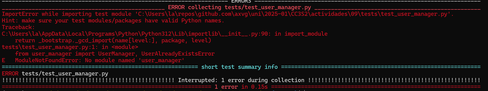
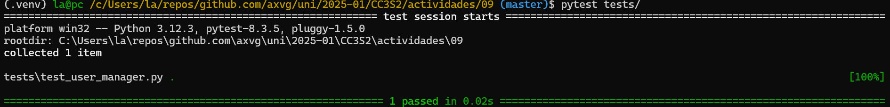
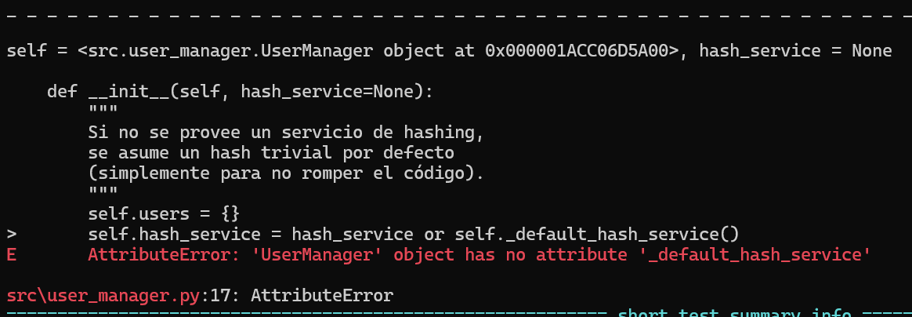
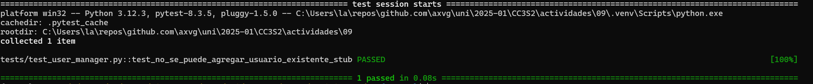
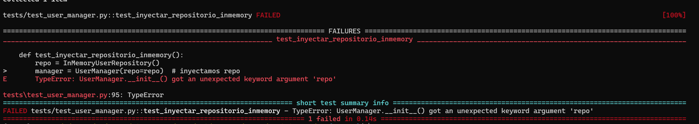
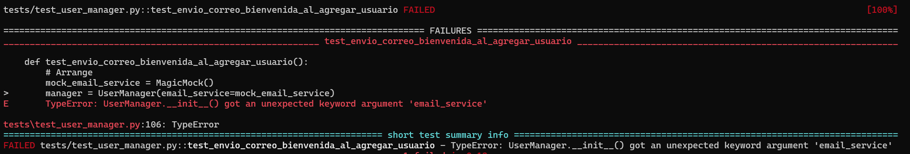

### Actividad: Red-Green-Refactor

### Ejercicio

Desarrolla las 6 iteraciones de Desarrollo Guiado por Pruebas (TDD) (Red-Green-Refactor) aplicadas a la clase `UserManager`, incluyendo casos de mocks, stubs, fakes, spies e inyección de dependencias. Cada iteración presenta un escenario diferente para ilustrar cómo podrías usar estas técnicas. 

### Iteración 1: Agregar usuario (Básico)

<details>
<summary>
<h4>
Paso 1 (Red): Escribimos la primera prueba
</h4>
</summary>


Creamos la prueba que verifica que podemos agregar un usuario con éxito. Para mantenerlo simple, no usamos aún ninguna inyección de dependencias ni mocks.

**Archivo:** `tests/test_user_manager.py`

```python
import pytest
from user_manager import UserManager, UserAlreadyExistsError

def test_agregar_usuario_exitoso():
    # Arrange
    manager = UserManager()
    username = "kapu"
    password = "securepassword"

    # Act
    manager.add_user(username, password)

    # Assert
    assert manager.user_exists(username), "El usuario debería existir después de ser agregado."
```

Si ejecutamos `pytest`, la prueba fallará porque aún no hemos implementado la clase `UserManager`.

</details>


Solucion:

Primero, se creara el entorno virtual:

```sh
python -m venv .venv
source .venv/Scripts/activate
pip install pytest
```
Se agrega el test:

https://github.com/axvg/CC3S2/blob/1cd3d6f027260f8380222bce4093c7f3deb17c09/actividades/09/tests/test_user_manager.py#L4-L15


Luego ejecuta los tests con:

```sh
pytest -v
```
La prueba falla porque la clase `UserManager` aun no existe.



<details>
<summary>
<h4>
Paso 2 (Green): Implementamos lo mínimo para que pase la prueba
</h4>
</summary>

**Archivo:** `user_manager.py`

```python
class UserAlreadyExistsError(Exception):
    pass

class UserManager:
    def __init__(self):
        self.users = {}

    def add_user(self, username, password):
        if username in self.users:
            raise UserAlreadyExistsError(f"El usuario '{username}' ya existe.")
        self.users[username] = password

    def user_exists(self, username):
        return username in self.users
```

Volvemos a ejecutar `pytest` y ahora la prueba debe pasar.
</details>

Solucion:

Se implementa la clase `UserManager` y la excepcion `UserAlreadyExistsError` segun el ejemplo. Se eecuta de nuevo:

https://github.com/axvg/CC3S2/blob/eed4bbe9cd68688e8476e464486c9ec25bf42fbf/actividades/09/src/user_manager.py#L1-L15

```sh
pytest -v
```

Ahora la prueba pasa correctamente.



<details>
<summary>
<h4>
Paso 3 (Refactor)
</h4>
</summary>

Revisamos que el código sea claro y conciso. Por ahora, el diseño es simple y cumple su función.
</details>

Se usa el metodo adicional para que sea mas facil de leer si un usuario existe:

https://github.com/axvg/CC3S2/blob/135a7dd6997acbd8765c5293b67abed38654c82e/actividades/09/src/user_manager.py#L10

### Iteración 2: Autenticación de usuario (Introducción de una dependencia para Hashing)

Ahora queremos asegurar contraseñas usando *hashing*. Para ello, introduciremos **inyección de dependencias**: crearemos una interfaz (o protocolo) para un "servicio de hashing", de modo que `UserManager` no dependa directamente de la implementación de hashing.


<details>
<summary>
<h4>
Paso 1 (Red): Escribimos la prueba
</h4>
</summary>

Queremos verificar que `UserManager` autentica correctamente a un usuario con la contraseña adecuada. Asumiremos que la contraseña se almacena en hash.

**Archivo:** `tests/test_user_manager.py`

```python
import pytest
from user_manager import UserManager, UserNotFoundError, UserAlreadyExistsError

class FakeHashService:
    """
    Servicio de hashing 'falso' (Fake) que simplemente simula el hashing
    devolviendo la cadena con un prefijo "fakehash:" para fines de prueba.
    """
    def hash(self, plain_text: str) -> str:
        return f"fakehash:{plain_text}"

    def verify(self, plain_text: str, hashed_text: str) -> bool:
        return hashed_text == f"fakehash:{plain_text}"

def test_autenticar_usuario_exitoso_con_hash():
    # Arrange
    hash_service = FakeHashService()
    manager = UserManager(hash_service=hash_service)

    username = "usuario1"
    password = "mypassword123"
    manager.add_user(username, password)

    # Act
    autenticado = manager.authenticate_user(username, password)

    # Assert
    assert autenticado, "El usuario debería autenticarse correctamente con la contraseña correcta."
```

Notar que hemos creado un `FakeHashService` que actúa como un **Fake**: se comporta como un servicio “real”, pero su lógica es simplificada para pruebas (no usa un algoritmo de hashing real).

Si ejecutamos la prueba, fallará porque no hemos implementado ni `authenticate_user` ni la inyección de `hash_service`.
</details>

https://github.com/axvg/CC3S2/blob/2fa70ce4c5650ed01d5db8943627d11540249a54/actividades/09/tests/test_user_manager.py#L18-L44

Se crea un fakeService de hashing para pruebas. se ejecuta el test y este falla porque `UserManager` no tiene metodos relacionados.



<details>
<summary>
<h4>
Paso 2 (Green): Implementamos la funcionalidad y la DI
</h4>
</summary>

```python
class UserNotFoundError(Exception):
    pass

class UserAlreadyExistsError(Exception):
    pass

class UserManager:
    def __init__(self, hash_service=None):
        """
        Si no se provee un servicio de hashing, se asume un hash trivial por defecto
        (simplemente para no romper el código).
        """
        self.users = {}
        self.hash_service = hash_service
        if not self.hash_service:
            # Si no pasamos un hash_service, usamos uno fake por defecto.
            # En producción, podríamos usar bcrypt o hashlib.
            class DefaultHashService:
                def hash(self, plain_text: str) -> str:
                    return plain_text  # Pésimo, pero sirve de ejemplo.

                def verify(self, plain_text: str, hashed_text: str) -> bool:
                    return plain_text == hashed_text

            self.hash_service = DefaultHashService()

    def add_user(self, username, password):
        if username in self.users:
            raise UserAlreadyExistsError(f"El usuario '{username}' ya existe.")
        hashed_pw = self.hash_service.hash(password)
        self.users[username] = hashed_pw

    def user_exists(self, username):
        return username in self.users

    def authenticate_user(self, username, password):
        if not self.user_exists(username):
            raise UserNotFoundError(f"El usuario '{username}' no existe.")
        stored_hash = self.users[username]
        return self.hash_service.verify(password, stored_hash)
```

Ejecutamos `pytest` y la prueba debería pasar. Nuestra inyección de dependencias nos permite cambiar la lógica de hashing sin modificar `UserManager`.
</details>

Solucion:

Se modifica `user_manager.py` para inyectarle un servicio de hashing:

https://github.com/axvg/CC3S2/blob/026b8f81ddd59e909b7a7543831771c7d9d40b2f/actividades/09/src/user_manager.py#L10-L28

Se usa este servicio para el metodo de autenticacion:

https://github.com/axvg/CC3S2/blob/026b8f81ddd59e909b7a7543831771c7d9d40b2f/actividades/09/src/user_manager.py#L39-L43

Con esta implementacion el test pasa correctamente.

<details>
<summary>
<h4>
Paso 3 (Refactor)
</h4>
</summary>

Podemos refactorizar si lo consideramos necesario, pero por ahora la estructura cumple el propósito.
</details>

Solucion:

Se crea un metodo para el servicio de hash y dentro una clase interna `DefaultHashService` para usar el servicio de manera similar y hacer el codigo mas legible separando esta funcionalidad en un nuevo metodo

https://github.com/axvg/CC3S2/blob/62d5aa0ca12c0ca93eb2903dcb678b4bacb7cecc/actividades/09/src/user_manager.py#L19-L27


### Iteración 3: Uso de un Mock para verificar llamadas (Spy / Mock)

Ahora queremos asegurarnos de que, cada vez que llamamos a `add_user`, se invoque el método `hash` de nuestro servicio de hashing. Para ello, usaremos un **mock** que “espía” si se llamó el método y con qué parámetros. Esto sería un caso de **Spy o Mock**.

<details>
<summary>
<h4>
Paso 1 (Red): Escribimos la prueba de "espionaje"
</h4>
</summary>


Instalaremos e importaremos `unittest.mock` (incluido con Python 3) para crear un mock:

```python
from unittest.mock import MagicMock

def test_hash_service_es_llamado_al_agregar_usuario():
    # Arrange
    mock_hash_service = MagicMock()
    manager = UserManager(hash_service=mock_hash_service)
    username = "spyUser"
    password = "spyPass"

    # Act
    manager.add_user(username, password)

    # Assert
    mock_hash_service.hash.assert_called_once_with(password)
```


Esta prueba verificará que, después de llamar a `add_user`, efectivamente el método `hash` se llamó **exactamente una vez** con `password` como argumento.

</details>

Solucion:

Se crea el test de acuerdo al ejercicio:

https://github.com/axvg/CC3S2/blob/981e39bc1cf7a5835b4d3759f8af89f6528b54fa/actividades/09/tests/test_user_manager.py#L48-L59

Aca se realiza mock del `hash_service` para verificar que al agregar usuario se encripta la contraseña (se llama la funcion), para este el mock se pasa en el constructor como dependencia.

<details>
<summary>
<h4>
Paso 2 (Green): Probar que todo pasa
</h4>
</summary>

Realmente, nuestro código ya llama a `hash_service.hash`. Si ejecutamos `pytest`, la prueba debería pasar de inmediato, pues la implementación actual ya cumple la expectativa.
</details>


Solucion:


El test pasa correctamente, debdio a que el codigo llama al metodo hash al agregar un usuario:

https://github.com/axvg/CC3S2/blob/981e39bc1cf7a5835b4d3759f8af89f6528b54fa/actividades/09/src/user_manager.py#L29-L32


<details>
<summary>
<h4>
Paso 3 (Refactor)
</h4>
</summary>

No hay cambios adicionales. El uso de Mocks/Spies simplemente corrobora el comportamiento interno.
</details>

Este paso no se aplica, ya que se prueba el uso de mocks.

### Iteración 4: Excepción al agregar usuario existente (Stubs/más pruebas negativas)

En esta iteración, reforzamos la prueba para el caso de usuario duplicado. Ya tenemos la excepción `UserAlreadyExistsError`, pero vamos a hacer una **prueba un poco más compleja** usando *stubs* si quisiéramos aislar ciertos comportamientos.

Realmente, podemos considerar un “stub” si quisiéramos forzar que `user_exists` devuelva `True`. Sin embargo, nuestra lógica interna ya está implementada. Mostraremos un stub parcial:


<details>
<summary>
<h4>
Paso 1 (Red): Prueba
</h4>
</summary>

```python
def test_no_se_puede_agregar_usuario_existente_stub():
    # Este stub forzará que user_exists devuelva True
    class StubUserManager(UserManager):
        def user_exists(self, username):
            return True

    stub_manager = StubUserManager()
    with pytest.raises(UserAlreadyExistsError) as exc:
        stub_manager.add_user("cualquier", "1234")

    assert "ya existe" in str(exc.value)
```

Aquí forzamos con una subclase `StubUserManager` que devuelva `True` en `user_exists`, simulando que el usuario “ya existe”. Así aislamos el comportamiento sin importar lo que pase dentro.
</details>

Solucion:

Se agrega el test:

https://github.com/axvg/CC3S2/blob/3d93a8b0afd2fb9292f8de7539cf5726292be44d/actividades/09/tests/test_user_manager.py#L63-L73

Lo que se fuerza es que `user_exists` retorne `True` para poder probar el error `UserAlreadyExistsError`.


<details>
<summary>
<h4>
Paso 2 (Green)
</h4>
</summary>

Nuestra lógica ya lanza `UserAlreadyExistsError` si `user_exists` devuelve `True`. Así que la prueba debería pasar sin modificar el código.
</details>

Solucion:

Este test corre correctamente:



Debido a que se llama el metodo `user_exists` (que es usado en el stub para que retorne siempre `True`) y este hara que se emita el error `UserAlreadyExistsError`:

https://github.com/axvg/CC3S2/blob/6846f3b603655100fbb45b9c0ebe494d0e7a2aad/actividades/09/src/user_manager.py#L30-L31

<details>
<summary>
<h4>
Paso 3 (Refactor)
</h4>
</summary>

Nada adicional por el momento.
</details>


### Iteración 5: Agregar un "Fake" repositorio de datos (Inyección de Dependencias)

Hasta ahora, `UserManager` guarda los usuarios en un diccionario interno (`self.users`). Supongamos que queremos que en producción se use una base de datos, pero en pruebas se use un repositorio en memoria. Esto es un uso típico de **Fake** o **InMemory** repos.

<details>
<summary>
<h4>
Paso 1 (Red): Nueva prueba
</h4>
</summary>

Creamos una prueba que verifique que podemos inyectar un repositorio y que `UserManager` lo use.

```python
class InMemoryUserRepository:
    """Fake de un repositorio de usuarios en memoria."""
    def __init__(self):
        self.data = {}

    def save_user(self, username, hashed_password):
        if username in self.data:
            raise UserAlreadyExistsError(f"'{username}' ya existe.")
        self.data[username] = hashed_password

    def get_user(self, username):
        return self.data.get(username)

    def exists(self, username):
        return username in self.data

def test_inyectar_repositorio_inmemory():
    repo = InMemoryUserRepository()
    manager = UserManager(repo=repo)  # inyectamos repo
    username = "fakeUser"
    password = "fakePass"

    manager.add_user(username, password)
    assert manager.user_exists(username)
```

Como vemos, ahora `UserManager` debería aceptar un `repo` para almacenar y consultar usuarios, en vez de usar un diccionario interno.
</details>

Se agrega la prueba:

https://github.com/axvg/CC3S2/blob/6846f3b603655100fbb45b9c0ebe494d0e7a2aad/actividades/09/tests/test_user_manager.py#L76-L100

Este test usa la memoria para realizar pruebas (en lugar de una base de datos). Se prueba que al agregar un usuario este existe. Sin embargo este test fallara porque no se tiene un argumento `repo` en el constructor de la clase `UserManager`.




<details>
<summary>
<h4>
Paso 2 (Green): Implementación
</h4>
</summary>

Modificamos `UserManager` para recibir un `repo`:

```python
class UserManager:
    def __init__(self, hash_service=None, repo=None):
        self.hash_service = hash_service or self._default_hash_service()
        self.repo = repo
        if not self.repo:
            # Si no se inyecta repositorio, usamos uno interno por defecto
            self.repo = self._default_repo()
    
    def _default_hash_service(self):
        class DefaultHashService:
            def hash(self, plain_text: str) -> str:
                return plain_text
            def verify(self, plain_text: str, hashed_text: str) -> bool:
                return plain_text == hashed_text
        return DefaultHashService()

    def _default_repo(self):
        # Un repositorio en memoria muy básico
        class InternalRepo:
            def __init__(self):
                self.data = {}
            def save_user(self, username, hashed_password):
                if username in self.data:
                    raise UserAlreadyExistsError(f"'{username}' ya existe.")
                self.data[username] = hashed_password
            def get_user(self, username):
                return self.data.get(username)
            def exists(self, username):
                return username in self.data
        return InternalRepo()

    def add_user(self, username, password):
        hashed = self.hash_service.hash(password)
        self.repo.save_user(username, hashed)

    def user_exists(self, username):
        return self.repo.exists(username)

    def authenticate_user(self, username, password):
        stored_hash = self.repo.get_user(username)
        if stored_hash is None:
            raise UserNotFoundError(f"El usuario '{username}' no existe.")
        return self.hash_service.verify(password, stored_hash)
```

Volvemos a correr los tests. Ahora debe pasar.
</details>

Solucion:

Se agrega el argumento para `repo` y un `_default_repo` (por si se olvida inyectar un repo)

https://github.com/axvg/CC3S2/blob/fd60d982656fddfb663b4ba0c5f6d9444b88751f/actividades/09/src/user_manager.py#L10-L17

Este `_default_repo` es basicamente un diccionario de python que tiene metodo similar al de `save_user` de la clase `UserManager`:

https://github.com/axvg/CC3S2/blob/fd60d982656fddfb663b4ba0c5f6d9444b88751f/actividades/09/src/user_manager.py#L33-L49

De hecho, debido a que la validacion de que un usuario exista esta en este `repo`, la validacion para el metodo `save_user` de la clase `UserManager` se remueve:

https://github.com/axvg/CC3S2/blob/fd60d982656fddfb663b4ba0c5f6d9444b88751f/actividades/09/src/user_manager.py#L51-L53

<details>
<summary>
<h4>
Paso 3 (Refactor)
</h4>
</summary>

El código quedó un poco más ordenado; `UserManager` no depende directamente de la estructura interna de almacenamiento.
</details>


### Iteración 6: Introducir un “Spy” de notificaciones (Envío de correo)

Finalmente, agregaremos una funcionalidad que, cada vez que se agrega un usuario, se envíe un correo de bienvenida. Para probar este envío de correo sin mandar correos reales, usaremos un **Spy** o **Mock** que verifique que se llamó al método `send_welcome_email` con los parámetros correctos.

<details>
<summary>
<h4> 
Paso 1 (Red): Prueba
</h4>
</summary>

```python
from unittest.mock import MagicMock

def test_envio_correo_bienvenida_al_agregar_usuario():
    # Arrange
    mock_email_service = MagicMock()
    manager = UserManager(email_service=mock_email_service)
    username = "nuevoUsuario"
    password = "NuevaPass123!"

    # Act
    manager.add_user(username, password)

    # Assert
    mock_email_service.send_welcome_email.assert_called_once_with(username)
```

Esta prueba fallará al inicio porque `UserManager` aún no llama a ningún `send_welcome_email`.
</details>

Solucion:

Se agrega el siguiente test:

https://github.com/axvg/CC3S2/blob/fd60d982656fddfb663b4ba0c5f6d9444b88751f/actividades/09/tests/test_user_manager.py#L103-L114

Aca se prueba que se envia un correo de bienvenida al registro de un usuario, sin embargo este metodo aun no es llamado por `UserManager`. Aca se esta realizando TDD por lo que el test fallara.



<details>
<summary>
<h4> 
Paso 2 (Green): Implementamos la llamada al servicio de correo
</h4>
</summary>

Modificamos `UserManager`:

```python
class UserManager:
    def __init__(self, hash_service=None, repo=None, email_service=None):
        self.hash_service = hash_service or self._default_hash_service()
        self.repo = repo or self._default_repo()
        self.email_service = email_service  # <--- nuevo

    # ... resto de métodos ...

    def add_user(self, username, password):
        hashed = self.hash_service.hash(password)
        self.repo.save_user(username, hashed)
        if self.email_service:
            self.email_service.send_welcome_email(username)
```

Ejecutamos de nuevo `pytest`. Ahora la prueba debe pasar, ya que llamamos al `email_service`.
</details>

Solucion:

Se agrega la inyeccion de la dependencia `email_service` al `UserManager`:

https://github.com/axvg/CC3S2/blob/fd60d982656fddfb663b4ba0c5f6d9444b88751f/actividades/09/src/user_manager.py#L10-L18

Aca a diferencia de `repo` o `hash_service` no se tiene un valor por defecto si es que se olvida de entregar uno ya que:

https://github.com/axvg/CC3S2/blob/fd60d982656fddfb663b4ba0c5f6d9444b88751f/actividades/09/src/user_manager.py#L54-L55

Si este servicio no es inyectado no se enviara correo al registro del usuario, con estos cambios el test pasa a verde:


<details>
<summary>
<h4> 
Paso 3 (Refactor)
</h4>
</summary>
</details>

---

<details>

### Ejercicio integral


Imagina que tenemos la necesidad de gestionar usuarios en un sistema. El **UserManager** debe:

1. **Agregar usuarios** (verificar que no exista uno igual).
2. **Autenticarlos** (usando un servicio de hashing).
3. **Verificar si existen**.
4. **Enviar correos de bienvenida** (opcional).
5. **Usar un repositorio de datos (fake o real)** mediante inyección de dependencias.
6. **Tener pruebas que usen stubs, fakes, mocks y spies**.

En este ejercicio, verás un ejemplo de 6 iteraciones en la metodología TDD **(Red-Green-Refactor)**, cada una introduciendo distintas técnicas.

#### Estructura recomendada

```
user_management/
├── user_manager.py
├── tests/
│   └── test_user_manager.py
└── requirements.txt
```

- **`user_manager.py`:** Contendrá la implementación de `UserManager` y las excepciones.
- **`tests/test_user_manager.py`:** Contendrá las pruebas unitarias.


#### Iteración 1: Agregar usuario (Básico)

<details>
<summary>
<h4> 
Paso 1 (Red): Primera prueba
</h4>
</summary>

Archivo: `tests/test_user_manager.py`
```python
import pytest
from user_manager import UserManager, UserAlreadyExistsError

def test_agregar_usuario_exitoso():
    # Arrange
    manager = UserManager()
    username = "kapu"
    password = "securepassword"

    # Act
    manager.add_user(username, password)

    # Assert
    assert manager.user_exists(username), "El usuario debería existir después de ser agregado."
```

Al ejecutar `pytest`, esta prueba fallará (Red) porque `UserManager` aún no está implementado (o está incompleto).
</details>

<details>
<summary>
<h4>
Paso 2 (Green): Implementamos lo mínimo
</h4>
</summary>

Archivo: `user_manager.py`
```python
class UserAlreadyExistsError(Exception):
    pass

class UserManager:
    def __init__(self):
        self.users = {}  # Diccionario simple para guardar usuarios en memoria

    def add_user(self, username, password):
        if username in self.users:
            raise UserAlreadyExistsError(f"El usuario '{username}' ya existe.")
        self.users[username] = password

    def user_exists(self, username):
        return username in self.users
```

Re-ejecutamos `pytest` y la prueba debe pasar (Green).
</details>

<details>
<summary>
<h4>
Paso 3 (Refactor)
</h4>
</summary>

Revisamos si el código está limpio. Por ahora está bien.
</details>


### Iteración 2: Autenticación con inyección de un servicio de Hashing (Fake)

Queremos que la contraseña se almacene con un hash seguro. Para facilitar pruebas, inyectaremos un servicio de hashing que en producción podría ser `bcrypt`, pero en los tests usaremos un **Fake**.

<details>
<summary>
<h4>
Paso 1 (Red): Nueva prueba
</h4>
</summary>

```python
class FakeHashService:
    """
    Servicio 'fake' que devuelve un hash simplificado con un prefijo, y lo verifica.
    """
    def hash(self, plain_text: str) -> str:
        return f"fakehash:{plain_text}"

    def verify(self, plain_text: str, hashed_text: str) -> bool:
        return hashed_text == f"fakehash:{plain_text}"

def test_autenticar_usuario_exitoso_con_hash():
    # Arrange
    hash_service = FakeHashService()
    manager = UserManager(hash_service=hash_service)

    username = "usuario1"
    password = "mypassword123"
    manager.add_user(username, password)

    # Act
    autenticado = manager.authenticate_user(username, password)

    # Assert
    assert autenticado, "El usuario debería autenticarse correctamente con la contraseña correcta."
```

Si ejecutamos ahora, fallará porque `UserManager` no usa aún ningún servicio de hashing ni tiene método `authenticate_user`.
</details>

<details>
<summary>
<h4>
Paso 2 (Green): Implementación con inyección de hash_service
</h4>
</summary>

En `user_manager.py`, agregamos la dependencia:

```python
class UserNotFoundError(Exception):
    pass

class UserAlreadyExistsError(Exception):
    pass

class UserManager:
    def __init__(self, hash_service=None):
        """
        Inyectamos un servicio de hashing para no depender de una implementación fija.
        """
        self.users = {}
        self.hash_service = hash_service or self._default_hash_service()

    def _default_hash_service(self):
        # Hash por defecto si no se provee nada (inseguro, solo para no romper).
        class DefaultHashService:
            def hash(self, plain_text: str) -> str:
                return plain_text
            def verify(self, plain_text: str, hashed_text: str) -> bool:
                return plain_text == hashed_text
        return DefaultHashService()

    def add_user(self, username, password):
        if username in self.users:
            raise UserAlreadyExistsError(f"El usuario '{username}' ya existe.")
        hashed_pw = self.hash_service.hash(password)
        self.users[username] = hashed_pw

    def user_exists(self, username):
        return username in self.users

    def authenticate_user(self, username, password):
        if not self.user_exists(username):
            raise UserNotFoundError(f"El usuario '{username}' no existe.")
        stored_hash = self.users[username]
        return self.hash_service.verify(password, stored_hash)
```

Corremos `pytest`: la prueba debe pasar (Green).
</details>


<details>
<summary>
<h4>
Paso 3 (Refactor)
</h4>
</summary>

El código se ve razonable para esta etapa.
</details>

### Iteración 3: Uso de un Mock/Spy para verificar llamadas internas

Queremos asegurarnos de que, al agregar un usuario, efectivamente se llama a `hash`. Usaremos `MagicMock` de `unittest.mock` para espiar la llamada.


<details>
<summary>
<h4>
Paso 1 (Red): Prueba con Spy
</h4>
</summary>

```python
from unittest.mock import MagicMock

def test_hash_service_es_llamado_al_agregar_usuario():
    # Arrange
    mock_hash_service = MagicMock()
    manager = UserManager(hash_service=mock_hash_service)
    username = "spyUser"
    password = "spyPass"

    # Act
    manager.add_user(username, password)

    # Assert
    mock_hash_service.hash.assert_called_once_with(password)
```

Esta prueba fallaría si `add_user` no invocara a `hash(...)`.
</details>

<details>
<summary>
<h4>
Paso 2 (Green)
</h4>
</summary>

Nuestra implementación ya invoca `hash(...)`, así que al correr `pytest` debería pasar sin cambios.
</details>

<details>
<summary>
<h4>
Paso 3 (Refactor)
</h4>
</summary>

Nada adicional.
</details>


### Iteración 4: Uso de Stubs para forzar comportamientos

Como ejemplo, usaremos un **stub** que fuerza que `user_exists` devuelva `True`, de modo que `UserAlreadyExistsError` se lance inmediatamente.

<details>
<summary>
<h4>
Paso 1 (Red): Prueba
</h4>
</summary>


```python
def test_no_se_puede_agregar_usuario_existente_stub():
    # Creamos una subclase que "stubbea" user_exists para devolver True
    class StubUserManager(UserManager):
        def user_exists(self, username):
            return True

    stub_manager = StubUserManager()
    with pytest.raises(UserAlreadyExistsError) as exc:
        stub_manager.add_user("cualquier", "1234")

    assert "ya existe" in str(exc.value)
```
</details>

<details>
<summary>
<h4>
Paso 2 (Green)
</h4>
</summary>

Ya tenemos en `add_user` la lógica que lanza la excepción si existe el usuario. Nuestra subclase “stub” fuerza esa condición. La prueba debe pasar de inmediato.
</details>

<details>
<summary>
<h4>
Paso 3 (Refactor)
</h4>
</summary>

Sin cambios.
</details>


### Iteración 5: Inyección de un repositorio (Fake)

Queremos que `UserManager` no dependa de un diccionario interno para almacenar usuarios, sino que podamos inyectar (en producción) un repositorio real (BD, etc.) y en las pruebas, un repositorio en memoria. Esto es otro ejemplo de **Fake**.

<details>
<summary>
<h4>
Paso 1 (Red): Prueba con un repositorio fake
</h4>
</summary>

```python
class InMemoryUserRepository:
    """Fake de repositorio en memoria."""
    def __init__(self):
        self.data = {}

    def save_user(self, username, hashed_pw):
        if username in self.data:
            raise UserAlreadyExistsError(f"'{username}' ya existe.")
        self.data[username] = hashed_pw

    def get_user(self, username):
        return self.data.get(username)

    def exists(self, username):
        return username in self.data

def test_inyectar_repositorio_inmemory():
    repo = InMemoryUserRepository()
    manager = UserManager(repo=repo)  # inyectamos el repo
    username = "fakeUser"
    password = "fakePass"

    manager.add_user(username, password)
    assert manager.user_exists(username)
```

Falla (Red) porque `UserManager` no recibe ni usa un `repo`.
</details>

<details>
<summary>
<h4>
Paso 2 (Green): Implementación
</h4>
</summary>

En `user_manager.py`, modificamos el constructor y métodos:

```python
class UserManager:
    def __init__(self, hash_service=None, repo=None):
        self.hash_service = hash_service or self._default_hash_service()
        self.repo = repo or self._default_repo()

    def _default_hash_service(self):
        # ... igual que antes ...
    
    def _default_repo(self):
        # Repo interno por defecto
        class InternalRepo:
            def __init__(self):
                self.data = {}
            def save_user(self, username, hashed_pw):
                if username in self.data:
                    raise UserAlreadyExistsError(f"'{username}' ya existe.")
                self.data[username] = hashed_pw
            def get_user(self, username):
                return self.data.get(username)
            def exists(self, username):
                return username in self.data
        return InternalRepo()

    def add_user(self, username, password):
        hashed = self.hash_service.hash(password)
        self.repo.save_user(username, hashed)

    def user_exists(self, username):
        return self.repo.exists(username)

    def authenticate_user(self, username, password):
        stored_hash = self.repo.get_user(username)
        if stored_hash is None:
            raise UserNotFoundError(f"El usuario '{username}' no existe.")
        return self.hash_service.verify(password, stored_hash)
```

Ejecutamos `pytest`: debe pasar (Green).
</details>


<details>
<summary>
<h4>
Paso 3 (Refactor)
</h4>
</summary>

Se ve razonable.
</details>

---

#### Iteración 6: Spy de Servicio de Correo

Por último, simularemos que cada vez que se registra un nuevo usuario, se envía un correo de bienvenida. Queremos verificar esa llamada con un **Spy** o un **Mock**.


<details>
<summary>
<h4>
Paso 1 (Red): Prueba
</h4>
</summary>

```python
def test_envio_correo_bienvenida_al_agregar_usuario():
    from unittest.mock import MagicMock

    # Arrange
    mock_email_service = MagicMock()
    manager = UserManager(email_service=mock_email_service)
    username = "nuevoUsuario"
    password = "NuevaPass123!"

    # Act
    manager.add_user(username, password)

    # Assert
    mock_email_service.send_welcome_email.assert_called_once_with(username)
```

Falla (Red) porque no existe la lógica de correo.
</details>


<details>
<summary>
<h4>
Paso 2 (Green): Implementamos en `UserManager`
</h4>
</summary>

```python
class UserManager:
    def __init__(self, hash_service=None, repo=None, email_service=None):
        self.hash_service = hash_service or self._default_hash_service()
        self.repo = repo or self._default_repo()
        self.email_service = email_service

    # ... resto de métodos ...

    def add_user(self, username, password):
        hashed = self.hash_service.hash(password)
        self.repo.save_user(username, hashed)
        # Enviamos correo si se inyectó un email_service
        if self.email_service:
            self.email_service.send_welcome_email(username)
```

Ejecutamos `pytest` y la prueba debe pasar (Green).
</details>


<details>
<summary>
<h4>
Paso 3 (Refactor)
</h4>
</summary>

Código listo. Hemos demostrado el uso de un Mock/Spy para verificar interacciones.
</details>
</details>
