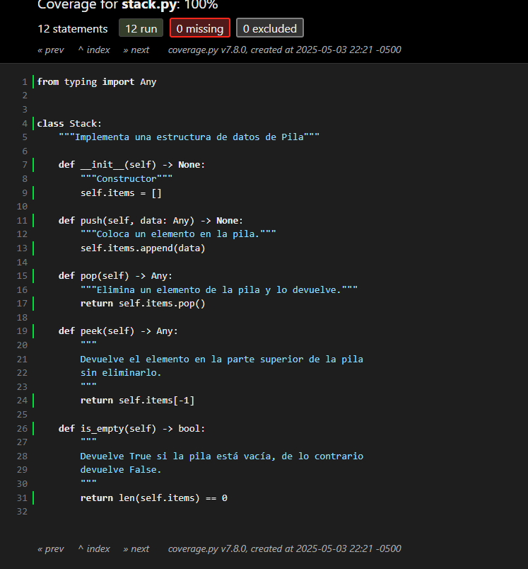
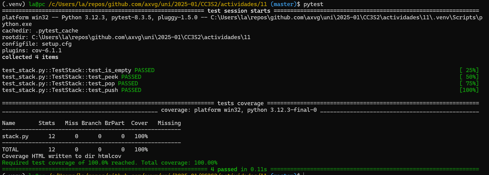

<details>
<summary>
<h1>
Actividad: Escribir aserciones en pruebas con pytest
</h1>
</summary>

En esta actividad aprenderás cómo escribir aserciones de pruebas utilizando pytest y otros complementos actualizados.

**Objetivos de aprendizaje**

Después de completar esta actividad, serás capaz de:

- Ejecutar casos de prueba con pytest
- Identificar los casos de prueba que fallan
- Escribir pruebas unitarias utilizando aserciones
- Generar informes de cobertura usando pytest-cov

</details>

<details>
<summary>
<h2>
Paso 1: Instalación de pytest y pytest-cov
</h2>
</summary>

Comencemos instalando las herramientas necesarias. En lugar de usar nosetests, utilizaremos pytest para ejecutar pruebas y pytest-cov para generar informes de cobertura de código.

En tu terminal, ejecuta el siguiente comando:

```
python3 -m pip install pytest pytest-cov
```
</details>

Solucion:

Para estos pasos se creara un entorno virtual. Se ejecutara los siguientes comandos:

```sh
python -m venv .venv
source .venv/Scripts/activate
pip install pytest pytest-cov
```


<details>
<summary>
<h2>
Paso 2: Archivos de prueba
</h2>
</summary>

Usaremos dos archivos para esta actividad: `stack.py` y `test_stack.py`.

- `stack.py`: Contiene la implementación de una pila (stack) que queremos probar.
- `test_stack.py`: Contiene el esqueleto de las pruebas para los métodos `push()`, `pop()`, `peek()`, y `is_empty()`.

Antes de escribir los casos de prueba, revisemos los métodos de la clase `Stack`:

```python
class Stack:
    def push(self, data: Any) -> None:
        ...
    def pop(self) -> Any:
        ...
    def peek(self) -> Any:
        ...
    def is_empty(self) -> bool:
        ...
```
Descripción de funciones:

- `push()`: Añade un elemento a la parte superior de la pila.
- `pop()`: Elimina y devuelve el elemento en la parte superior de la pila.
- `peek()`: Devuelve el valor del elemento en la parte superior de la pila sin eliminarlo.
- `is_empty()`: Devuelve True si la pila está vacía y False si no lo está.

Ten en cuenta que todos los métodos, excepto `is_empty()`, operan sobre el elemento que se encuentra en la parte superior de la pila. Por lo tanto, para que tus casos de prueba sean exhaustivos, debe haber dos o más elementos en la pila para garantizar que esté manipulando el elemento superior y no el inferior.

Puedes verificar al inicio de que las pruebas no pasan con pytest:

```
pytest -v
```
En pytest, puedes usar la opción `-x` o `--exitfirst` para detener la ejecución de las pruebas al encontrar el primer fallo.

```
pytest -x
```
o

```
pytest --exitfirst
```

**Observación**: [Nose](https://pypi.org/project/nose/) ejecuta las pruebas en un orden pseudoaleatorio. Esto es para garantizar que los casos de prueba no afecten el orden de ejecución ni dependan de él para funcionar.

pytest no ejecuta las pruebas en un orden pseudoaleatorio por defecto. En pytest, el orden de ejecución de las pruebas sigue la secuencia en la que se encuentran en los archivos de prueba. Es decir, las pruebas se ejecutan en el mismo orden en que están definidas dentro de cada archivo de prueba.

Sin embargo, si deseas ejecutar las pruebas en un orden aleatorio, pytest ofrece un plugin llamado pytest-randomly, que permite que las pruebas se ejecuten en un orden aleatorio o pseudoaleatorio, garantizando que los casos de prueba no dependan del orden de ejecución.

```
pytest --random-order
```
</details>

Solucion:

Se ejecutaran los tests del stack con:

```sh
pytest -v
```

Como se tiene `pytest-cov`, se puede verificar que porcentaje de coverage cubrimos en los tests:
```sh
pytest -v --cov=stack
```


Se puede comprobar que se tiene 100% de coverage en stack


<details>
<summary>
<h2>
Paso 3: Escribiendo aserciones para el método is_empty()
</h2>
</summary>

Vamos a comenzar con la prueba del método `is_empty()`. Este método devuelve True si la pila está vacía y False si no lo está.

Modifica la función `test_is_empty()` en `test_stack.py` para que se vea así:

```python
def test_is_empty():
    stack = Stack()
    assert stack.is_empty() == True  # La pila recién creada debe estar vacía
    stack.push(5)
    assert stack.is_empty() == False  # Después de agregar un elemento, la pila no debe estar vacía
```
Comprueba con este código tambien:

```python
def test_pop(self):
    self.stack.push(3)
    self.stack.push(5)
    self.assertEqual(self.stack.pop(), 5)
    self.assertEqual(self.stack.peek(), 3)
    self.stack.pop()
    self.assertTrue(self.stack.is_empty())
```
</details>

Solucion:

Se implemento el test para `is_empty` agregando primero un elemento y verificando que el stack ya no esta vacio.
```python
def test_is_empty():
    stack = Stack()
    assert stack.is_empty() == True  # La pila recién creada debe estar vacía
    stack.push(5)
    assert stack.is_empty() == False  # Después de agregar un elemento, la pila no debe estar vacía
```


<details>
<summary>
<h2>
Paso 4: Ejecuta pytest para verificar is_empty()
</h2>
</summary>

Ejecuta pytest para verificar si la prueba del método `is_empty()` pasa:

```
pytest -v
```
</details>

Si la prueba pasa, verás que `is_empty()` ha pasado. Si no, revisa el código para asegurar que la lógica de la prueba es correcta.

Solucion:

Se ejecuta el comando para verificar este test:

```sh
pytest test_stack.py::TestStack::test_is_empty
```


<details>
<summary>
<h2>
Paso 5: Escribiendo aserciones para el método peek()
</h2>
</summary>

El siguiente método que vamos a probar es `peek()`. Este método devuelve el valor en la parte superior de la pila sin eliminarlo.

Modifica la función `test_peek()` en `test_stack.py` de la siguiente manera:

```python
def test_peek():
    stack = Stack()
    stack.push(1)
    stack.push(2)
    assert stack.peek() == 2  # El valor superior debe ser el último agregado (2)
    assert stack.peek() == 2  # La pila no debe cambiar después de peek()
```
Comprueba con este código tambien:

```python
def test_peek(self):
    self.stack.push(3)
    self.stack.push(5)
    self.assertEqual(self.stack.peek(), 5)
```
</details>

Solucion:

El test para `peek` verifica que el elemento superior es el ultimo insertado y que el stack no cambia tras llamar a `peek` varias veces.

```python
def test_peek():
    stack = Stack()
    stack.push(1)
    stack.push(2)
    assert stack.peek() == 2  # El valor superior debe ser el último agregado (2)
    assert stack.peek() == 2  # La pila no debe cambiar después de peek()
```


<details>
<summary>
<h2>
Paso 6: Escribiendo aserciones para el método pop()
</h2>
</summary>

El método `pop()` elimina y devuelve el valor en la parte superior de la pila. Para asegurarte de que la prueba es útil, debes agregar al menos dos valores a la pila.

Modifica la función `test_pop()` en `test_stack.py`:

```python
def test_pop():
    stack = Stack()
    stack.push(1)
    stack.push(2)
    assert stack.pop() == 2  # El valor superior (2) debe eliminarse y devolverse
    assert stack.peek() == 1  # Después de pop(), el valor superior debe ser 1
```
Comprueba con este código tambien:

```python
def test_pop(self):
    self.stack.push(3)
    self.stack.push(5)
    self.assertEqual(self.stack.pop(), 5)
    self.assertEqual(self.stack.peek(), 3)
    self.stack.pop()
    self.assertTrue(self.stack.is_empty())
```
</details>

Solucion:

El test para `pop` agrega dos elementos, elimina el superior y verifica que el siguiente elemento es el anterior. 

```python
def test_pop():
    stack = Stack()
    stack.push(1)
    stack.push(2)
    assert stack.pop() == 2  # El valor superior (2) debe eliminarse y devolverse
    assert stack.peek() == 1  # Después de pop(), el valor superior debe ser 1
```


<details>
<summary>
<h2>
Paso 7: Escribiendo aserciones para el método push()
</h2>
</summary>

Finalmente, vamos a probar el método `push()`, que añade un valor a la pila.

Modifica la función `test_push()` en `test_stack.py`:

```python
def test_push():
    stack = Stack()
    stack.push(1)
    assert stack.peek() == 1  # El valor recién agregado debe estar en la parte superior
    stack.push(2)
    assert stack.peek() == 2  # Después de otro push, el valor superior debe ser el último agregado
```
Comprueba con este código tambien:

```python
 def test_push(self):
    self.stack.push(3)
    self.assertEqual(self.stack.peek(), 3)
    self.stack.push(5)
    self.assertEqual(self.stack.peek(), 5)
```
</details>

Solucion:

El test para `push` agrega elementos y verifica que el ultimo insertado es el que queda en la cima.

```py
def test_push():
    stack = Stack()
    stack.push(1)
    assert stack.peek() == 1  # El valor recién agregado debe estar en la parte superior
    stack.push(2)
    assert stack.peek() == 2  # Después de otro push, el valor superior debe ser el último agregado
```


<details>
<summary>
<h2>
Paso 8: Ejecuta pytest para verificar todas las pruebas
</h2>
</summary>

Ejecuta pytest nuevamente para asegurarte de que todas las pruebas pasan:

```
pytest -v
```
Si todo está correcto, todas las pruebas deberían pasar y la salida mostrará resultados exitosos.
</details>


Solucion:

Se ejecuta todos los tests con:

```sh
pytest -v
```
Todos los tests pasan por lo que la implementacion de la estructura stack es correcta.


<details>
<summary>
<h2>
Paso 9: Agregando cobertura de pruebas con pytest-cov
</h2>
</summary>

Para asegurarte de que tus pruebas cubren suficiente código, puedes generar un informe de cobertura utilizando pytest-cov. Ejecuta el siguiente comando para generar un informe de cobertura:

```
pytest --cov=stack --cov-report term-missing
```
Esto te mostrará cuántas líneas de código están cubiertas por las pruebas y cuáles no.
</details>

Solucion:

Para ver el porcentaje de lineas cubiertas por los tests se ejecuta:

```sh
pytest --cov=stack --cov-report=term-missing
```
Esto muestra que lineas no estan cubiertas. Si se usa `--cov-report=html` para el reporte en html, se muestra que:



Todas las lineas estan testeadas correctamente


<details>
<summary>
<h2>
setup.cfg
</h2>
</summary>

Este es un archivo de configuración para pytest y coverage, que personaliza cómo se ejecutan las pruebas y cómo se recopila el informe de cobertura de código. 

- `[tool:pytest]` Esto indica que las configuraciones que siguen son para la herramienta pytest, el marco de pruebas en Python.

- `addopts = -v --tb=short --cov=stack --cov-report=term-missing`
    - `-v`: Ejecuta pytest en modo detallado (verbose mode), lo que proporciona información adicional sobre qué pruebas están siendo ejecutadas y sus resultados.
    - `--tb=short`: Muestra solo el rastro de la pila acortado (short traceback) cuando se produce un error. Esto es útil para evitar la salida excesiva de texto en caso de errores o fallos de pruebas.
    - `--cov=stack`: Indica que pytest debe calcular la cobertura de código para el módulo o archivo stack.py. stack es el nombre del archivo o paquete para el cual se recopilará la cobertura.
    - `--cov-report=term-missing`: Muestra el informe de cobertura en la terminal e incluye las líneas faltantes que no están siendo cubiertas por las pruebas. Esto es útil para identificar qué partes del código no han sido probadas.
- `[coverage:run]` Este bloque contiene configuraciones específicas para el comando coverage run, que ejecuta las pruebas y recopila datos de cobertura.

  - `branch = True`: Esta opción indica que el análisis de cobertura debe incluir la cobertura de ramas (branch coverage), no solo de líneas de código. Esto asegura que se analicen todas las ramas condicionales (por ejemplo, si tienes un if en tu código, se verifica si ambas ramas —verdadera y falsa— han sido cubiertas por las pruebas).
  - `omit =`: Este parámetro especifica qué archivos o directorios omitir del informe de cobertura. En este caso:

    - */tests/*: Omite cualquier archivo o directorio bajo un directorio llamado tests.
    - */test_*: Omite archivos que comiencen con test_. Esto es útil para excluir los propios archivos de prueba del análisis de cobertura, ya que no es necesario incluirlos en el informe de cobertura de código.
- `[coverage:report]`Este bloque define cómo se debe generar el informe de cobertura de código después de ejecutar las pruebas.

    - `show_missing = True` Esta opción asegura que el informe muestre qué líneas de código están faltando en la cobertura, es decir, aquellas que no fueron ejecutadas por las pruebas. Esto te ayuda a identificar fácilmente las partes del código que no han sido probadas y donde podrías necesitar agregar más casos de prueba.

Este tipo de configuración es útil para obtener información clara sobre qué partes del código han sido probadas, y al mismo tiempo te permite ver qué partes del código aún requieren más cobertura de pruebas.
</details>

Solucion:

Se automatiza `pytest` usando el archivo `setup.cfg`y se aplican los parametros siguientes:
```sh
[tool:pytest]
addopts = -v --tb=short --cov=stack --cov-report=term-missing --cov-report=html --disable-warnings

[coverage:run]
branch = True
omit =
    */tests/*
    */test_*

[coverage:report]
show_missing = True
fail_under = 100
```
Esto nos permite que escribiendo en la terminal: `pytest` se pueda tener un coverage y un reporte html sin usar las opciones adicionales como en pasos anteriores, ademas se evita tener warnings en en el resultado.



