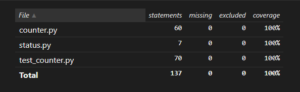
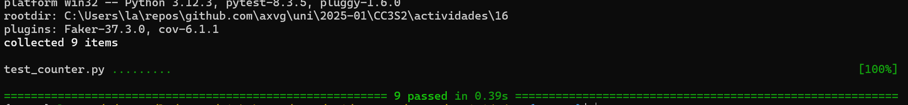
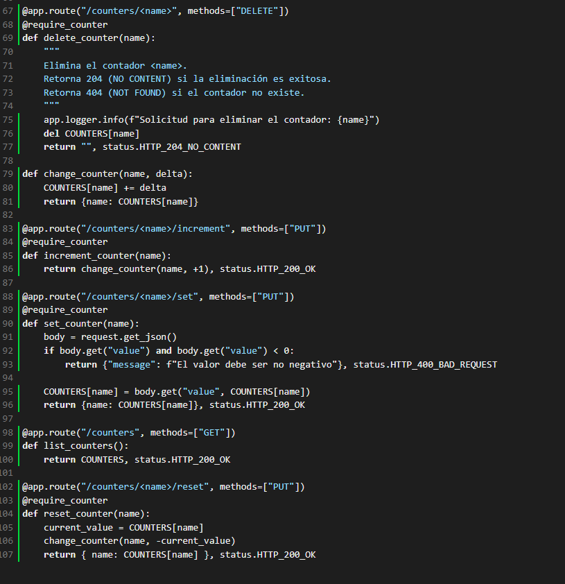

### Actividad: Práctica del ciclo TDD

<details>
<summary><strong>1. Estructura de los archivos de ejemplo</strong></summary>

El repositorio de referencia contiene:

- **`counter.py`**  
  Implementa una aplicación Flask que gestiona contadores en memoria (diccionario Python).
- **`status.py`**  
  Define constantes para códigos HTTP (`HTTP_200_OK`, `HTTP_201_CREATED`, etc.).
- **`tests_counters.py`**  
  Pruebas Pytest que validan las rutas CRUD: creación, lectura, actualización y eliminación.

Rutas disponibles en `counter.py`:

- **`POST   /counters/<name>`**  Crear un nuevo contador con valor inicial 0.  
- **`GET    /counters/<name>`**  Obtener el valor actual de un contador.  
- **`PUT    /counters/<name>`**  Actualizar (incrementar) el valor de un contador.  
- **`DELETE /counters/<name>`**  Eliminar un contador existente.  

</details>

<details>
<summary><strong>2. Desarrollo paso a paso (TDD)</strong></summary>

En cada operación seguimos el ciclo:  
1. **Red →** escribir la prueba que falla.  
2. **Green →** implementar lo mínimo para pasar la prueba.  
3. **Refactor →** mejorar el diseño sin alterar el comportamiento.

</details>

<details>
<summary><strong>2.1. Actualizar un contador (PUT)</strong></summary>

**Paso 1: Prueba (Red)**  
```python
def test_update_counter(client):
    """Debe incrementar el contador y devolver 200 OK."""
    # 1. Crear contador
    response = client.post("/counters/update_me")
    assert response.status_code == HTTPStatus.CREATED
    assert response.get_json()["update_me"] == 0

    # 2. Incrementar
    response = client.put("/counters/update_me")
    assert response.status_code == HTTPStatus.OK
    assert response.get_json()["update_me"] == 1
```

**Paso 2: Implementación (Green)**  
```python
@app.route("/counters/<name>", methods=["PUT"])
def update_counter(name):
    global COUNTERS
    if name not in COUNTERS:
        return {"message": f"El contador '{name}' no existe"}, status.HTTP_404_NOT_FOUND
    COUNTERS[name] += 1
    return {name: COUNTERS[name]}, status.HTTP_200_OK
```

**Paso 3: Refactor**  
- Extraer la validación de existencia a un decorador `@require_counter`.  
- Mantener el cuerpo de la función limpio de lógica repetida.

```python
# En counter.py, al inicio:
from functools import wraps

def require_counter(f):
    @wraps(f)
    def wrapper(name, *args, **kwargs):
        if name not in COUNTERS:
            return {"message": f"El contador '{name}' no existe"}, status.HTTP_404_NOT_FOUND
        return f(name, *args, **kwargs)
    return wrapper

# Ruta refactorizada:
@app.route("/counters/<name>", methods=["PUT"])
@require_counter
def update_counter(name):
    COUNTERS[name] += 1
    return {name: COUNTERS[name]}, status.HTTP_200_OK
```

</details>

<details>
<summary><strong>2.2. Leer un contador (GET)</strong></summary>

**Paso 1: Prueba (Red)**  
```python
def test_read_counter(client):
    """Debe devolver el valor actual y 200 OK."""
    client.post("/counters/read_me")
    response = client.get("/counters/read_me")
    assert response.status_code == HTTPStatus.OK
    assert response.get_json()["read_me"] == 0
```

**Paso 2: Implementación (Green)**  
```python
@app.route("/counters/<name>", methods=["GET"])
def read_counter(name):
    global COUNTERS
    if name not in COUNTERS:
        return {"message": f"El contador '{name}' no existe"}, status.HTTP_404_NOT_FOUND
    return {name: COUNTERS[name]}, status.HTTP_200_OK
```

**Paso 3: Refactor**  
- Aplicar `@require_counter` para eliminar la comprobación manual.

```python
@app.route("/counters/<name>", methods=["GET"])
@require_counter
def read_counter(name):
    return {name: COUNTERS[name]}, status.HTTP_200_OK
```

</details>

<details>
<summary><strong>2.3. Eliminar un contador (DELETE)</strong></summary>

**Paso 1: Prueba (Red)**  
```python
def test_delete_counter(client):
    """Debe eliminar el contador y devolver 204 NO CONTENT."""
    client.post("/counters/delete_me")
    response = client.delete("/counters/delete_me")
    assert response.status_code == HTTPStatus.NO_CONTENT

    # Confirmar que ya no existe
    response = client.get("/counters/delete_me")
    assert response.status_code == HTTPStatus.NOT_FOUND
```

**Paso 2: Implementación (Green)**  
```python
@app.route("/counters/<name>", methods=["DELETE"])
def delete_counter(name):
    global COUNTERS
    if name not in COUNTERS:
        return {"message": f"El contador '{name}' no existe"}, status.HTTP_404_NOT_FOUND
    del COUNTERS[name]
    return "", status.HTTP_204_NO_CONTENT
```

**Paso 3: Refactor**  
- Reutilizar `@require_counter` y unificar patrón de respuesta.

```python
@app.route("/counters/<name>", methods=["DELETE"])
@require_counter
def delete_counter(name):
    del COUNTERS[name]
    return "", status.HTTP_204_NO_CONTENT
```

</details>

#### 3. Ejercicios adicionales

<details>
<summary><strong> 3.1. Incrementar un contador (ruta dedicada) </strong></summary>

1. **Prueba (Red):**  
   ```python
   def test_increment_counter(client):
       client.post("/counters/my_counter")
       response = client.put("/counters/my_counter/increment")
       assert response.status_code == HTTPStatus.OK
       assert response.get_json()["my_counter"] == 1
   ```
2. **Implementación (Green):**  
   ```python
   def change_counter(name, delta):
       COUNTERS[name] += delta
       return {name: COUNTERS[name]}

   @app.route("/counters/<name>/increment", methods=["PUT"])
   @require_counter
   def increment_counter(name):
       return change_counter(name, +1), status.HTTP_200_OK
   ```
3. **Refactor:**  
   - `change_counter` ya centraliza la lógica de ajuste de valor.

</details>

Solucion:

RED: Se agrega el test, que prueba la ruta que permite incrementar el counter de un nomnbre en especifico, en este caso, es `my_counter`. Luego se verifica si la llamada fue correcta y si incremento en 1. Se usa `client` que es el fixture de la API.

```py
   def test_increment_counter(client):
       client.post("/counters/my_counter")
       response = client.put("/counters/my_counter/increment")
       assert response.status_code == HTTPStatus.OK
       assert response.get_json()["my_counter"] == 1
```



Se obtiene un error, se pasa al siguiente paso de TDD: GREEN

```py
def change_counter(name, delta):
    COUNTERS[name] += delta
    return {name: COUNTERS[name]}

@app.route("/counters/<name>/increment", methods=["PUT"])
@require_counter
def increment_counter(name):
    return change_counter(name, +1), status.HTTP_200_OK
```

Se define una funcion que permite actualizar la llave `name` del diccionario `COUNTERS`. En este API se usa el diccionario en memoria para guardar la cantidad de cada contador.

Finalmente se define la ruta con el decorador que permite usar pedidos `PUT` y el `<name>` dentro del body request. Ademas se usa un decorador que se definido en el paso 2, para validar la existencia de este contador.


Al correr este test se obtiene un resultado correcto:



Como el decorador realiza la validacion y el resto del body de la funcion es entregar la respuesta de la funcion `change_counter()`, no se refactoriza.

<details>
<summary><strong>3.2. Establecer valor específico</strong></summary>

1. **Prueba (Red):**  
   ```python
   def test_set_counter(client):
       client.post("/counters/custom")
       response = client.put("/counters/custom/set", json={"value": 10})
       assert response.status_code == HTTPStatus.OK
       assert response.get_json()["custom"] == 10
   ```
2. **Implementación (Green):**  
   ```python
   @app.route("/counters/<name>/set", methods=["PUT"])
   @require_counter
   def set_counter(name):
       body = request.get_json()
       COUNTERS[name] = body.get("value", COUNTERS[name])
       return {name: COUNTERS[name]}, status.HTTP_200_OK
   ```
3. **Refactor:**  
   - Validar que `body["value"]` sea entero y ≥0; elevar 400 BAD REQUEST si no.

</details>

Solucion:

RED: Se agrega el test que prueba la ruta que permite establecer un valor especifico al contador `custom`. Se envia el valor 10 en el body del request y se verifica que el contador tenga ese valor.

```py
def test_set_counter(client):
    client.post("/counters/custom")
    response = client.put("/counters/custom/set", json={"value": 10})
    assert response.status_code == HTTPStatus.OK
    assert response.get_json()["custom"] == 10
```

Se obtiene un error al ejecutar el test y se pasa al siguiente paso de TDD: GREEN

```py
@app.route("/counters/<name>/set", methods=["PUT"])
@require_counter
def set_counter(name):
    body = request.get_json()
    COUNTERS[name] = body.get("value", COUNTERS[name])
    return {name: COUNTERS[name]}, status.HTTP_200_OK
```

Se define la ruta que permite establecer un valor especifico al contador. Se obtiene el body del request con `request.get_json()` y se extrae el valor del campo `value`. Si no existe el campo se mantiene el valor actual del contador.

Al ejecutar el test se obtiene un resultado correcto.

REFACTOR:

Se realiza una validacion dentro del body de la funcion para evitar usar valores negativos al realizar updates de contadores y se devuelve `HTTP_400_BAD_REQUEST`.

```py
    if body.get("value") and body.get("value") < 0:
        return {"message": f"El valor debe ser no negativo"}, status.HTTP_400_BAD_REQUEST
```

El resto de la funcion seria el caso correcto despues de las dos validaciones por el decorador y esta nueva condicion, al igual que el ejercicio anterior, por lo que no se refactoriza.

<details>
<summary><strong>3.3. Listar todos los contadores</strong></summary>

1. **Prueba (Red):**  
   ```python
   def test_list_counters(client):
       client.post("/counters/a")
       client.post("/counters/b")
       response = client.get("/counters")
       assert response.status_code == HTTPStatus.OK
       data = response.get_json()
       assert set(data.keys()) == {"a", "b"}
   ```
2. **Implementación (Green):**  
   ```python
   @app.route("/counters", methods=["GET"])
   def list_counters():
       return COUNTERS, status.HTTP_200_OK
   ```
3. **Refactor:**  
   - Ninguno necesario si es sencillo; considerar paginación o filtros.

</details>

Solucion:

RED: Se agrega el test que prueba la ruta que permite obtener todos los contadores existentes. Se crean dos contadores `a` y `b`, luego se hace un GET a `/counters` y se verifica que ambos contadores esten en la respuesta.

```py
def test_list_counters(client):
    client.post("/counters/a")
    client.post("/counters/b")
    response = client.get("/counters")
    assert response.status_code == HTTPStatus.OK
    data = response.get_json()
    assert set(data.keys()) == {"a", "b"}
```

Se obtiene un error al ejecutar este test luego se pasa al siguiente paso: GREEN

```py
@app.route("/counters", methods=["GET"])
def list_counters():
    return COUNTERS, status.HTTP_200_OK
```

Se define la ruta que permite obtener todos los contadores. Esta devuelve el diccionario `COUNTERS` que contiene todos los contadores en memoria.

Al ejecutar el test se obtiene un resultado correcto. La implementacion es directa, como el ejercicio 3.1 la validacion la realiza el decorador por lo que no requiere refactorizacion.

<details>
<summary><strong>3.4. Reiniciar un contador</strong></summary>

1. **Prueba (Red):**  
   ```python
   def test_reset_counter(client):
       client.post("/counters/tmp")
       client.put("/counters/tmp")
       response = client.put("/counters/tmp/reset")
       assert response.status_code == HTTPStatus.OK
       assert response.get_json()["tmp"] == 0
   ```
2. **Implementación (Green):**  
   ```python
   @app.route("/counters/<name>/reset", methods=["PUT"])
   @require_counter
   def reset_counter(name):
       COUNTERS[name] = 0
       return {name: COUNTERS[name]}, status.HTTP_200_OK
   ```
3. **Refactor:**  
   - Reutilizar `change_counter` con delta = –current value, si se desea.

</details>

Solucion:

RED: Se agrega el test que prueba la ruta que permite reiniciar un contador a 0. Se crea el contador `tmp`, se incrementa una vez, luego se reinicia y se verifica que el valor sea 0.

```py
def test_reset_counter(client):
    client.post("/counters/tmp")
    client.put("/counters/tmp")
    response = client.put("/counters/tmp/reset")
    assert response.status_code == HTTPStatus.OK
    assert response.get_json()["tmp"] == 0
```

Se obtiene un error por este nuevo test luego se pasa al siguiente paso de TDD: GREEN

Se define la siguiente ruta:

```py
@app.route("/counters/<name>/reset", methods=["PUT"])
@require_counter
def reset_counter(name):
    COUNTERS[name] = 0
    return {name: COUNTERS[name]}, status.HTTP_200_OK
```

Esta permite reiniciar un contador estableciendo su valor a 0. Se asigna directamente el valor 0 al contador especificado en el diccionario `COUNTERS`.

Al ejecutar el test se obtiene un resultado correcto.

REFACTOR:

Para que sea mas legible se puede agregar una variable para obtener el valor actual `current_value` y usar la funcion que cambia los valores de contadores `change_counters` (usado en el ejercicio 3.1):

```py
def reset_counter(name):
    current_value = COUNTERS[name]
    change_counter(name, -current_value)
    return { name: COUNTERS[name] }, status.HTTP_200_OK
```

Des este manera se resta el mismo valor de este contador para obtener 0 (reset).

Despues de realizar todos los cambios y tests necesarios se obtiene un coverage de 100% para esta actividad:




> **Nota:** No es necesario modificar los archivos de prueba (`tests_counters.py`). Todas las refactorizaciones deben dejar intactas las pruebas existentes.
