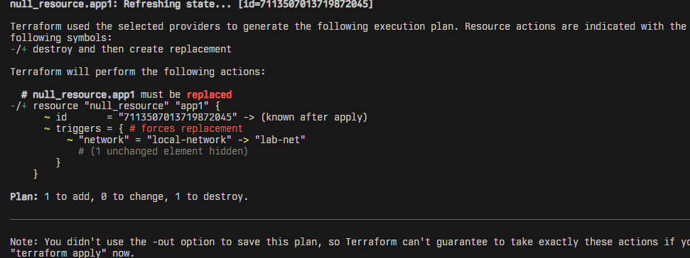

### Actividad: Escribiendo infraestructura como código en un entorno local con Terraform

<details>
<summary><strong>Contexto</strong></summary>

Imagina que gestionas docenas de entornos de desarrollo locales para distintos proyectos (app1, app2, ...). En lugar de crear y parchear manualmente cada carpeta, construirás un generador en Python que produce automáticamente:

* **`network.tf.json`** (variables y descripciones)
* **`main.tf.json`** (recursos que usan esas variables)

Después verás cómo Terraform identifica cambios, remedia desvíos manuales y permite migrar configuraciones legacy a código. Todo sin depender de proveedores en la nube, Docker o APIs externas.

</details>

<details>
<summary><strong>Fase 0: Preparación</strong></summary>

1. **Revisa** el [proyecto de la actividad](https://github.com/kapumota/DS/tree/main/2025-1/Iac_orquestador_local)  :

   ```
   modules/simulated_app/
     ├─ network.tf.json
     └─ main.tf.json
   generate_envs.py
   ```
2. **Verifica** que puedes ejecutar:

   ```bash
   python generate_envs.py
   cd environments/app1
   terraform init
   ```
3. **Objetivo**: conocer la plantilla base y el generador en Python.

</details>

Solucion:

Se realizaron modificaciones, para evitar borrar el archivo lock y state de terraform y solo alterar los archivos .tf.json de cada carpeta de app.
Ademas se cambio los archivos main.tf.json para que use las variables dentro de cada app.

Despues de aplicar `python3 generate-envs.py` se crearon 10 carpetas en `environments\app*` con archivos main.tf.json y network.tf.json.

En la carpeta `environments/app1`, se ejecuto:

```sh
terraform init # para descargar librerias de terraform
terraform plan # para ver los cambios que se realizaran
terraform apply # para realizar los cambios, en este caso solo se imprimio en el terminal las variables
```

Ademas se debe usar `terrafrom apply` para que se cree el archivo `terraform.tfstate` que guardar los cambios que se aplicaron y que seran necesarios para la siguiente fase.

<details>
<summary><strong>Fase 1: Expresando el cambio de infraestructura</strong></summary>

* **Concepto**
Cuando cambian variables de configuración, Terraform los mapea a **triggers** que, a su vez, reconcilian el estado (variables ->triggers ->recursos).

* **Actividad**

  - Modifica en `modules/simulated_app/network.tf.json` el `default` de `"network"` a `"lab-net"`.
  - Regenera `environments/app1` con `python generate_envs.py`.
  - `terraform plan` observa que **solo** cambia el trigger en `null_resource`.

* **Pregunta**

  * ¿Cómo interpreta Terraform el cambio de variable?
  * ¿Qué diferencia hay entre modificar el JSON vs. parchear directamente el recurso?
  * ¿Por qué Terraform no recrea todo el recurso, sino que aplica el cambio "in-place"?
  * ¿Qué pasa si editas directamente `main.tf.json` en lugar de la plantilla de variables?

<details>
<summary><em>Procedimiento</em></summary>

1. En `modules/simulated_app/network.tf.json`, cambia:

   ```diff
     "network": [
       {
   -     "default": "net1",
   +     "default": "lab-net",
         "description": "Nombre de la red local"
       }
     ]
   ```
2. Regenera **solo** el app1:

   ```bash
   python generate_envs.py
   cd environments/app1
   terraform plan
   ```

   Observa que el **plan** indica:

   > \~ null\_resource.app1: triggers.network: "net1" -> "lab-net"

</details>

</details>


Solucion:

Al cambiar el archivo `modules/simulated_app/network.tf.json`, se cambio la variable `network` de `local-network` a `lab-net`.

Se ejecuto el script de python `python3 generate_envs.py` que creo de nuevo los archivso `main` y `network` para cada app.

Dentro de `environments/app1` se verifico que en el archivo `network.tf.json`, la variable `network` cambio de `local-network` a `lab-net`.

Se hizo `terraform plan` y se mostro que hubo un cambio del estado, en este caso el nombre de network:



>  * ¿Cómo interpreta Terraform el cambio de variable?

Terraform lee el valor nuevo al ejecutar `plan`. Si el cambio no requiere reemplazo del recurso, se aplica en sitio (in-place).

>  * ¿Qué diferencia hay entre modificar el JSON vs. parchear directamente el recurso?

Modificar el JSON mantiene la estructura de directorios, si se usara la version anterior (que borraba directorios), se borraria los archivos `.locl` y `.state`, esto rompe la consistencia y causaria drift

>  * ¿Por qué Terraform no recrea todo el recurso, sino que aplica el cambio "in-place"?

Porque evalua si el cambio puede aplicarse sin destruir. Solo recrearia si el cambio afecta propiedades que son no actualizables.

>  * ¿Qué pasa si editas directamente `main.tf.json` en lugar de la plantilla de variables?

Si se edita `main.tf.json` de cada app estas tendrian valores estaticos independientes de variables.

<details>
<summary><strong>Fase 2: Entendiendo la inmutabilidad</strong></summary>

#### A. Remediación de 'drift' (out-of-band changes)

1. **Simulación**

   ```bash
   cd environments/app2
   # edita manualmente main.tf.json: cambiar "name":"app2" ->"hacked-app"
   ```
2. Ejecuta:

   ```bash
   terraform plan
   ```

    Verás un plan que propone **revertir** ese cambio.
3. **Aplica**

   ```bash
   terraform apply
   ```
    Y comprueba que vuelve a "app2".
   

#### B. Migrando a IaC

* **Mini-reto**
 1. Crea en un nuevo directorio `legacy/` un simple `run.sh` + `config.cfg` con parámetros (p.ej. puerto, ruta).

    ```
     echo 'PORT=8080' > legacy/config.cfg
     echo '#!/bin/bash' > legacy/run.sh
     echo 'echo "Arrancando $PORT"' >> legacy/run.sh
     chmod +x legacy/run.sh
     ```
  2. Escribe un script Python que:

     * Lea `config.cfg` y `run.sh`.
     * Genere **automáticamente** un par `network.tf.json` + `main.tf.json` equivalente.
     * Verifique con `terraform plan` que el resultado es igual al script legacy.

</details>

<details>
<summary><strong>Fase 3: Escribiendo código limpio en IaC</strong></summary>

| Conceptos                       | Ejercicio rápido                                                                                               |
| ------------------------------------------ | -------------------------------------------------------------------------------------------------------------- |
| **Control de versiones comunica contexto** | - Haz 2 commits: uno que cambie `default` de `name`; otro que cambie `description`. Revisar mensajes claros. |
| **Linting y formateo**                     | - Instala `jq`. Ejecutar `jq . network.tf.json > tmp && mv tmp network.tf.json`. ¿Qué cambió?                 |
| **Nomenclatura de recursos**               | - Renombra en `main.tf.json` el recurso `null_resource` a `local_server`. Ajustar generador Python.           |
| **Variables y constantes**                 | - Añade variable `port` en `network.tf.json` y usarla en el `command`. Regenerar entorno.                     |
| **Parametrizar dependencias**              | - Genera `env3` de modo que su `network` dependa de `env2` (p.ej. `net2-peered`). Implementarlo en Python.    |
| **Mantener en secreto**                    | - Marca `api_key` como **sensitive** en el JSON y leerla desde `os.environ`, sin volcarla en disco.           |

</details>

Solucion:

1. Se realizaron cambios para las descripciones y nombres de la variable nombre dentro del modulo usado como plantilla
2. Esto realiza un formateo correcto de JSON, ya que `jq` es un parser para JSON.
3. Se realizaron estos cambios y se vio que el recurso `local_server` no existe como paquete aceptado por `hashicorp`
5. se agrego una variable `api_key` dentro de las variables usadas en `network.tf.json`, se agrego `sensitive : true` para que no se muestre en el output al usar `terrafom plan o apply`.


<details>
<summary><strong>Fase 4: Integración final y discusión</strong></summary>

1. **Recorrido** por:

   * Detección de drift (*remediation*).
   * Migración de legacy.
   * Estructura limpia, módulos, variables sensibles.
2. **Preguntas abiertas**:

   * ¿Cómo extenderías este patrón para 50 módulos y 100 entornos?
   * ¿Qué prácticas de revisión de código aplicarías a los `.tf.json`?
   * ¿Cómo gestionarías secretos en producción (sin Vault)?
   * ¿Qué workflows de revisión aplicarías a los JSON generados?

</details>

Solucion:

>  * ¿Cómo extenderías este patrón para 50 módulos y 100 entornos?

   Se podria realizar los siguientes cambios :

```py
    dev_dir = os.path.join(env_dir, "dev")
    prod_dir = os.path.join(env_dir, "prod")
    
    os.makedirs(dev_dir, exist_ok=True)
    os.makedirs(prod_dir, exist_ok=True)
```
Con se crea dos entornos por aplicacion, por ejemplo dentro de `app1`, se tendra directorios `dev` y `prod`.

Para tener 100 apps, se cambio la lista siguiente que antes creaba 10:

```py
ENVS = [
    {"name": f"app{i}", "network": f"net{i}"} for i in range(1, 51)
]
```

>   * ¿Qué prácticas de revisión de código aplicarías a los `.tf.json`?

Se podria usar lints y auto formatters para terraform, estos son cubiertos por extensiones de editor como `HashiCorp Terraform` para `VSCode`.

>   * ¿Cómo gestionarías secretos en producción (sin Vault)?

Los secretos podrian ponerse como variables y utilizar `sensitive = true`, otra forma seria crear un scrip python para que este cree el archivo `.tf` y con `os.getenv` de python se leerian los `secrets` de un archivo `.env`

>   * ¿Qué workflows de revisión aplicarías a los JSON generados?

Como en el paso anterior, puede usarse `jq` para formatear los JSON. Con esta herramienta, se podria crear un `hook` de `pre-commit` para que todos los archivos `.tf.json` en un repositorio remoto tengan un formato correcto.


#### Ejercicios

<details>
<summary>1. <strong>Drift avanzado</strong></summary>

   * Crea un recurso "load\_balancer" que dependa de dos `local_server`. Simula drift en uno de ellos y observa el plan.

</details>

Solucion:

Se creo el archivo `drift/main.tf`, en el que el recurso `load_balaner` depende de dos `local_server`, se ejecuto:

```sh
terraform init
terraform plan
terraform apply
```

Con esto se crearon los archivos `.lock` y `.state`. Despues se cambio el nombre del recurso `local_server_2` a `local_server_3`, al ejecutar:

```sh
terraform plan
```

Se observo que no se podria modifcar estos recursos porque no se cumple la condicion para `load_balancer` que es tener `local_server_2`.

<details>
<summary>2. <strong>CLI Interactiva</strong></summary>

   * Refactoriza `generate_envs.py` con `click` para aceptar:

     ```bash
     python generate_envs.py --count 3 --prefix staging --port 3000
     ```

</details>

Solucion:

Para esto se uso la librera `argparse` en lugar de `click`, que viene con python. Se definio un parser con 3 flags (count, port y prefix):

```py
    parser = argparse.ArgumentParser(description="Crear apps")
    parser.add_argument("--count", required=True, help="Numero de apps a crear")
    parser.add_argument("--prefix", required=True, help="Prefijo de las app")
    parser.add_argument("--port", required=True, help="Puerto de las redes de servidores en todas las apps")

    args = parser.parse_args()
```

Luego se uso:
- `count`: para crear cierta cantidad de apps con archivos `tf.json` dentro.
- `prefix`: usado para los nombres de apps creados.
- `port`: se parseo los archivos `network.tf.json` y se puso la flag port dentro de la variable `port` de terraform.

<details>
<summary>3. <strong>Validación de Esquema JSON</strong></summary>

   * Diseña un JSON Schema que valide la estructura de ambos TF files.
   * Lanza la validación antes de escribir cada archivo en Python.

</details>

<details>
<summary>4. <strong>GitOps Local</strong></summary>

   * Implementa un script que, al detectar cambios en `modules/simulated_app/`, regenere **todas** las carpetas bajo `environments/`.
   * Añade un hook de pre-commit que ejecute `jq --check` sobre los JSON.

</details>

<details>
<summary>5. <strong>Compartición segura de secretos</strong></summary>

   * Diseña un mini-workflow donde `api_key` se lee de `~/.config/secure.json` (no versionado) y documenta cómo el equipo la distribuye sin comprometer seguridad.

</details>
