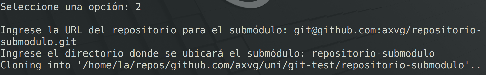

### Actividad: Exploración y administración avanzada de Git mediante un script interactivo

#### Materiales necesarios

- Un entorno de terminal (Linux, macOS o Windows con Git Bash).
- Un repositorio Git (puede ser uno de prueba).
- El script interactivo (por ejemplo, `git_avanzado.sh`).

> Puedes revisar una versión del script interactivo [aquí](https://github.com/kapumota/DS/blob/main/2025-1/git_avanzado.sh).

#### Instrucciones previas

1. **Descarga y guarda el script:**
   - Copia el contenido del script proporcionado (el ejemplo extendido) y guárdalo en un archivo llamado `git_avanzado.sh`.

2. **Asignar permisos de ejecución:**
   - Abre la terminal en el directorio donde guardaste el archivo y ejecuta:
     ```bash
     chmod +x git_avanzado.sh
     ```

3. **Ubicación:**
   - Asegúrate de ejecutar el script dentro de la raíz de un repositorio Git, ya que el script interactúa con el entorno Git.

### Procedimiento de la actividad

A continuación se muestra un ejemplo de uso que ilustra una sesión interactiva con el script. Este ejemplo simula cómo un usuario podría interactuar con algunas de las opciones
del menú. Recuerda que, al ejecutarlo, verás mensajes en tiempo real en la terminal y deberás ingresar las opciones y datos solicitados.

1. **Inicio del script**

   Tras darle permisos de ejecución y ejecutar el script desde la raíz de un repositorio Git, se muestra el siguiente menú en la terminal:

   ```
   ====== Menú avanzado de Git ======
   1) Listar reflog y restaurar un commit
   2) Agregar un submódulo
   3) Agregar un subtree
   4) Gestión de ramas
   5) Gestión de stashes
   6) Mostrar estado y últimos commits
   7) Gestión de tags
   8) Gestión de Git Bisect
   9) Gestión de Git Diff
   10) Gestión de Hooks
   11) Salir
   Seleccione una opción:
   ```

2. **Opción: agregar un submódulo (Opción 2)**

   - **Usuario:** Ingresa `2` y presiona Enter.
   - El script pide:
     ```
     Ingrese la URL del repositorio para el submódulo:
     ```
   - **Usuario:** Escribe, por ejemplo:  
     `https://github.com/axvg/repositorio-submodulo.git`
   - El script solicita:
     ```
     Ingrese el directorio donde se ubicará el submódulo:
     ```
   - **Usuario:** Escribe, por ejemplo:  
     `libs/submodulo`
   - **Script:** Ejecuta:
     ```bash
     git submodule add https://github.com/axvg/repositorio-submodulo.git libs/submodulo
     git submodule update --init --recursive
     ```
   - **Salida esperada:**  
     El mensaje confirmando que el submódulo ha sido agregado:
     ```
     Submódulo agregado en: libs/submodulo
     ```

En este caso se necesita copiar el link `git@github.com:axvg/repositorio-submodulo.git` porque si se usa el link con https se necesita poner las credenciales en la terminal.





3. **Opción: Gestión de ramas (Opción 4)**

   - **Usuario:** Regresa al menú principal y escoge la opción `4`.
   - El script despliega un submenú:
     ```
     === Gestión de Ramas ===
     a) Listar ramas
     b) Crear nueva rama y cambiar a ella
     c) Cambiar a una rama existente
     d) Borrar una rama
     e) Volver al menú principal
     Seleccione una opción:
     ```
   - **Ejemplo A: Listar ramas (Opción a)**
     - **Usuario:** Ingresa `a` y presiona Enter.
     - **Script:** Ejecuta `git branch` y muestra la lista de ramas:
       ```
         master
       * feature/nueva-funcionalidad
       ```
   - **Ejemplo B: Crear una nueva rama (Opción b)**
     - **Usuario:** Ingresa `b`, luego el script pregunta:
       ```
       Ingrese el nombre de la nueva rama:
       ```
     - **Usuario:** Escribe `feature/login`.
     - **Script:** Ejecuta `git checkout -b feature/login` y confirma:
       ```
       Rama 'feature/login' creada y activada.
       ```


4. **Opción: Gestión de git diff (Opción 9)**

   - **Usuario:** Selecciona la opción `9` del menú principal.
   - El submenú de diff se muestra:
     ```
     === Gestión de git diff ===
     a) Mostrar diferencias entre el working tree y el área de staging (git diff)
     b) Mostrar diferencias entre el área de staging y el último commit (git diff --cached)
     c) Comparar diferencias entre dos ramas o commits
     d) Volver al menú principal
     Seleccione una opción:
     ```
   - **Ejemplo:**  
     - **Usuario:** Ingresa `c` para comparar dos revisiones.  
       El script solicita:
       ```
       Ingrese el primer identificador (rama o commit):
       ```
     - **Usuario:** Escribe `master`.
     - El script luego pregunta:
       ```
       Ingrese el segundo identificador (rama o commit):
       ```
     - **Usuario:** Escribe `feature/login`.
     - **Script:** Ejecuta `git diff master feature/login` y muestra las diferencias entre ambas ramas en la terminal.


Aca podria agregar un mensaje cuando haya dos ramas que sean iguales y no tengan diferencias

5. **Opción: Gestión de hooks (Opción 10)**

   - **Usuario:** Escoge la opción `10` para gestionar hooks.
   - Se despliega el submenú de hooks:
     ```
     === Gestión de hooks ===
     a) Listar hooks disponibles
     b) Crear/instalar un hook (ej. pre-commit)
     c) Editar un hook existente
     d) Borrar un hook
     e) Volver al menú principal
     Seleccione una opción:
     ```
   - **Ejemplo:** Crear un hook pre-commit.
     - **Usuario:** Ingresa `b`.
     - El script pregunta:
       ```
       Ingrese el nombre del hook a instalar (por ejemplo, pre-commit):
       ```
     - **Usuario:** Escribe `pre-commit`.
     - Luego el script solicita:
       ```
       Ingrese el contenido del hook (una línea, se agregará '#!/bin/bash' al inicio):
       ```
     - **Usuario:** Escribe una línea, por ejemplo:
       `echo "Ejecutando pre-commit hook..." && exit 0`
     - **Script:** Crea el archivo `.git/hooks/pre-commit`, lo hace ejecutable y confirma:
       ```
       Hook 'pre-commit' instalado.
       ```


6. **Finalizar la Sesión**

   - **Usuario:** Cuando termine de utilizar las opciones deseadas, regresa al menú principal y selecciona `11` para salir:
     ```
     Saliendo del script.
     ```

### Preguntas

- **¿Qué diferencias observas en el historial del repositorio después de restaurar un commit mediante reflog?**

Restaurar un commit usando `reflog` y `git reset --hard` como hace el script reescribe la historia de la rama actual. El commit que selecciona del reflog se convierte en el nuevo HEAD de la rama. Todos los commits que vinieron despues de ese punto en esa rama se pierden de la historia principal de la rama. Para alguien que vea el historial despues del reset parecera que esos commits posteriores nunca ocurrieron en esa linea de desarrollo.

- **¿Cuáles son las ventajas y desventajas de utilizar submódulos en comparación con subtrees?**

Los submodulos mantienen los repositorios completamente separados. El repositorio principal solo almacena una referencia un puntero a un commit especifico del repositorio del submodulo. La ventaja es que es muy claro que version del submodulo estas usando y actualizarlo a una nueva version es un paso controlado (`git submodule update --remote`). La desventaja es que el flujo de trabajo es mas complejo los colaboradores necesitan inicializar (`git submodule init`) y actualizar (`git submodule update`) los submodulos manualmente despues de clonar o hacer pull.

Los subtrees copian archivos y el historial del otro repositorio directamente dentro de tu repositorio principal mezclando su contenido e historia. La ventaja es que el flujo de trabajo es mas simple una vez añadido funciona como cualquier otro directorio en tu proyecto no hay comandos especiales para clonar o hacer pull. La desventaja es que tu repositorio principal crece mas en tamaño y el historial se vuelve mas complejo. Actualizar el codigo del subtree desde su origen o enviar cambios de vuelta al origen es un proceso mas manual y por esto puede tener mas errores que con submodulos.

- **¿Cómo impacta la creación y gestión de hooks en el flujo de trabajo y la calidad del código?**

Genera un impacto positivo en el flujo de trabajo y la calidad al automatizar verificaciones y forzar estandares. Hooks como `pre-commit` o `pre-push` pueden ejecutar automaticamente linters formateadores de codigo, tests unitarios o verificar mensajes de commit. En el caso de python estos pueden ser `flake8`, `black`, y tests de `pytest`. Esto asegura que el codigo que entra al repositorio cumple ciertos criterios de calidad y consistencia antes de ser compartido (cuando distintos usuarios usan distintos formatters puede generara merge conflicts). Reduce la carga de revision manual para problemas comunes y previene que codigo roto o mal formateado llegue a la rama principal o al pipeline de CI/CD.

- **¿De qué manera el uso de `git bisect` puede acelerar la localización de un error introducido recientemente?**

`git bisect` acelera la localizacion de errores porque usa una busqueda binaria en el historial de commits en lugar de una busqueda lineal. Le dices a git un commit donde el error existe (`git bisect bad`) y uno anterior donde no existia (`git bisect good`). Git automaticamente salta a un commit a mitad de camino entre esos dos. Tu pruebas ese commit y le dices a git si es bueno o malo. Git entonces descarta la mitad del historial restante donde sabes que el error no esta (o si esta) y repite el proceso saltando a la mitad del rango restante.

- **¿Qué desafíos podrías enfrentar al administrar ramas y stashes en un proyecto con múltiples colaboradores?**

Al administrar ramas con muchos colaboradores el principal desafio son los merge conflict que ocurren cuando varias personas modifican las mismas partes del codigo en ramas distintas. Se necesita una estrategia clara de integracion como integrar frecuentemente la rama principal en las feature branches (`pull --rebase` o `merge`) pero esto requiere coordinacion y comunicacion. Si hay ramas que viven mucho tiempo estas divergen mas y aumentan la dificultad de la fusion. Para los stashes el desafio es que son locales y temporales. Si haces `git stash` y luego bajas muchos cambios de otros colaboradores al hacer `git stash pop` o `git stash apply` es mas probable que tengas conflictos entre tus cambios guardados y los cambios nuevos.


### Ejercicios 

1 . Extiende el menú de gestión de ramas para incluir la funcionalidad de renombrar ramas.

**Instrucciones:**

1. **Investiga** el comando `git branch -m` que permite renombrar una rama.
2. **Modifica** la función de “Gestión de Ramas” para agregar una nueva opción (por ejemplo, "f) Renombrar una rama").
3. **Implementa** la lógica para solicitar al usuario el nombre de la rama actual y el nuevo nombre.
4. **Verifica** que, tras el cambio, la rama se renombre correctamente.  
   **Pista:** Considera cómo se comporta el cambio si la rama en uso es la que se desea renombrar.

**Ejemplo de salida esperada:**

```
Ingrese el nombre de la rama actual: feature/login
Ingrese el nuevo nombre para la rama: feature/authentication
Rama 'feature/login' renombrada a 'feature/authentication'
```

Para esto se crea un opcion `e)` que nos permite cambiar el nombre de una rama con el comando `branch -m`. Se cambia el nombre de la rama `feature/login`. Se agrego una nueva opcion `e) Renombrar una rama` al sub-menu presentado. Se uso un bloque `case` para manejar esta seleccion. Con la informacion de la nueva rama ejecuta el comando `git branch -m "$rama_actual" "$nuevo_nombre"` para efectuar el renombrado y mostrando el mensaje `Rama '$rama_actual' renombrada a '$nuevo_nombre'`.


2 . Amplia la sección de "Gestión de git diff" para permitir ver las diferencias de un archivo específico entre dos commits o ramas.

**Instrucciones:**

1. **Investiga** cómo usar `git diff` con la opción `--` para especificar un archivo (por ejemplo, `git diff commit1 commit2 -- path/to/file`).
2. **Agrega** al submenú de diff una nueva opción (por ejemplo, "e) Comparar diferencias de un archivo específico").
3. **Solicita** al usuario ingresar dos identificadores (ramas o commits) y luego la ruta del archivo.
4. **Ejecuta** el comando `git diff` para mostrar únicamente las diferencias para ese archivo y presenta el resultado en pantalla.

**Ejemplo de salida esperada:**

```
Ingrese el primer identificador (rama o commit): master
Ingrese el segundo identificador (rama o commit): feature/login
Ingrese la ruta del archivo: src/app.js
[Mostrará el diff solo de 'src/app.js' entre las dos revisiones]
```

Para permitir la comparacion de un archivo entre dos revisiones se actualiza la funcion `gestionar_diff`. Se introdujo una nueva opcion `d) Comparar diferencias de un archivo especifico...` en el submenu de diff. Se usa el bloque `case` y cuando se selecciona esta opcion el script solicita al usuario los dos identificadores de revision con `read id1` y `read id2` (inputs) y despues la ruta del archivo con `read archivo`. El comando usaod es  `git diff "$id1" "$id2" -- "$archivo"`.


3 . Crea una función que permita instalar automáticamente un hook que, por ejemplo, verifique si se han agregado comentarios de documentación en cada commit.

**Instrucciones:**

1. **Investiga** el hook pre-commit, que se ejecuta antes de que se realice un commit.
2. **Escribe** un pequeño script en Bash que verifique si se han modificado archivos y, para cada archivo modificado, compruebe si existen comentarios de documentación. Puedes establecer una regla simple, por ejemplo, que cada función definida en un archivo debe tener un comentario anterior.
3. **Integra** la función en el submenú de "Gestión de Hooks" o crea una nueva opción en el menú principal para instalar este hook.
4. **Prueba** la funcionalidad creando o modificando un commit sin la documentación requerida y verifica que el hook evite completar el commit.

**Ejemplo de contenido del hook:**

```bash
#!/bin/bash
# Hook pre-commit para verificar documentación en funciones

# Lista de archivos modificados
files=$(git diff --cached --name-only --diff-filter=ACM | grep '\.c\|\.h\|\.js')
for file in $files; do
    # Ejemplo simplificado: verificar si existe al menos una línea con comentario ('//')
    if ! grep -q "//" "$file"; then
        echo "Error: El archivo '$file' no contiene comentarios de documentación."
        exit 1
    fi
done
exit 0
```

Se incluye la opcion `e) Instalar hook pre-commit para verificar documentacion` en el submenu. El bloque `case` para `e|E` define la ruta del archivo como `hook_file=".git/hooks/pre-commit"`. Luego utiliza multiples comandos `echo "..." >> "$hook_file"` para escribir el script de Bash directamente en ese archivo y en el terminal. Este script primero obtiene la lista de archivos modificados o añadidos que son `.c`, `.h`, o `.js` usando `git diff --cached --name-only --diff-filter=ACM | grep ...`. Despues itera sobre estos archivos con un bucle `for`. Dentro del bucle usa `grep -q "//"` para verificar si el archivo contiene al menos un comentario de estilo `//`. Si `grep` no encuentra (`! grep -q`) ningun comentario imprime un mensaje de error y ejecuta `exit 1` lo cual detiene el proceso de commit. Si todos los archivos revisados pasan la verificacion el script termina con `exit 0` permitiendo que el commit continue. Tambien se usa `chmod +x "$hook_file"` para que el script sea ejecutables.


4 . Implementa una opción en el script que realice un merge automatizado de una rama determinada en la rama actual, incluyendo la resolución automática de conflictos (siempre que sea posible).

**Instrucciones:**

1. **Investiga** las opciones de `git merge` y cómo utilizar el parámetro `--strategy-option` (por ejemplo, `-X theirs` o `-X ours`) para la resolución automática de conflictos.
2. **Añade** una nueva opción en el menú principal (por ejemplo, "12) Merge automatizado de una rama").
3. **Solicita** al usuario el nombre de la rama que se desea fusionar.
4. **Ejecuta** el comando de merge con una estrategia de resolución automática, por ejemplo:
   ```bash
   git merge -X theirs <rama_a_fusionar>
   ```
5. **Valida** la operación mostrando el estado final tras el merge.

**Ejemplo de salida esperada:**

```
Ingrese el nombre de la rama a fusionar: feature/login
Merge completado automáticamente utilizando la estrategia 'theirs'.
```

Se agrego la opcion `11) Merge automatizado` a la funcion `mostrar_menu_principal`. Se creo una nueva funcion `merge_automatizado`. Esta funcion solicita al usuario el nombre de la rama a fusionar con `read rama`. Luego ejecuta el comando `git merge -X theirs "$rama"`. La opcion `-X theirs` le dice a Git que si encuentra conflictos de fusion resuelva automaticamente usando la version del codigo que viene de la rama que se esta fusionando (`$rama`). La funcion tambien comprueba el codigo de salida del comando merge (`$?`). Si es 0 (exito) informa que el merge se completo usando la estrategia theirs. Si no es 0 indica que hubo un error y se necesita revisar manualmente.


5 . Implementa una opción en el script que genere un reporte con información relevante del repositorio (estado, ramas, últimos commits, stashes, etc.) y lo guarde en un archivo.

**Instrucciones:**

1. **Agrega** una nueva opción al menú principal (por ejemplo, "13 Generar reporte de estado del repositorio").
2. **Crea** una función que ejecute varios comandos de Git (ej. `git status`, `git branch`, `git log -n 5`, `git stash list`) y redirija la salida a un archivo, por ejemplo `reporte_git.txt`.
3. **Agrega** mensajes claros en el reporte que indiquen qué información corresponde a cada comando.
4. **Verifica** que el archivo se cree correctamente y que contenga la información esperada.

**Ejemplo de salida esperada:**

Al ejecutar la función, se debe crear el archivo `reporte_git.txt` con contenido similar a:
```
=== Estado del repositorio ===
[Salida de git status]

=== Ramas existentes ===
[Salida de git branch]

=== Últimos 5 commits ===
[Salida de git log -n 5]

=== Lista de stashes ===
[Salida de git stash list]
```

Para esto se la funcion `generar_reporte`. Esta funcion define el nombre del archivo de salida `reporte="reporte_git.txt"`. Utiliza `echo "..." > "$reporte"` para escribir el primer encabezado y crear o sobrescribir el archivo. Despues usa el operador de append `>>` para añadir al archivo los encabezados y la salida de varios comandos de Git utiles: `git status`, `git branch`, `git log -n 5 --oneline`, y `git stash list`.

 