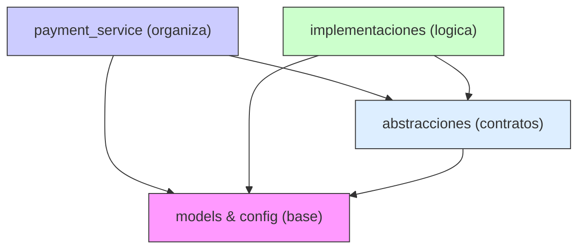
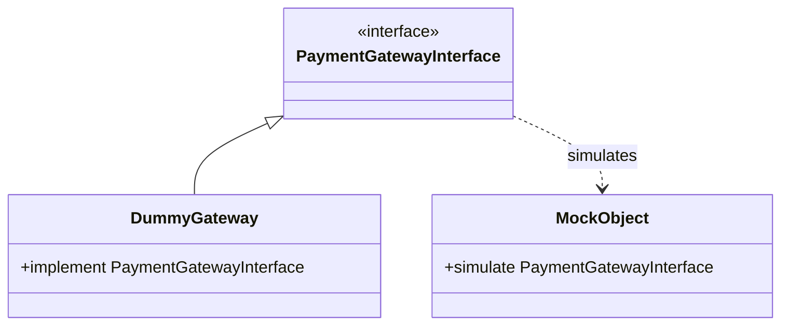

### Ejemplo sobre testing y DevOps con SOLID

> Puedes revisar aquí el proyecto desarrollado en clase: [devops_testings_1](https://github.com/kapumota/DS/tree/main/2025-1/devops-testing-proyecto)

####  Nivel teórico (SRP -> DIP)

1. **Clasifica responsabilidades**
   - *Contexto:* El módulo `services.py` concentra orquestación de pagos.
   - *Enunciado:* Señala cuatro responsabilidades concretas de `PaymentService`. Indica cuáles serían candidatas a extraerse a nuevos "policies" u "object collaborators" para reforzar SRP sin romper LSP.
   - *Aceptación:* ensayo de 400 palabras; menciona qué fixtures habría que crear para las nuevas clases.

Solucion:

En `services.py`, el `PaymentService` dirige la logica para el proceso de pago. Aca varias responsabilidades se entrelazan dentro de su metodo `process_payment`, lo que podría dificultar su mantenimiento y extension a largo plazo, esto no cumple muy bien el Principio de Responsabilidad Unica (SRP). Se puede identificar las cuatro responsabilidades:

- Obtencion y validacion del usuario: La linea `user = self._user_repo.get(username)` se encarga de recuperar la entidad `User`. Aunque delegada al repositorio, la decision de obtener el usuario y manejar el caso de que no exista (implicito en KeyError del repo) es una responsabilidad del servicio.

- Validacion de la solicitud de pago: La llamada a `validate_amount(amount)` verifica que el monto sea valido. Esta es una regla especifica para los pagos que podria modificarse en el futuro como con limites maximos, mas tipos de monedas permitidas.

- Interaccion con la pasarela de pagos: El bloque `self._gw.charge(amount, currency, user)` maneja la comunicacion con el sistema externo de pago. Esto incluye no solo la llamada sino tambien implicitamente la gestion de exito/fallo de dicha comunicacion.

- Creacion y persistencia del registro de pago: Si el cobro es exitoso, se crea una instancia de `Payment` y se guarda mediante `self._pay_repo.add(payment)`. Esto implica la transformacion de datos de la solicitud en una entidad que persista y se guarde.

Para reforzar el principio SRP sin romper el principio LSP se podrian extraer las siguientes responsabilidades:

- Validacion de la solicitud de pago: Se podria crear un `PaymentValidator`. Esta clase encapsularia todas las reglas de validacion (monto, tipo de moneda, quizas limites por usuario). `PaymentService` delegaria la validacion a este colaborador.

Fixture necesaria: `@pytest.fixture def payment_validator(): return PaymentValidator()` (posiblemente con dependencias a Config si las reglas son configurables).

- Gestion de la interaccion con la pasarela: Si bien la pasarela ya es una dependencia, la logica de como interactuar (como manejo de errores especificos de la pasarela o si se introducen reintentos) podria extraerse a una clase como `PaymentExecution`. Esta clase envolveria la llamada al `PaymentGateway`.

Fixture necesaria: `@pytest.fixture def payment_execution(fake_gateway, app_config): return PaymentExecution(fake_gateway, app_config.retries)` (asumiendo que toma el gateway y configuracion de reintentos).

- Creacion del registro de pago : Una clase `PaymentCreator` podria ser responsable de construir el objeto `Payment` a partir de los datos validados y el usuario.

Fixture necesaria: `@pytest.fixture def payment_creator(): return PaymentCreator()`.

- La obtencion del usuario ya esta bien delegada al `UserRepository`. Extraer las responsabilidades mencionadas arriba haria que `PaymentService` se enfocara puramente en la orquestacion de las funcionalidades principales, de esta forma seria mas modular, testeable y se apegaria al principio SRP. Cada nueva clase tendria su propio conjunto de tests unitarios, y los tests de `PaymentService` se centrarian en la correcta interaccion entre estos componentes, utilizando mocks para los nuevas clases.

2. **Mapa de dependencias**
   - *Contexto:* El grafo actual de paquetes es lineal (`models -> repositories -> services`).
   - *Enunciado:* Dibuja (texto o diagrama) la versión ideal tras aplicar DIP para introducir un `NotificationService` y un `RetryPolicy`.
   - *Aceptación:* el grafo no debe contener ciclos; se justifica cada flecha.

Solucion:

- models y config: son la base. `models` son los tipos de datos (como un pago). config son los ajustes (como reintentar 3 veces).

- abstracciones: son plantillas (contratos) que indican la estructura y como debe funcionar sin detalles. Hay una abstraccion para guardar datos (contrato_repo), uno para hablar con la pasarela de pago (contrato_gateway), otro para mandar avisos (contrato_notificacion) y uno para los reintentos (contrato_reintento). estos contratos pueden necesitar saber de models (para saber que datos manejan) o de config (para saber como ajustarse).

- payment_service: es el que organiza el proceso de pago. En lugar de preocuparse como se guarda en la base de datos usa el contrato_repo. Lo mismo para cobrar, avisar o reintentar: usa los contratos correspondientes. El payment_service solo se preocupa de que estos contratos se cumplan, no le importa quien los cumple.

- Implementaciones: estas son el codigo que realizan el trabajo, siguiendo las reglas de los contratos (abstracciones).
   repo_real: es la forma concreta de guardar datos.
   gateway_real: es la pasarela de pago especifica que se usa.
   notificador_real: es como se mandan los avisos (por email, sms).
   reintentador_real: es la logica especifica de como reintentar.

De esta forma se cumple que las dependencias no siguen un ciclo sin fin, `payment_service` solo depende de abstracciones y no con partes de logica real esto tambien ayuda al DIP. Si por ejemplo  se quiere cambiar base de datos solo se cambia la implementacion de repo y `payment_service` queda intacta.

3. **Análisis de sustitución**
   - *Contexto:* `DummyGateway` y `Mock` cumplen la interfaz de pasarela.
   - *Enunciado:* Escribe un argumento formal sobre por qué `Mock` **sí** cumple LSP aunque acepte métodos inexistentes y cómo mitigarlo con `spec`.
   - *Aceptación:* referencia a `unittest.mock.create_autospec` y ejemplos de fallo.

4. **Cobertura ≠ calidad**
   - *Contexto:* el pipeline actual solo desarrolla pruebas funcionales.
   - *Enunciado:* describe al menos tres defectos que una cobertura del 100 % no detectaría y qué tipo de prueba los revelaría.
   - *Aceptación:* se citan tipos (property-based, fuzzing, contract tests…).

Solucion:

Una cobertura de pruebas del 100 % solo indica que cada parte del codigo fue ejecutada al menos una vez durante las pruebas. no garantiza que el codigo sea correcto  o seguro. Lo defectos que podrian pasar desapercibidos son:

- Casos de borde no contemplados: el codigo podria tener una logica incorrecta que produce resultados correctos para los pocos casos de prueba  definidos, pero falla para otros valores validos. por ejemplo, un calculo de descuento podria funcionar para 10% y 20% (cubriendo la linea), pero estar mal implementado para 15% o para valores como 0% o 100%. Estos errores se mostrarian con pruebas de tipo **property-based testing**, para esto se usa libreria `hyphotesis` para generar un amplio rango de datos de entradas (validos o invalidos pero esperados) y mostrando contra-ejemplos

- Problemas de concurrencia: si el sistema maneja multiples hilos o procesos accediendo a recursos compartidos, como i InMemoryUserRepository es usado por multiples requests simultaneamente, una cobertura del 100% en  no revelara condiciones de carrera donde el estado del recurso se corrompe debido a accesos no sincronizados. El tipo de prueba que lo revelaria son las pruebas de estres (stress testing) o pruebas de concurrencia, estas pruebas ponen al sistema a una alta carga de trabajo y ejecutan operaciones concurrentes para provocar los problemas que se menciono antes.

- Incumplimiento de contrato con sistemas externos:
`PaymentService` podria estar implementado correctamente segun su propia logica y alcanzar 100% de cobertura con un `DummyGateway`. Sin embargo la pasarela de pagos real podria haber cambiado en su api (como en un campo renombrado, en su endpoint, un nuevo campo obligatorio o un formato de fecha distinto) y si `PaymentService` no se ha actualizado entonces las pruebas funcionales con el `DummyGateway` no detectarian estos cambios. Con `contract testings` permitirian definir un contrato (abstraccion) entre el consumidor (en este caso `PaymentService`) y un proveedor (la pasarela de pagos), estos tests verifican que ambas partes cumplan con el contrato acordado.

- Otros defectos que podrian no ser detectados incluyen problemas de rendimiento (el codigo es correcto pero lento revelado por pruebas de rendimiento/benchmark), vulnerabilidades de seguridad (reveladas por pruebas de seguridad). Fuzzing (fuzz testing, python usa la libreria `pythonfuzz`) seria util para encontrar fallos con entradas inesperadas que las pruebas funcionales tipicas no consideran.

5. **Ventajas y riesgos de monkeypatch**
   - *Enunciado:* contrapón en 300 palabras setter-like vs constructor-like.
   - *Aceptación:* lista de "casos de uso apropiados" y "smells" para cada estilo.

Constructor-like DI:
Las dependencias se proporcionan al crear un objeto como argumentos del constructor. Ejemplo:

`PaymentService(gateway, payment_repo, user_repo)`

Las ventajas son:
- Dependencias explicitas y claras desde el inicio de la definicion de clase.

- El objeto puede asegurar que tiene todo lo necesario para ser valido tras su creacion.

- Se obliga la inmutabilidad de las dependencias una vez establecidas.

Desventajas:

- Puede llevar a constructores con muchos parametros si un objeto tiene demasiadas dependencias.

- Al cambiar una dependencia para un subconjunto de metodos o para un caso de prueba especifico puede ser mas dificl ya que requiere crear una nueva instancia.

Setter-like DI:

Las dependencias se establecen despues de que el objeto ha sido creado a traves de metodos `setter`. En el caso de monkeypatch se alteran atributos o metodos dinamicamente en tiempo de ejecucion (runtime) para la duracion de una prueba.

Ventajas:

- Permite cambiar dependencias de forma mas granular o de forma tardia.

- El monkeypatch se usa para aislar codigo dificil de testear como funciones globales (datetime.now(), requests.get()), o para simular condiciones de error especificas.

Desventajas:

- Las dependencias son menos obvias, el momento del implementacion puede estar oculto.

- Con monkeypatch la accion es de lejos y puede hacer que el flujo de la prueba sea mas dificil de seguir.

- El uso excesivo puede ocultar problemas de diseño.

#### Nivel implementación, código y fixtures

6. **Fixture condicional por entorno**
   *Objetivo:* permitir que los mismos tests usen `DummyGateway` localmente y un gateway real en integración.
   *Tareas:*

    - Leer la variable de entorno `USE_REAL_GATEWAY`.
    - Si está activa, crear el gateway real (puede ser un stub que simule latencia).
    - Ajustar `conftest.py` para registrar la nueva fixture con prioridad.
      *Aceptación:* `pytest -m "not slow"` corre en < 1 s; `pytest -m slow` tarda ≥ 0.5 s por la latencia simulada.

7. **Custom marker `@pytest.mark.contract`**
   *Objetivo:* señalar tests que verifiquen invariantes de dominio (p. ej. "no se persiste un `Payment` sin usuario").
   *Tareas:*

   - Definir marcador en `pytest.ini`.
   -  Etiquetar dos casos.
   -  Añadir a CI un paso "contract" que solo ejecute esos tests.
      *Aceptación:* salida de `pytest -m contract` muestra exactamente 2 tests.

8. **Policy de reintentos**
   *Objetivo:* implementar `RetryPolicy` configurado con `Config.retries`.
   *Tareas:*

   - Nueva clase en `src/devops_testing/retry.py`.
   - Integrar en `PaymentService.process_payment`.
   - Escribir tests parametrizados donde el gateway falla n-1 veces y triunfa en el intento n.
      *Aceptación:* todos los escenarios con `retries` {1, 2, 3} pasan; el tiempo total no debe exceder 0.2 s.

9. **Property-based testing con Hypothesis**
   *Objetivo:* generar montos aleatorios positivos y verificar que siempre se persiste el pago.
   *Tareas:*

    - Añadir `hypothesis` a `requirements.txt` (sin romper velocidad de suite).
    - Crear `test_payment_property.py`.
      *Aceptación:* la prueba se ejecuta en < 1 s con 100 ejemplos.

10. **Observabilidad: logging configurable**
    *Objetivo:* permitir inyectar un logger en `PaymentService`.
    *Tareas:*

    - Añadir parámetro opcional `logger` al constructor.
    - Fixture `capsys` verifica que se registran dos mensajes INFO.
       *Aceptación:* prueba `test_logging_emitted` debe capturar texto "start-payment" y "payment-ok".

#### Nivel proyecto - extensiones completas

11. **Gateway de terceros simulado (FASTAPI)**
    *Contexto:* reemplazar el Mock por un microservicio HTTP local.
    *Tareas:*

    - Crear `src/external_gateway/app.py` con FastAPI y endpoint `/charge`.
    - Fixture `gateway_server` levanta Uvicorn en un hilo usando puerto libre.
    - Implementar `HttpPaymentGateway` que haga `requests.post`.
    - Añadir pruebas de integración con la app corriendo.
       *Aceptación:* los tests etiquetados `@pytest.mark.http` deben pasar y cerrarse limpiamente.

12. **Persistencia en SQLite**
    *Objetivo:* sustituir `InMemoryPaymentRepository` por `SQLitePaymentRepository`.
    *Tareas:*

    - Crear nuevo módulo `persistence/sqlite_repo.py`.
    - Añadir migración automática en `__init__`.
    - Fixture `tmp_path` genera BD temporal; los tests reaprovechan casos existentes vía parametrización.
       *Aceptación:* suite corre con ambos repos sin duplicar lógica; cobertura se mantiene.

13. **Pipeline local con Make + tox**
    *Objetivo:* simular la matriz del CI en equipos de los estudiantes.
    *Tareas:*

    - Definir `tox.ini` con entornos `py310`, `py311`, `lint`, `type`.
    - Agregar Makefile con targets `test`, `ci`, `coverage`, `format`.
    - Documentar en README la invocación `make ci`.
       *Aceptación:* comando `tox -q` finaliza verde en los entornos instalados.

14. **Mutación guiada (mutmut o cosmic-ray)**
    *Objetivo:* demostrar que la suite detecta mutaciones.
    *Tareas:*

    - Configurar mutmut para limitarse a `src/devops_testing/services.py`.
    - Script `run_mutation.sh` para ejecutar y mostrar resumen.
    - Ajustar test si algún mutante sobrevive.
       *Aceptación:* score final ≥ 95 %.

15. **Informe de reporte de pruebas en Markdown**
    *Objetivo:* generar reporte automático post-pytest.
    *Tareas:*

    - Usar `pytest-markdown-report` o plugin casero.
    - Guardar `reports/latest.md` con lista de tests y duración.
    - Añadir step opcional en Makefile.
       *Aceptación:* archivo contiene sección "Slowest tests" con top 3.

### Stubs & Mocks y configuraciones avanzadas

> Puedes revisar aquí el proyecto desarrollado en clase: [devops_testings_2](https://github.com/kapumota/DS/tree/main/2025-1/devops_testing_mocks)

#### Afinar la comprensión de conceptos

1. **Modelo de sustitución y variabilidad**
   Explica por qué `DummyGateway` cumple el Principio de Sustitución de Liskov mientras que un mock sin autospec podría violarlo.Como parte del razonamiento, dibuja un diagrama UML que compare la jerarquía `PaymentGatewayInterface ->DummyGateway ->Mock`.

El principio de sustitución de Liskov (LSP) se usara para entender porqu `DummyGateway` es un buen sustituto y un `Mock` sin autospec puede no serlo. DummyGateway esta diseñado para cumplir estrictamente la interfaz `PaymentGatewayInterface`, implementando el metodo `charge` con la signature y el comportamiento esperados. Si `PaymentService` espera un `PaymentGatewayInterface`, puede usar un `DummyGateway` sin problemas porque este se adhiere al contrato, retornando un booleano y aceptando los parametros correctos. Esto mantiene la corrección del programa.

Por otro lado, un `unittest.mock.Mock` basico, sin autospec, es mas permisivo. Podria no cumplir LSP porque aceptaria llamadas a metodos que no existen en `PaymentGatewayInterface` o llamadas a `charge` con un numero incorrecto de argumentos. Por ejemplo, si el codigo accidentalmente llama a `gateway.char_ge()` (con error typo), el `Mock` no fallaria, devolviendo otro `Mock`, mientras que `DummyGateway` o una implementacion real lanzarian un `AttributeError`. Esta diferencia en el manejo de errores puede alterar el comportamiento del programa de manera inesperada. Esta flexibilidad se convierte en un riesgo si no es controlado.

Para controlar esto, `autospec=True` o `create_autospec` configura el `Mock` para que imite la interfaz del objeto real, incluyendo la firma (signature) de sus metodos. Asi un `Mock` con autospec se comporta de manera mucho mas cercana a `DummyGateway` respecto a LSP, ya que rechazaria llamadas incorrectas tal como lo haria la interfaz original.

En el diagrama UML, `PaymentGatewayInterface` es la interfaz. `DummyGateway` la implementa directamente (herencia de interfaz). `MockObject` "simula" esta interfaz; una linea punteada indica esta relacion. 

2. **Side effects y semántica de idempotencia**
   Describe al menos dos riesgos de emplear `side_effect` para simular errores transitorios en un servicio que, en producción, debe ser idempotente. Argumenta cómo los tests pueden falsamente aprobar una implementación no idempotente.

3. **Covarianza de fixtures**
   Analiza la diferencia semántica entre una fixture `function` y una fixture `session` cuando el recurso subyacente representa un pool de conexiones HTTP. Justifica qué alcance usarías si el gateway de pagos fuera un microservicio real.

4. **Cobertura vs. mutación**
   Define **cobertura de línea** y **tasa de mutantes muertos**. Explica, con cifras hipotéticas, cómo un módulo podría alcanzar 100 % de cobertura y aun así dejar vivos el 30 % de mutantes.

5. **Costo temporal del benchmarking**
   Discute las implicaciones de incluir `pytest-benchmark` en el pipeline continuo: ¿qué impacto podría tener en la duración total? Propón al menos dos estrategias para equilibrar velocidad y confiabilidad de las métricas.

#### Implementación guiada: tocar el código y las pruebas

1. **Refactor seguro con autospec**
   Cambia la firma de `PaymentGatewayInterface.charge` para aceptar un parámetro opcional `currency="USD"`. Ajusta `PaymentService` y sus tests usando autospec para garantizar que todos los mocks detecten la nueva firma.
   *Pista*: busca en `tests/` cualquier llamada a `charge` y pasa ahora `currency="USD"`.

2. **Patching selectivo en cadena**
   Crea un nuevo test que aplique parcheo holístico sobre `DummyGateway.charge` **solo durante la mitad** de los casos parametrizados. Usa un decorator que detecte el parámetro `mode="patched"` y active el parche antes de llamar al caso.

3. **Spies con histograma**
   Extiende `test_spy_latency.py` para que, además del promedio, registre un histograma de latencias usando `collections.Counter` con *buckets* de 1 ms. Verifica que al menos el 90 % de los valores caiga en el primer bucket.

4. **Property-based con contratos cuantitativos**
   Añade un test Hypothesis que genere secuencias de `credit` y `debit` y asegure que la suma *net* de montos aplicados coincida con la diferencia entre saldo inicial y saldo final. Integra `assume()` para descartar casos de saldo negativo antes de las operaciones.

5. **Mutación focalizada en un parámetro**
   Ejecuta `mutmut run --paths-to-mutate devops_testing/services.py --mutation-operator-name conditional` para mutar solamente operadores condicionales en `PaymentService.process_payment`. Identifica un mutante que sobreviva y escribe una prueba unitaria que lo mate.

6. **Benchmark de contención**
   Modifica `utils.retry` para aceptar un parámetro `backoff_factor`. Agrega un benchmark que compare la estrategia `delay=0.01, backoff_factor=1.0` con `delay=0.001, backoff_factor=2.0`. Asegura mediante una aserción que la segunda estrategia tarde menos del 80 % del tiempo total.

7. **Fixture de sesión con token temporal**
   Implementa en `conftest.py` una fixture `session` llamada `auth_token`, que simule la obtención de un JWT con expiración de 60 s. Ajusta las pruebas de gateway para incluir el token en cada llamada; no realices ninguna validación de firma, solo propaga el string para demostrar la dependencia.

8. **Variables de entorno combinadas**
   Crea una parametrización que abarque combinaciones de `DEBUG`, `CURRENCY` y una nueva variable `TIMEOUT`. Verifica con `importlib.reload` que el módulo `config` lea los tres valores y que `Config.as_dict()` los exponga correctamente.

#### Proyecto integrador

1. **Gateway resiliente con reintentos idempotentes**
   Diseña una subclase `ResilientGateway` que, al fallar el cargo, espere un tiempo exponencial (`retry`, `backoff_factor` creciente) y reintente hasta N veces. Debe registrar en un atributo `attempts` la cantidad de reintentos efectuados. Implementa property-based tests que demuestren que `attempts ≤ N` y que en caso de éxito el último resultado siempre sea `success=True`.

2. **Panel de telemetría en tiempo real**
   Añade a `utils.py` una función `record_metric(name: str, value: float)` que envíe estadísticas a un diccionario global `METRICS`. Emplea spies para capturar latencia y, usando un *side effect*, llama a `record_metric`. Escribe un test que, tras processar 100 pagos, afirme que existen las claves `latency_p95` y `count`.

3. **Pipeline local tipo "quality-gate"**
   Redacta un script `local_quality_gate.py` que ejecute en orden: cobertura con umbral (85 %), mutación (0 mutantes vivos), property-based tests (más de 500 ejemplos), benchmarks (sin regresiones superiores al 20 %) y linting (p. ej. `ruff`). Si alguno de esos pasos falla, el script termina con código de salida ≠ 0. Demuestra su uso en un `README` ampliado.

4. **Backtesting de configuraciones de entorno**
   Genera dinámicamente las matrices de entorno (`CURRENCY`, `TIMEOUT`, `DEBUG`) con un archivo YAML `env_matrix.yml`. Crea una carga parametrizada que lea el YAML, aplique cada combinación con `monkeypatch` y ejecute un subconjunto de pruebas **core** señaladas con `-m core`. Evalúa tiempos de ejecución y fallo en función del tamaño de la matriz.

5. **Informe de mutación visual**
   Construye un script que lea la salida JSON de `mutmut results --json` y produzca un gráfico de barras con *matplotlib* mostrando mutantes vivos vs. muertos por archivo. Incluye un test que genere el gráfico en `/tmp/mutants.png` y afirme que el archivo existe y su tamaño es mayor que 1 kB.

6. **Ensayo de regresión latente**
   Introduce deliberadamente un bug de concurrencia en `InMemoryPaymentRepository` (p. ej. no proteger la lista `_log`). Implementa pruebas con `threading` que lo expongan bajo alta contención. A continuación, corrige el bug añadiendo un `threading.Lock`. Documenta en un comentario la diferencia de latencia promedio antes y después de la corrección.

7. **Test canario con fecha congelada**
   Usa `freezegun` para simular el paso de un año de operaciones: congela la fecha en `2025-01-01`, procesa 365 cargos diarios y luego avanza a `2026-01-01`. Asegura que ninguna excepción de expiración se dispare y que los totales registrados coincidan con `365 * monto`.

8. **Comparativa de estrategias de retry**
   Programa un experimento que lance tres versiones del decorador `retry`: lineal, exponencial y Fibonacci. Para cada una, corre un benchmark contra un mock con probabilidad de fallo configurable y grafica tiempo total vs. tasa de éxito. Adjunta un test que verifique que la estrategia Fibonacci no produce tiempos totales mayores a la exponencial en escenarios de fallo al 50 %.

